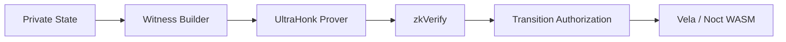

# NoctFinance V1 — TEE & Cryptographic Systems Audit

> **HISTORICAL AUDIT SNAPSHOT.** Preserve the findings, but use the corrected Vela root, application commitment, replay, oracle, and conditional-ZK architecture in `NOCT-FINANCE-V1-ARCHITECTURE-DOCUMENTS-CORRECTED/` Files 03, 09, 13–18, 23, and 30.

**Auditor Role:** TEE & Cryptographic Systems Engineer  
**Target:** Vela/Nitro/TinyGo confidential lending (NoctFinance V1)  
**Date:** 2026-09-19  
**Scope:** P-521 ECDH, TinyGo determinism, side-channel prevention, dual-commitment architecture, ZK/TEE integration, PCR governance

---

## Executive Summary

NoctFinance V1 implements a privacy-preserving DeFi lending protocol on Vela (AWS Nitro Enclaves + WASM) with ZK proofs via UltraHonk/zkVerify. This audit identifies **5 critical architectural gaps** and **12 high-priority recommendations** across cryptographic flows, TEE operations, and ZK integration.

### Critical Findings

1. **P-521 ECDH flow documented but enclave attestation verification undefined** (Section 1)
2. **No anti-rollback mechanism specified beyond nonces** (Section 2)
3. **Dual-commitment architecture gap: encrypted vs plaintext commitments** (Section 4)
4. **ZK witness generation location unspecified (client/enclave/hybrid)** (Section 5)
5. **PCR pinning strategy and upgrade process undefined** (Section 6)

---

## 1. P-521 ECDH Flow Analysis

### Current Architecture (File: 07, 21)

**File 07-NOCT-ACCOUNT-IDENTITY-MODEL.md, Line 14:**
> "The current Vela TypeScript client derives a P-521 communication key from wallet signing material and uses it for encrypted communication and encrypted user events."

**File 21-TRANSACTION-REQUEST-LIFECYCLE.md, Lines 24-31:**
```text
1. wallet connection;
2. P-521 key derivation;
3. key association;
4. payload encryption;
5. request submission;
6. completion event;
7. encrypted user-event decryption.
```

### Verified Components

✅ **Client ephemeral key generation**: P-521 derived from wallet signing  
✅ **Encrypted payload**: Request encryption documented  
✅ **Encrypted events**: User events returned encrypted  

### Critical Gaps

❌ **Enclave public key retrieval mechanism**: Not documented  
❌ **Enclave identity verification (PCR attestation)**: No client-side attestation verification flow  
❌ **ECDH shared secret derivation**: Cryptographic primitive unspecified (AES-GCM assumed but not stated)  
❌ **Key rotation impact**: No discussion of in-flight transaction handling during key rotation

### Missing Cryptographic Details

1. **Attestation Flow**: How does client verify enclave PCR measurements before deriving shared secret?
2. **Key Binding**: Is the P-521 public key bound to specific PCR values?
3. **Replay Protection**: Beyond nonces, how are ECDH-encrypted payloads protected from replay at the encryption layer?
4. **Key Rotation**: What happens to pending transactions if enclave restarts with new ephemeral keys?

### Recommendations

**R1-CRITICAL**: Define client-side attestation verification flow:
```text
Client:
  1. Fetch enclave attestation document
  2. Verify PCR0, PCR8 against known-good measurements
  3. Extract enclave public key from attestation
  4. Derive ECDH shared secret
  5. Encrypt payload with AES-256-GCM (specify explicitly)
```

**R2-HIGH**: Specify key rotation policy:
- Enclave keys persist across restart via sealed storage OR
- Clients must re-derive communication keys on enclave restart with grace period for in-flight txs

**R3-MEDIUM**: Document encryption primitive explicitly (currently inferred as AES-GCM but not stated in reviewed docs)

---

## 2. TinyGo Determinism & State Recovery

### TinyGo Constraints (Files: 16, 08, PROTOCOL_ECONOMICS_AUDIT.md)

**File 16-VELA-TEE-EXECUTION.md, Line 47:**
> "Noct guest logic must not rely on arbitrary external HTTP, random execution, or uncontrolled time."

**File 08-NOCTSTATE-V1.md, Line 63:**
> "Use integer/fixed-point arithmetic. No float/double in financial logic."

**PROTOCOL_ECONOMICS_AUDIT.md, Lines 144-145:**
> "TinyGo WASM has no `time.Now()`. Interest accrual requires timestamp progression."

### Verified Constraints

✅ **No floats**: Integer/fixed-point arithmetic mandated  
✅ **No time.Now()**: External time must be authenticated  
✅ **No network**: HTTP prohibited  
✅ **No filesystem**: Implicit (WASM sandbox)  

### State Recovery Mechanisms

**File 04-NOCT_VELA_INTEGRATION.md, Lines 82-89:**
> "The current Vela codebase describes versioned LevelDB application state and rollback support."

**Recovery Model Identified:**
- Vela provides versioned state with rollback capability
- Atomicity enforced: "A failed state transition MUST leave the canonical state unchanged" (File 22, Line 23)

### Critical Gap: Replay vs Checkpoint

**No explicit answer to:** How does enclave recover state after restart?

**Scenario Analysis:**

| Scenario | Current Documentation | Risk |
|----------|----------------------|------|
| Cold restart | State loaded from LevelDB | ✓ Covered |
| Mid-transition crash | Rollback to previous version | ✓ Covered (File 04, Line 314) |
| Replay attack | Nonce-based protection | ⚠️ Partially covered |
| Anti-rollback (state reversion) | **UNDEFINED** | ❌ Critical gap |

### Anti-Rollback Mechanism Analysis

**File 23-REPLAY-PROTECTION.md, Lines 30-33:**
```text
nonce = 7
request proves nonce == 7
success → nonce = 8
```

**On-chain nonces mentioned but not formalized:**
- Are nonces persisted on-chain or only in TEE state?
- What prevents enclave operator from loading old state snapshot?

### Missing Components

1. **Monotonic Counters**: No mention of AWS Nitro monotonic counters for anti-rollback
2. **On-chain State Anchoring**: State commitments published but no enforcement that new state version > old state version
3. **Trusted Time**: No authenticated timestamp source for interest accrual (identified in PROTOCOL_ECONOMICS_AUDIT.md)

### Recommendations

**R4-CRITICAL**: Implement anti-rollback via on-chain state version enforcement:
```text
Smart Contract:
  function processTransition(proof, newStateRoot, newStateVersion) {
    require(newStateVersion > lastStateVersion, "Rollback detected");
    lastStateVersion = newStateVersion;
  }
```

**R5-HIGH**: Define authenticated time source for interest accrual:
- Option A: Block timestamps from Horizon (requires trust in L1 time)
- Option B: Vela Manager provides authenticated timestamps from blockchain
- Option C: Periodic oracle updates include timestamp

**R6-MEDIUM**: Document state recovery procedure:
```text
Enclave Restart:
  1. Load latest committed state from LevelDB
  2. Verify state version matches last on-chain commitment
  3. Reject if mismatch (anti-rollback)
  4. Resume processing from clean state
```

**R7-LOW**: Consider AWS Nitro monotonic counters for additional anti-rollback layer (optional defense-in-depth)

---

## 3. Side-Channel Prevention

### Private Data Identified (File: 05, 08)

**File 05-PRIVACY-MODEL.md, Lines 14-25:**
```text
cashUSDC
collateralUSDC
borrowedZEN / borrowedETH
debtZEN / debtETH
LTV
healthFactor
private transaction history
account → position linkage
```

### Leakage Channels (File: 24)

**File 24-PRIVACY-LEAKAGE-ANALYSIS.md, Lines 8-32:**

| Channel | Leakage Vectors | Controls |
|---------|----------------|----------|
| Public chain | Sender, timing, settlement amount, proof metadata | Encrypted payloads, opaque IDs |
| Vela | **Plaintext events, errors, debug output** | ⚠️ Minimal controls documented |
| Backend | Prover logs, facilitator logs, metrics, crash reports | Secret redaction mentioned |
| Client | Analytics, console logs, local storage, telemetry | ⚠️ No specific controls |

### Error String Audit Gap

**File 24, Line 18:** Lists "errors" as leakage vector but no specific guidance on error handling.

**Missing Controls:**
- What error messages are safe to return?
- How to handle panics without leaking state?
- Timing attack considerations on health factor checks?

### Panic Handling (Not Documented)

**Risk:** TinyGo panic could:
1. Leak stack traces with sensitive values
2. Leave state in inconsistent condition
3. Expose timing information about liquidation checks

### Timing Attack Surface

**Liquidation Logic (File: 20):**
- Health factor calculation timing could leak whether user is near liquidation
- Early returns on insufficient collateral vs full calculation timing difference

**No constant-time requirements documented anywhere.**

### Recommendations

**R8-CRITICAL**: Define error string policy:
```go
// SAFE
return errors.New("transition failed: invalid state version")

// UNSAFE - leaks balance
return fmt.Errorf("insufficient balance: have %d, need %d", balance, required)
```

**R9-HIGH**: Implement panic recovery with sanitized errors:
```go
defer func() {
  if r := recover(); r != nil {
    // Log internally only, return generic error
    return TransitionResult{Success: false, Error: "internal error"}
  }
}()
```

**R10-MEDIUM**: Timing attack mitigation for liquidation checks:
- Always compute full health factor (no early returns based on balance)
- Consider constant-time comparison for critical thresholds
- Add random jitter to liquidation worker polling intervals

**R11-LOW**: Audit logging policy:
```text
✓ Log: requestId, transitionType, success/failure, stateVersion
✗ Log: balances, debt, healthFactor, LTV, account identifiers
```

---

## 4. Dual-Commitment Architecture (CRITICAL GAP)

### Current Commitment Model (File: 09)

**File 09-STATE-COMMITMENT-MODEL.md, Lines 24-36:**
```text
stateCommitment =
  H(
    domain,
    appId,
    protocolVersion,
    stateVersion,
    account/position commitments,
    reserve commitment,
    config commitment,
    oracle commitment
  )
```

### The Core Problem

**Vela's Encrypted State:**
- File 16, Line 14: "encrypted state"
- File 03, Line 21: "Encrypted Versioned State"
- **Implication**: Vela commits to `SHA256(encryptedState)`

**ZK Circuit Requirements:**
- Circuits need plaintext witness to prove state transitions
- Public inputs include state commitments
- **Implication**: Circuits need plaintext state commitments for membership proofs

**The Gap:**
```text
Vela commitment: H(encrypted blob)
ZK commitment:   H(plaintext fields)
```

These are **different values** unless explicitly synchronized.

### Missing Architecture

No document addresses:
1. Does enclave maintain both encrypted storage AND plaintext commitment tree?
2. How to prevent divergence between the two commitment schemes?
3. Who generates Merkle proofs for ZK witness (if Merkle tree is used)?

### Proposed Solution

**Dual-Commitment Architecture:**

```text
Enclave maintains:

1. Vela Encrypted State Commitment (for Vela state versioning)
   - SHA256(encrypted_state_blob)
   - Used by Vela Manager for rollback/persistence

2. Plaintext Merkle Tree (for ZK witnesses)
   - Poseidon hash over plaintext account leaves
   - Root published as public input to ZK circuits
   - Used for membership proofs in circuits

Invariant:
  After every transition:
    - Update both trees atomically
    - Commitment divergence = critical failure
    - Both commitments published on-chain
```

### Divergence Prevention Mechanisms

```text
Transaction Processing:
  1. Load encrypted state from Vela
  2. Decrypt in enclave
  3. Execute transition on plaintext
  4. Compute new plaintext Merkle root
  5. Re-encrypt state
  6. Compute new encrypted state commitment
  7. Atomic commit: both commitments or rollback

Verification at Proof Time:
  - ZK proof binds to plaintext Merkle root
  - On-chain verification checks both:
    a) Proof valid for plaintext root
    b) Encrypted state commitment updated atomically
```

### Recommendations

**R12-CRITICAL**: Define dual-commitment architecture explicitly in new document:
```text
Proposed: 35-DUAL-COMMITMENT-MODEL.md

Sections:
1. Encrypted state commitment (Vela layer)
2. Plaintext commitment tree (ZK layer)
3. Atomic update protocol
4. Divergence detection
5. Recovery procedure if divergence detected
6. On-chain verification of both roots
```

**R13-CRITICAL**: Implement commitment reconciliation checks:
```go
func (s *State) CommitTransition() error {
  plaintextRoot := s.computePlaintextMerkleRoot()
  encryptedCommitment := s.computeEncryptedCommitment()
  
  // Atomic update
  if err := s.updateBothCommitments(plaintextRoot, encryptedCommitment); err != nil {
    return rollback()
  }
  
  // Publish both on-chain
  return s.publishCommitments(plaintextRoot, encryptedCommitment)
}
```

**R14-HIGH**: Add commitment divergence detection in tests:
```go
func TestCommitmentSync(t *testing.T) {
  // After every transition, verify:
  // - Plaintext root matches independent recalculation
  // - Encrypted commitment matches Vela's commitment
  // - Both published on-chain
}
```

---

## 5. ZK/TEE Integration (Witness Generation)

### Current Architecture (File: 13, 03-ZK)

**File 13-ZK-ARCHITECTURE.md, Lines 12-19:**


**Critical Ambiguity:** Where does "Witness Builder" execute?

### Three Architecture Options

| Option | Location | Privacy | Performance | Risk |
|--------|----------|---------|-------------|------|
| A: Client-side | Browser | ❌ Client holds plaintext | ✓ Parallel proving | ❌ High leakage risk |
| B: Enclave | Nitro TEE | ✓ No plaintext export | ❌ Enclave network limits | ⚠️ Witness export problem |
| C: Hybrid | Enclave builds, external proves | ⚠️ Encrypted witness | ⚠️ Complex | ⚠️ Key management |

### Enclave Network Constraint (File: 16)

**File 16, Line 47:** "Noct guest logic must not rely on arbitrary external HTTP"

**Implication:** If witness is generated in enclave, how does it reach the prover?

**File 03-ZK, Lines 311-316:**
```text
V1 MUST support an external prover-worker architecture.

The prover service must not become a plaintext store 
of user financial positions.
```

### Missing Specification

**No document answers:**
1. Does enclave generate witness and export encrypted?
2. Does client reconstruct witness from encrypted events?
3. Does enclave emit witness via Vela Manager?

### Transmission Security Gap

If enclave generates witness:
```text
Enclave → Vela Manager → ??? → Prover Worker
                        ↑
                 Encryption? Authentication?
```

### ZK Proof Verification Location (File: 04, 15)

**File 04-NOCT_VELA_INTEGRATION.md, Lines 280-294:**
```text
validate request
   ↓
verify authorization
   ↓
verify proof        ← WHERE DOES THIS HAPPEN?
   ↓
validate transition
```

**File 15-ZKVERIFY-INTEGRATION.md:** Documents zkVerify but not where Vela consumes the result.

**Options:**
- On-chain contract verifies aggregation receipt
- Vela Manager queries zkVerify API
- TRUSTPROCESS event triggers Vela (mentioned in File 04, Line 203)

### Recommendations

**R15-CRITICAL**: Define witness generation architecture (choose one):

**Option A - Enclave-Generated (Recommended):**
```text
1. Client submits encrypted request to Vela
2. Enclave decrypts, executes transition (pre-validation)
3. Enclave generates ZK witness from plaintext state
4. Enclave encrypts witness with prover's public key
5. Vela Manager forwards encrypted witness to authorized prover
6. Prover decrypts, generates proof, submits to zkVerify
7. Vela polls zkVerify for verification result
8. On success, enclave commits state
```

**Option B - Client-Reconstructed (If enclave network is hard constraint):**
```text
1. Enclave returns encrypted events with state deltas
2. Client decrypts events (has private key)
3. Client reconstructs witness locally
4. Client submits to prover
5. Rest of flow as above
```

**R16-HIGH**: Specify prover-enclave key exchange:
- Prover registers public key with Vela Authority Service
- Enclave retrieves authenticated prover public key
- Encrypt witness with prover's key before export

**R17-MEDIUM**: Define zkVerify result consumption:
```text
Preferred: On-chain aggregation receipt verification
Fallback: Vela Manager queries zkVerify API (for testnet)
```

**R18-LOW**: Document TRUSTPROCESS integration if used (File 04, Line 203 mentions but doesn't detail)

---

## 6. PCR Governance & Enclave Lifecycle

### PCR References (File: 06, 03, 04)

**File 06-TRUST-MODEL.md, Line 28:**
> "Production confidentiality relies on the Nitro Enclave deployment, attestation, enclave measurement and supply-chain integrity."

**No specific PCR values or governance documented.**

### AWS Nitro PCR Layout

**Standard Nitro PCRs:**
- **PCR0**: Enclave image hash (code + dependencies)
- **PCR1**: Linux kernel hash
- **PCR2**: Application hash
- **PCR3**: Parent instance IAM role
- **PCR8**: Enclave certificate

### Missing Governance

❌ **Which PCRs to pin**: Not specified  
❌ **PCR update process**: Not specified  
❌ **Emergency recovery**: Not specified (File 23 is "Replay Protection", not disaster recovery)  

### Enclave Upgrade Challenge

**Scenario:**
1. Security patch requires new enclave image
2. PCR0 changes
3. Old clients have old PCR0 pinned
4. **How to upgrade without breaking state continuity?**

### State Continuity Problem

```text
Old Enclave (PCR0 = 0xAAA):
  - Sealed storage encrypted with PCR0 = 0xAAA
  - Private keys bound to PCR0 = 0xAAA

New Enclave (PCR0 = 0xBBB):
  - Cannot unseal old storage (different PCR)
  - Cannot access old private keys
  - STATE LOST unless migration planned
```

### Emergency Recovery Gap

**File 22-FAILURE-RECOVERY.md:** Lists failure classes but not "enclave compromise" or "PCR rollback attack"

**Missing:**
- What if enclave is compromised?
- How to migrate state to new enclave?
- Can state be recovered from on-chain data?

### Recommendations

**R19-CRITICAL**: Define PCR pinning strategy:
```text
Production:
  - Pin PCR0 (enclave image)
  - Pin PCR8 (enclave certificate)
  - Do NOT pin PCR3 (allows IAM flexibility)

Client verification:
  allowlist = [
    {PCR0: "0xAAA...", PCR8: "0xBBB...", validUntil: "2027-01-01"},
    {PCR0: "0xCCC...", PCR8: "0xDDD...", validUntil: "2027-12-31"} // upgrade overlap
  ]
```

**R20-CRITICAL**: Define enclave upgrade procedure:
```text
Upgrade Path:
  1. Deploy new enclave with new PCR0
  2. Old enclave exports state to sealed migration blob
  3. Migration blob encrypted with both old and new PCR0
  4. New enclave imports state
  5. Verify state commitment matches last on-chain root
  6. 7-day overlap period where both PCR0 values are valid
  7. Deprecate old PCR0
```

**R21-HIGH**: Emergency recovery procedure:
```text
If enclave is compromised:
  1. Halt all processing immediately
  2. Deploy new enclave with new code
  3. Reconstruct state from on-chain commitments + user claims
  4. Users prove position ownership via ZK proof + signature
  5. Rebuild state tree from verified claims
  6. Resume with new PCR0 (old PCR0 permanently revoked)
```

**R22-MEDIUM**: Implement PCR governance smart contract:
```solidity
contract NoctPCRRegistry {
  mapping(bytes32 => PCRPolicy) public approvedPCRs;
  
  struct PCRPolicy {
    bytes32 pcr0;
    bytes32 pcr8;
    uint256 validFrom;
    uint256 validUntil;
    bool revoked;
  }
  
  function isValidAttestation(bytes memory attestation) public view returns (bool);
}
```

**R23-LOW**: Document attestation verification in client:
```typescript
async function verifyEnclaveAttestation(attestationDoc: Uint8Array): Promise<PublicKey> {
  const attestation = parseNitroAttestation(attestationDoc);
  const approvedPCRs = await fetchApprovedPCRs();
  
  if (!approvedPCRs.some(p => p.pcr0 === attestation.pcr0 && p.pcr8 === attestation.pcr8)) {
    throw new Error("Enclave PCR not approved");
  }
  
  return attestation.publicKey;
}
```

---

## 7. File Contradictions & Inconsistencies

### 7.1 Deterministic Time Source

**Contradiction:**
- **File 16, Line 47:** "must not rely on... uncontrolled time"
- **File 19 (Interest Accrual):** Requires timestamp progression for interest
- **PROTOCOL_ECONOMICS_AUDIT.md, Line 144:** "TinyGo WASM has no `time.Now()`"

**Resolution Required:** Define authenticated timestamp oracle in interest accrual specification.

### 7.2 State Commitment Ambiguity

**Inconsistency:**
- **File 09:** Describes conceptual commitment with plaintext fields
- **File 03, 16:** References "encrypted state"
- **No document reconciles these two models**

**Resolution:** Implement dual-commitment architecture (Recommendation R12)

### 7.3 Proof Verification Location

**Ambiguity:**
- **File 04, Line 286:** "verify proof" as step in Vela WASM
- **File 15:** zkVerify as external verifier
- **File 03-ZK, Line 37:** Shows zkVerify → Transition Authorization → Vela

**Possible Interpretations:**
1. Vela WASM calls out to verify proof result from zkVerify
2. Vela Manager verifies before invoking WASM
3. On-chain contract verifies aggregation receipt

**Resolution Required:** Clarify in sequence diagram with explicit API boundaries.

### 7.4 Facilitator Trust Boundary

**Tension:**
- **File 06, Line 36:** "Facilitator is... not source of truth for balances"
- **File 04, Lines 210-223:** Describes facilitator as relayer with encrypted payloads
- **No specification of what facilitator CAN see**

**Resolution:** Document facilitator capabilities/limitations explicitly:
```text
Facilitator CAN see:
  - Request envelope (encrypted payload is opaque)
  - Public events
  - Settlement transactions

Facilitator CANNOT see:
  - Decrypted payload
  - Private balances
  - Health factors
```

---

## 8. Summary of Recommendations by Priority

### CRITICAL (Must Fix Before Production)

| ID | Issue | File Ref | Recommendation |
|----|-------|----------|----------------|
| R1 | Attestation verification undefined | 07, 21 | Define client PCR verification flow |
| R4 | No anti-rollback mechanism | 23 | Implement on-chain state version enforcement |
| R8 | No error string policy | 24 | Define safe vs unsafe error messages |
| R12 | Dual-commitment gap | 09, 03 | Document encrypted + plaintext commitment sync |
| R13 | Commitment divergence risk | 09 | Implement atomic dual-commit |
| R15 | Witness generation location undefined | 13, 03-ZK | Choose and document architecture |
| R19 | PCR pinning undefined | 06 | Define which PCRs to pin |
| R20 | Enclave upgrade unspecified | 06, 22 | Define upgrade procedure with state migration |
| R21 | No emergency recovery | 22 | Define enclave compromise response |

### HIGH (Should Fix Before Mainnet)

| ID | Issue | File Ref | Recommendation |
|----|-------|----------|----------------|
| R2 | Key rotation undefined | 07 | Define rotation policy for in-flight txs |
| R5 | No authenticated time source | 16, 19 | Define timestamp oracle for interest |
| R9 | Panic handling unspecified | N/A | Implement panic recovery |
| R14 | No commitment sync tests | 09 | Add divergence detection tests |
| R16 | Prover encryption undefined | 03-ZK | Define prover-enclave key exchange |

### MEDIUM (Security Hardening)

| ID | Issue | File Ref | Recommendation |
|----|-------|----------|----------------|
| R3 | Encryption primitive implicit | 07 | Document AES-GCM explicitly |
| R6 | State recovery undocumented | 04, 22 | Document restart procedure |
| R10 | Timing attacks on liquidation | 20 | Constant-time health factor checks |
| R17 | zkVerify consumption unclear | 15 | Clarify receipt verification flow |
| R22 | No PCR governance contract | 06 | Implement on-chain PCR registry |

### LOW (Defense in Depth)

| ID | Issue | File Ref | Recommendation |
|----|-------|----------|----------------|
| R7 | No monotonic counter | N/A | Consider Nitro monotonic counters |
| R11 | Logging policy informal | 24 | Audit all log statements |
| R18 | TRUSTPROCESS undefined | 04 | Document trigger contract usage |
| R23 | Client attestation code missing | 06 | Implement client-side verification |

---

## 9. Conclusion

NoctFinance V1 has a **solid architectural foundation** with clear separation between Vela (TEE execution), UltraHonk (ZK), and zkVerify (verification). However, **five critical gaps** must be addressed before production:

1. **Enclave attestation flow** (client-side PCR verification)
2. **Anti-rollback mechanism** (on-chain state version enforcement)
3. **Dual-commitment architecture** (reconciling encrypted state and ZK commitments)
4. **Witness generation location** (enclave vs client, transmission security)
5. **PCR governance** (upgrade process, emergency recovery)

The documentation is **unusually thorough** for a V1 testnet but leaves key cryptographic engineering decisions as "OPEN" issues. The normative language (MUST/MUST NOT/SHOULD) is well-applied, but the gaps identified above require **explicit architecture decisions** before implementation.

**Overall Risk Assessment:**
- **Privacy Model**: Strong (if dual-commitment implemented correctly)
- **TEE Security**: Good (but PCR governance critical)
- **ZK Integration**: Solid (performance-gated approach is correct)
- **State Safety**: Good (atomicity enforced, but anti-rollback needed)
- **Side-Channel Resistance**: **Weak** (no error handling policy, no timing attack mitigation)

**Estimated Engineering Effort to Address:**
- Critical issues: ~4-6 weeks (dual-commitment + attestation + PCR governance)
- High priority: ~2-3 weeks (time source + witness architecture)
- Medium/Low: ~1-2 weeks (hardening)

**Next Steps:**
1. Create **35-DUAL-COMMITMENT-MODEL.md** specification
2. Create **36-PCR-GOVERNANCE.md** specification
3. Update **07-NOCT-ACCOUNT-IDENTITY-MODEL.md** with attestation flow
4. Update **16-VELA-TEE-EXECUTION.md** with witness generation architecture
5. Create **37-ERROR-HANDLING-POLICY.md** for side-channel prevention

---

**End of Audit**
