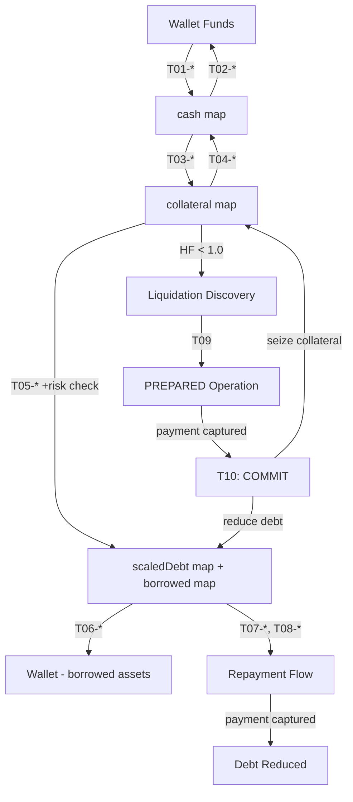

# Noct Finance V1 Multi-Collateral Architecture
## Complete Architecture Specification for Multi-Asset Protocol

**Version:** V1 Architecture Specification  
**Date:** September 2026  
**Status:** Comprehensive architectural specification for multi-collateral support  
**Scope:** ETH, ZEN, and USDC as both collateral and borrow assets

---

## Executive Summary

This document provides the complete architectural specification for Noct Finance V1, a **multi-collateral, multi-borrow protocol** supporting ETH, ZEN, and USDC as both collateral and debt assets from day one.

The refactoring is grounded in:
1. **Discovered Vela Runtime Capabilities** from HorizenOfficial/vela-nova and vela-starterkit repositories
2. **Noct Finance V1 Multi-Asset Requirements** - support for USDC, ETH, and ZEN as both collateral and borrow assets
3. **Strict Anti-Hallucination Discipline** - every component maps to verified Vela capabilities

---

# PART 1: VELA CAPABILITY DOSSIER

## 1.1 Vela Execution Model (Ground Truth from Repository Analysis)

### Core Architecture Discovery

From examination of `/tmp/vela-nova/runtime/wasm-go/`:

**Execution Environment:**
- **Runtime:** Wasmtime-go executing TinyGo-compiled WASM modules
- **TEE:** AWS Nitro Enclave (production) or emulated mode (local dev)
- **State Management:** AES-256 encrypted, versioned, stored in LevelDB outside enclave
- **Entry Points:** 
  - `deploy()` - initialization
  - `load_module()` - cache warm-up
  - `deposit()` - on-chain asset ingestion
  - `process_request()` - user-initiated transitions
  - `trusted_request()` - trigger-driven authenticated transitions (no sender)

**Confirmed Limitations:**
```go
// From types.go and app.go analysis:
- NO native HTTP/network calls from WASM guest
- NO direct blockchain reads from guest
- NO floating-point arithmetic (TinyGo constraint)
- NO math/big (TinyGo constraint)
- NO non-deterministic operations (time.Now() must be injected)
- NO direct access to external oracles
```

### State Persistence Model

**Discovered Pattern:**
```go
type ApplicationInternalState struct {
    AppID         uint64
    Accounts      map[string]*AccountState  // address hex -> state
    // ... application-specific fields
    Nonce         uint64
    Transactions  []TransactionRecord       // optional history
}
```

**State Lifecycle:**
1. Manager loads encrypted state from LevelDB
2. Executor decrypts with enclave StateKey (AES-256)
3. WASM guest deserializes JSON → Go struct
4. Guest computes complete next state
5. Guest serializes → JSON
6. Executor encrypts and signs
7. Manager persists new version with SHA256 state root

**Critical Constraint:** State must be **deterministic** and **JSON-serializable**. No references to external mutable state.

### Request Processing Flow

**Standard PROCESS Request:**
```
User → ProcessorEndpoint.submitRequest(PROCESS, encrypted_payload, token, amount, fee)
  ↓
Manager polls → load state + WASM
  ↓
Executor decrypts state (AES) + payload (P-521 ECDH)
  ↓
if amount > 0: call deposit(sender, token, amount, state)
  ↓
call process_request(sender, requestType, payload, state)
  ↓
Encrypt new state + events, sign UpdatePayload (secp256k1)
  ↓
Manager submits stateUpdate → ProcessorEndpoint
  ↓
Contract verifies TEE signature → emit events → process withdrawals
```

**TRUSTPROCESS Request (Trigger-Driven):**
```
process_request() emits AppEvent with opaque intent
  ↓
stateUpdate finalizes → trigger.execute(appEventData)
  ↓
Trigger reads on-chain data (e.g., OracleAdapter)
  ↓
trigger.getTrustProcessPayload() returns authenticated payload
  ↓
TRUSTPROCESS enqueued (higher priority than normal queue)
  ↓
Executor calls trusted_request(appId, cleartext_payload, state)
  ↓
NO sender, NO P-521 decryption, NO requestType parameter
  ↓
Guest validates domain separation + processes authenticated data
```

**Critical Discovery:** The trigger mechanism is the ONLY way for Vela WASM to consume fresh on-chain data (oracle prices, block timestamps) in a risk-sensitive transition.

### Custody and Withdrawal Model

**Discovered Pattern from ProcessResult:**
```go
type ProcessResult struct {
    State       []byte              // new encrypted state
    Events      []PlainEvent        // encrypted per-user events
    AppEvents   []AppEvent          // plaintext application events
    Withdrawals []Withdrawal        // native asset withdrawals
    Report      []byte              // deanonymization report
    Fuel        *Uint256           // gas metering
    Error       string
}

type Withdrawal struct {
    TokenAddress       Address   // 0x0 = ETH
    DestinationAddress Address
    Amount             *Uint256
}
```

**Withdrawal Flow:**
1. Guest debits internal balance
2. Guest appends to `ProcessResult.Withdrawals`
3. Executor signs the complete result
4. ProcessorEndpoint creates pull-payment claim
5. User/liquidator calls `claim(token, payee)` on-chain

**Conservation Equation (from Vela pattern):**
```
Custody[token] = LedgerBalance[token] + PendingInbound[token] + PendingOutbound[token]
```

### Multi-Token Support

**Confirmed Capability:**
- ProcessorEndpoint accepts `tokenAddress` parameter (0x0 = ETH, otherwise ERC-20)
- TokenAllowlist contract gates which ERC-20s are accepted
- Per-token balance tracking in guest state: `map[string]*Uint256` (token hex → balance)
- Withdrawals specify tokenAddress explicitly

**Example from vela-nova payment app:**
```go
type AccountState struct {
    Address  types.Address
    Balances map[string]*types.Uint256  // multi-token balances
}
```

**Constraint:** Token allowlist is configured on-chain at ProcessorEndpoint deployment, NOT dynamically updatable by guest.

### Oracle Integration Architecture

**Discovered Pattern (from trigger-contract documentation):**
```
On-chain OracleAdapter contract:
  - Verifies Pyth signatures via official Pyth EVM contract
  - Stores normalized snapshot: {epoch, prices[], timestamps, commitment}
  - Monotonic epoch counter

NoctTrigger (extends AbstractTrigger):
  - execute() called during stateUpdate
  - Reads OracleAdapter state
  - Enforces maxRiskDelaySeconds against block.timestamp
  - Returns domain-separated payload binding snapshot to intent

trusted_request():
  - Validates trigger domain (chain, endpoint, app, trigger addresses)
  - Requires epoch > lastAcceptedEpoch (strict monotonicity)
  - Consumes prices for risk calculation
  - Accepts epoch atomically with risk transition
```

**Critical Constraint:** Guest CANNOT:
- Fetch HTTP oracle data
- Verify Pyth signatures directly
- Use WASI time for risk decisions
- Accept caller-supplied prices

Guest CAN ONLY consume oracle data via authenticated TRUSTPROCESS payload from registered trigger.

### Numeric Computation Capabilities

**Confirmed from vela-common-go types:**
```go
type Uint256 struct {
    // Internally [4]uint64, methods for:
    Add, Sub, Mul, Div, Cmp, IsZero, String, Bytes
    AddOverflow returns bool on overflow
}
```

**Critical Gap:** No native `mulDivDown(a, b, d)` or `mulDivUp(a, b, d)` in vela-common-go.

**Implication:** Noct MUST implement checked full-width mulDiv in TinyGo-compatible Go, OR vendor an audited U256 library that provides it (e.g., from Aave/Compound patterns).

**TinyGo Constraints:**
- No math/big
- No floating-point for financial logic
- All arithmetic must be explicit checked operations
- Overflow must return error, not panic

### Privacy and Event Model

**User Events (PlainEvent):**
- Encrypted per-recipient using P-521 ECDH → AES-GCM
- User must register P-521 public key via ASSOCIATEKEY request
- Optional EventSubType for categorization (HMAC-derived from user seed)

**Application Events (AppEvent):**
- Plaintext, visible on-chain
- Used to communicate with trigger contracts
- MUST NOT contain private balances, debt, health factors, or account addresses

**Deanonymization:**
- Separate request type (DEANONYMIZATION)
- Gated by AuthorityRegistry
- Returns encrypted report via ProcessResult.Report
- NOT accessible to normal users or liquidators

### Memory and Execution Limits

**From full-stack tests:**
- State size: practical limit ~few MB (LevelDB + encryption overhead)
- Fuel metering: custom per-app (Uint256 returned in results)
- No explicit WASM memory limit in code, but Nitro enclave resources finite
- Transactions field in payment app limited to MaxTransactions = 50 (sliding window)

**Implication for Multi-Collateral:**
- Per-account state grows with number of collateral+debt positions
- Liquidation discovery scanning must be bounded (work budget per request)
- Cannot iterate entire account set in single request

---

## 1.2 Vela Capabilities Summary Table

| Capability | Status | Implementation Path |
|------------|--------|---------------------|
| **Multi-token custody** | ✅ Supported | ProcessorEndpoint tokenAddress + Allowlist |
| **Encrypted state persistence** | ✅ Supported | AES-256 via Executor StateKey |
| **Per-user private balances** | ✅ Supported | map[address]→AccountState in guest |
| **Oracle price ingestion** | ✅ Via Trigger | OracleAdapter + NoctTrigger + TRUSTPROCESS |
| **Deterministic timestamps** | ✅ Via Trigger | Oracle adapter block timestamp in payload |
| **Multi-asset withdrawals** | ✅ Supported | Withdrawal.TokenAddress field |
| **Checked U256 arithmetic** | ⚠️ Partial | Add/Sub/Mul yes; mulDiv needs custom impl |
| **Full-width mulDiv** | ❌ Missing | MUST implement in TinyGo-compatible code |
| **Liquidation discovery** | ✅ Pattern exists | Scan in trusted_request, emit opaque quote |
| **Cross-asset risk checks** | ✅ Feasible | Compute in guest with oracle prices |
| **Interest accrual** | ✅ Feasible | Deterministic via oracle timestamp |
| **Asynchronous deposits** | ✅ Supported | deposit() called per-token, updates state |
| **Multi-borrow positions** | ✅ Feasible | Per-asset scaledDebt fields in account |
| **Native ZK proving** | ❌ Not native | Custom Noct layer (Noir/UltraHonk) |
| **Direct blockchain reads** | ❌ Not supported | Must use trigger + TRUSTPROCESS |
| **HTTP/network calls** | ❌ Not supported | All external data via authenticated payloads |

---

## 1.3 Unresolved Constraints & Verification Register

### UC-1: Full-Width mulDiv Implementation
**Status:** REQUIRED, NOT PROVIDED BY VELA  
**Evidence:** vela-common-go Uint256 has Add/Sub/Mul/Div but no mulDivDown/mulDivUp  
**Requirement:** Noct MUST implement or vendor TinyGo-compatible checked U256 mulDiv  
**Risk:** Incorrect rounding in debt/collateral calculations breaks solvency  
**Resolution Path:** Port from Solidity Aave/Compound patterns OR use audited Go U256 library

### UC-2: Liquidation Scan Work Budget
**Status:** DESIGN DECISION REQUIRED  
**Evidence:** Payment app limits Transactions to 50 entries; full account iteration impossible  
**Requirement:** Discovery must process fixed work budget, emit at most one quote  
**Open Questions:**
- How many accounts can be scanned per discovery request?
- What happens if no liquidatable account found in budget?
- How to prevent starvation of accounts late in iteration order?

**Proposed Resolution:** 
- Persisted round-robin cursor over deterministic account order
- Fixed max iterations per discovery (e.g., 100 accounts)
- NO_QUOTE result if none found; keeper retries

### UC-3: Multi-Asset Liquidation Priority
**Status:** POLICY DECISION REQUIRED  
**Evidence:** V1 has ZEN and ETH debt; multi-collateral adds USDC debt  
**Question:** When position is liquidatable, which debt asset is repaid first?  
**Options:**
1. Liquidator chooses (flexibility, but may prefer profitable asset)
2. Deterministic waterfall (e.g., highest USD debt first)
3. Pro-rata across all debts
4. Each debt asset liquidated independently

**Trade-offs:**
- Option 1: Simplest, but liquidator may cherry-pick
- Option 2: Fair, deterministic, but complex state machine
- Option 3: Most equitable, but requires multi-asset payment capture
- Option 4: Simplest atomicity, but may require multiple liquidations

**Recommendation:** Option 2 (deterministic waterfall) for V2.0, with explicit ordering: ETH → ZEN → USDC

### UC-4: Asynchronous Deposit Ordering and Index Synchronization
**Status:** MATHEMATICAL VERIFICATION REQUIRED  
**Evidence:** V1 accrues reserves at oracle timestamp; multi-collateral has per-asset deposits at different times  
**Scenario:**
```
T0: User deposits 1000 USDC
T1: User deposits 10 ETH
T2: User borrows 5 ZEN (requires accrual of ZEN reserve to T2 oracle time)
T3: User deposits 100 USDC
T4: User borrows 2 ETH (requires accrual of ETH reserve to T4 oracle time)
```

**Question:** How do supply indexes accrue when collateral deposits are asynchronous?  
**V1 Answer:** No supply index (protocol-funded reserves)  
**V2 Implication:** If user-supplied liquidity added later, need per-asset supply indexes

**Current Resolution:** V2.0 maintains protocol-funded reserves (like V1); supply indexes deferred to V2.1+

### UC-5: Cross-Collateral Release Priority
**Status:** UX DECISION REQUIRED  
**Evidence:** V1 has single collateral (USDC); multi-collateral allows mixed collateral  
**Question:** When user requests "release 1000 USD worth of collateral," which asset is released?  
**Options:**
1. User specifies exact asset + amount
2. Protocol releases proportionally across all collateral
3. Protocol releases least-volatile first (USDC → ETH → ZEN)

**Recommendation:** Option 1 (explicit) for clarity and gas efficiency

### UC-6: Oracle Staleness Per-Asset
**Status:** RISK PARAMETER REQUIRED  
**Evidence:** V1 has single staleness threshold; multi-asset may have different confidence requirements  
**Question:** Should staleness/confidence vary by asset?  
**Proposed:** Single maxOracleStalenessSeconds for all assets in V2.0; per-asset in V2.1+

### UC-7: Bad Debt Socialization Across Reserves
**Status:** OUT OF SCOPE FOR V2.0  
**Evidence:** V1 does not handle bad debt (collateral < debt at liquidation)  
**Question:** How is bad debt socialized when one reserve becomes insolvent?  
**Resolution:** Defer to V2.1; V2.0 monitors but does not auto-socialize

---

# PART 2: ARCHITECTURAL DELTA (V1 → V2.0)

## 2.1 What Is REMOVED

### ❌ Single-Collateral Assumption
**V1:**
```text
collateralAsset = USDC only
```
**V2.0:**
```text
collateralAssets = [USDC, ETH, ZEN]
```

### ❌ Single USD Valuation Formula
**V1:**
```text
collateralUsd = mulDivDown(collateralUSDC, usdcPrice, WAD)
debtUsd = mulDivUp(debtZEN, zenPrice, WAD) + mulDivUp(debtETH, ethPrice, WAD)
```
**V2.0:** Generalized to per-asset weights and aggregation (see 3.3)

### ❌ Borrow-Only Asset Classification
**V1:**
```text
ZEN, ETH: borrow only (no user collateral)
```
**V2.0:**
```text
All assets can be both collateral and debt
```

## 2.2 What Is MODIFIED

### 🔄 Account State Structure
**V1:**
```go
type PrivateAccount struct {
    address              [20]byte
    cashUSDC             AmountWad
    collateralUSDC       AmountWad
    borrowedZEN          AmountWad
    borrowedETH          AmountWad
    scaledDebtZEN        ScaledDebt
    scaledDebtETH        ScaledDebt
    positionNonce        uint64
    lastUpdateTimestamp  uint64
}
```

**V2.0:**
```go
type PrivateAccount struct {
    address                 [20]byte
    cash                    map[AssetID]AmountWad      // per-asset cash balances
    collateral              map[AssetID]AmountWad      // per-asset collateral
    borrowed                map[AssetID]AmountWad      // per-asset borrowed (in custody)
    scaledDebt              map[AssetID]ScaledDebt     // per-asset debt shares
    positionNonce           uint64
    lastUpdateTimestamp     uint64
}

const (
    AssetUSDC AssetID = 0
    AssetETH  AssetID = 1
    AssetZEN  AssetID = 2
)
```

### 🔄 Reserve State Structure
**V1:**
```text
ReserveState[ZEN], ReserveState[ETH]
(two distinct structs)
```

**V2.0:**
```go
type ReserveState struct {
    asset                    AssetID
    availableLiquidity       AmountWad
    totalScaledDebt          ScaledDebt
    borrowIndex              IndexRay
    lastAccrualTimestamp     uint64
}

// In global state:
reserves map[AssetID]*ReserveState
// reserves[AssetUSDC], reserves[AssetETH], reserves[AssetZEN]
```

### 🔄 Risk Parameters
**V1:**
```yaml
maxLTVWad: 60%  (single value)
liquidationThresholdWad: 75% (single value)
```

**V2.0:**
```go
type AssetRiskConfig struct {
    collateralFactorWad      RatioWad  // LTV weight when used as collateral
    borrowFactorWad          RatioWad  // debt weight when borrowed
    liquidationThresholdWad  RatioWad  // individual asset liquidation threshold
    liquidationBonusWad      RatioWad  // per-asset bonus
}

riskParams map[AssetID]*AssetRiskConfig
```

**Example:**
```yaml
USDC:
  collateralFactor: 90%  # stable, high confidence
  borrowFactor: 100%     # 1:1 debt weight
  liquidationThreshold: 95%
  liquidationBonus: 5%

ETH:
  collateralFactor: 80%  # volatile
  borrowFactor: 100%
  liquidationThreshold: 85%
  liquidationBonus: 8%

ZEN:
  collateralFactor: 70%  # more volatile
  borrowFactor: 100%
  liquidationThreshold: 80%
  liquidationBonus: 10%
```

### 🔄 Health Factor Formula
**V1 (implicit):**
```text
Liquidatable if:
  debtUsd > mulDivDown(collateralUsd, liquidationThresholdWad, WAD)
```

**V2.0 (explicit, risk-weighted):**
```text
weightedCollateralUsd = Σ over assets: 
    mulDivDown(collateral[a], price[a], WAD) × collateralFactor[a] / WAD

weightedDebtUsd = Σ over assets:
    mulDivUp(debt[a], price[a], WAD) × borrowFactor[a] / WAD

healthFactor = weightedCollateralUsd / weightedDebtUsd  (if debt > 0)

Liquidatable if: healthFactor < 1.0
Borrow allowed if: postHF >= (WAD / maxLTVWad)
```

## 2.3 What Is ADDED

### ✅ Multi-Asset Deposit/Supply Flow
**New Transitions:**
```text
T01-USDC: CONSUME_DEPOSIT_USDC  (unchanged)
T01-ETH:  CONSUME_DEPOSIT_ETH   (new)
T01-ZEN:  CONSUME_DEPOSIT_ZEN   (new)

T03-USDC: SUPPLY_USDC  (unchanged)
T03-ETH:  SUPPLY_ETH   (new)
T03-ZEN:  SUPPLY_ZEN   (new)
```

### ✅ Multi-Asset Borrow
**New Borrow Types:**
```text
V1: BORROW_ZEN, BORROW_ETH
V2: BORROW_USDC (new), BORROW_ETH, BORROW_ZEN
```

### ✅ Multi-Asset Repayment
**New Repayment Paths:**
```text
V1: REPAY_ZEN, REPAY_ETH
V2: REPAY_USDC (new), REPAY_ETH, REPAY_ZEN
```

### ✅ Cross-Asset Liquidation Logic
**V2.0 Liquidation Flow:**
```text
1. Discovery: scan accounts, compute aggregate health factor
2. Select debt asset to liquidate (waterfall: ETH → ZEN → USDC)
3. Select collateral asset to seize (highest bonus-adjusted value first)
4. Prepare: lock debt slice + collateral slice
5. Capture: authenticated payment in debt asset
6. Commit: reduce debt, seize collateral, emit withdrawal
```

### ✅ Aggregate Position Monitoring
**New Derived Values:**
```text
totalCollateralUsd(account) = Σ collateral[a] × price[a] × collateralFactor[a]
totalDebtUsd(account) = Σ debt[a] × price[a] × borrowFactor[a]
healthFactor(account) = totalCollateralUsd / totalDebtUsd
borrowCapacityUsd(account) = totalCollateralUsd - totalDebtUsd
```

### ✅ Per-Asset Reserve Accrual
**V1:** Accrue ZEN and ETH reserves independently  
**V2:** Accrue USDC, ETH, and ZEN reserves independently (USDC added)

---

# PART 3: COMPREHENSIVE V2.0 SYSTEM ARCHITECTURE

## 3.1 NoctState V2.0 Schema

```go
// ===== GLOBAL STATE =====
type GlobalState struct {
    protocolVersion          uint64
    stateVersion             uint64
    configCommitment         [32]byte
    oracleCommitment         [32]byte
    positionRoot             [32]byte
    stateCommitment          [32]byte
}

// ===== NUMERIC TYPES (unchanged) =====
type AmountWad   U256  // 10^18 precision
type PriceWad    U256  // 10^18 USD per whole token
type RatioWad    U256  // 10^18 percentage (1e18 = 100%)
type RateRay     U256  // 10^27 annual rate
type IndexRay    U256  // 10^27 scaled index
type ScaledDebt  U256  // RAY-scaled debt shares

// ===== ASSET IDENTIFIERS =====
type AssetID uint8
const (
    AssetUSDC AssetID = 0
    AssetETH  AssetID = 1
    AssetZEN  AssetID = 2
)

// ===== ACCOUNT STATE (Multi-Asset) =====
type PrivateAccount struct {
    address                 [20]byte
    
    // Per-asset balances (sparse maps, only store nonzero)
    cash                    map[AssetID]AmountWad    // deposited but not supplied
    collateral              map[AssetID]AmountWad    // actively supplied as collateral
    borrowed                map[AssetID]AmountWad    // borrowed but not withdrawn
    scaledDebt              map[AssetID]ScaledDebt   // debt shares for accrual
    
    // Metadata
    positionNonce           uint64
    lastUpdateTimestamp     uint64
}

// ===== RESERVE STATE (Per-Asset) =====
type ReserveState struct {
    asset                    AssetID
    availableLiquidity       AmountWad
    totalScaledDebt          ScaledDebt
    borrowIndex              IndexRay     // starts at RAY, monotonic
    lastAccrualTimestamp     uint64
}

// ===== ORACLE STATE (Multi-Asset Prices) =====
type OracleState struct {
    latestAcceptedEpoch      uint64
    latestAcceptedTimestamp  uint64
    adapterBlockTimestamp    uint64    // for interest accrual
    prices                   map[AssetID]PriceWad
    oracleCommitment         [32]byte
}

// ===== PROTOCOL CONFIGURATION V2 =====
type ProtocolConfig struct {
    protocolVersion          uint64
    
    // Asset-specific risk parameters
    assetConfigs             map[AssetID]*AssetRiskConfig
    
    // Interest model (per-asset reserves, same curve for V2.0)
    interestConfig           InterestModelConfig
    
    // Oracle parameters
    maxOracleStalenessSeconds    uint64
    priceDeviationThresholdWad   RatioWad
    
    // Settlement parameters
    ethereumConfirmations        uint64
    prePaymentOperationTtlSeconds uint64
}

type AssetRiskConfig struct {
    // Collateral risk weighting
    collateralFactorWad      RatioWad  // e.g., 0.8 = 80% LTV
    
    // Borrow risk weighting
    borrowFactorWad          RatioWad  // typically 1.0 = 100%
    
    // Liquidation parameters
    liquidationThresholdWad  RatioWad  // e.g., 0.85 = liquidatable at 85%
    liquidationBonusWad      RatioWad  // e.g., 0.10 = 10% bonus
    closeFactorWad           RatioWad  // max % of debt to liquidate
    
    // Reserve management
    reserveFactorWad         RatioWad  // protocol fee on interest
}

// ===== PENDING OPERATIONS (Multi-Asset) =====
type PendingOperation struct {
    operationID              [32]byte
    kind                     OperationKind
    status                   OperationStatus
    
    // Identifiers
    account                  [20]byte
    debtAsset                AssetID    // asset being repaid/liquidated
    collateralAsset          AssetID    // asset being seized (liquidation only)
    
    // Locked amounts
    paymentAmount            AmountWad
    scaledDebtReduction      ScaledDebt
    collateralToWithdraw     AmountWad
    
    // Destination and metadata
    destination              [20]byte
    oracleEpoch              uint64
    quoteIndex               IndexRay    // index at preparation time
    createdAt                uint64
    expiresAt                uint64
}

type OperationKind uint8
const (
    OpRepay       OperationKind = 1
    OpLiquidation OperationKind = 2
)

type OperationStatus uint8
const (
    StatusPrepared        OperationStatus = 1
    StatusPaymentCaptured OperationStatus = 2
    StatusCommitted       OperationStatus = 3
    StatusExpired         OperationStatus = 4
)

// ===== INBOUND RECEIPTS (Multi-Asset) =====
type InboundReceipt struct {
    receiptID                [32]byte
    asset                    AssetID
    amount                   AmountWad
    purpose                  ReceiptPurpose
    operationID              [32]byte    // if tied to operation
    beneficiary              [20]byte
    status                   ReceiptStatus
    finalizedAt              uint64
}

type ReceiptPurpose uint8
const (
    PurposeDeposit         ReceiptPurpose = 1
    PurposeReserveFunding  ReceiptPurpose = 2
    PurposeRepay           ReceiptPurpose = 3
    PurposeLiquidation     ReceiptPurpose = 4
)

type ReceiptStatus uint8
const (
    ReceiptPending  ReceiptStatus = 1
    ReceiptCaptured ReceiptStatus = 2
    ReceiptConsumed ReceiptStatus = 3
)

// ===== COMMITMENT STATE =====
type CommitmentState struct {
    positionRoot             [32]byte  // Merkle root of all positions
    configCommitment         [32]byte
    oracleCommitment         [32]byte
}

// ===== COMPLETE STATE =====
type NoctStateV2 struct {
    globalState              GlobalState
    reserves                 map[AssetID]*ReserveState
    oracleState              OracleState
    protocolConfig           ProtocolConfig
    commitmentState          CommitmentState
    privateAccounts          map[[20]byte]*PrivateAccount
    pendingOperations        map[[32]byte]*PendingOperation
    inboundReceipts          map[[32]byte]*InboundReceipt
    
    // Replay protection
    consumedReceiptIDs       map[[32]byte]bool
    committedOperationIDs    map[[32]byte]bool
}
```

---

## 3.2 Mathematical Specification

### 3.2.1 Asynchronous Deposit & Multi-Asset Accrual

**Deposit Flow (Any Asset):**
```text
Input: asset a, amount m, beneficiary addr
Preconditions:
  - authenticated inbound receipt
  - receipt.status = PENDING
  - amount > 0
  
Effect:
  account[addr].cash[a] += m
  receipt.status = CONSUMED
  account.positionNonce += 1 (if user-initiated)
  stateVersion += 1
```

**Supply Flow (Any Asset):**
```text
Input: asset a, amount m
Preconditions:
  - account.cash[a] >= m
  - m > 0
  
Effect:
  account.cash[a] -= m
  account.collateral[a] += m
  account.positionNonce += 1
  stateVersion += 1
```

**Key Property:** Deposits and supplies are timestamped but do NOT require oracle prices. No supply index exists in V2.0 (protocol-funded reserves).

### 3.2.2 Interest Accrual (Per-Reserve, Independent)

**Per-Asset Reserve Accrual:**
```text
For each reserve asset a with debt:
  
  currentDebt = mulDivUp(totalScaledDebt[a], borrowIndex[a], RAY)
  denominator = availableLiquidity[a] + currentDebt
  
  if denominator == 0:
    utilization = 0
  else:
    utilization = mulDivDown(currentDebt, RAY, denominator)
  
  // Kink model (same for all assets in V2.0)
  if utilization <= optimalUtilizationRay:
    annualRate = baseRatePerYearRay 
                + mulDivDown(utilization, multiplierPerYearRay, RAY)
  else:
    excessUtil = utilization - optimalUtilizationRay
    annualRate = baseRatePerYearRay
                + mulDivDown(optimalUtilizationRay, multiplierPerYearRay, RAY)
                + mulDivDown(excessUtil, jumpMultiplierPerYearRay, RAY)
  
  // Linear accrual per chunk
  dt = min(remaining, maxAccrualChunkSeconds)
  rateTime = checkedMul(annualRate, U256(dt))
  indexDelta = mulDivDown(borrowIndex[a], rateTime, RAY × YEAR)
  borrowIndex[a] += indexDelta
  
  lastAccrualTimestamp[a] = targetTimestamp
```

**Multi-Reserve Accrual Orchestration:**
```text
When preparing a risk-sensitive operation:
  1. Load latest accepted OracleState (epoch, prices, timestamp)
  2. For each reserve with nonzero totalScaledDebt:
       AccrueReserve(asset, oracleState.adapterBlockTimestamp)
  3. Proceed with risk calculation using updated indexes
```

**Invariant:** Reserves accrue independently. A position with ETH+ZEN debt accrues both before computing aggregate debt USD.

### 3.2.3 Multi-Asset Borrow

**Preconditions:**
```text
- Latest accepted oracle epoch is fresh
- All reserves with existing debt are accrued to oracle timestamp
- amount > 0
- reserve[borrowAsset].availableLiquidity >= amount
```

**Aggregate Risk Check:**
```text
// Compute post-borrow position values
newBorrowed[borrowAsset] = account.borrowed[borrowAsset] + amount
newScaledDebt[borrowAsset] = account.scaledDebt[borrowAsset] 
                            + mulDivUp(amount, RAY, borrowIndex[borrowAsset])

// Aggregate weighted collateral
weightedCollateralUsd = 0
for each asset a where account.collateral[a] > 0:
  collUsd = mulDivDown(account.collateral[a], oracleState.prices[a], WAD)
  weightedCollateralUsd += mulDivDown(collUsd, assetConfig[a].collateralFactorWad, WAD)

// Aggregate weighted debt (POST-BORROW)
weightedDebtUsd = 0
for each asset a where newScaledDebt[a] > 0:
  currentDebt = mulDivUp(newScaledDebt[a], borrowIndex[a], RAY)
  debtUsd = mulDivUp(currentDebt, oracleState.prices[a], WAD)
  weightedDebtUsd += mulDivUp(debtUsd, assetConfig[a].borrowFactorWad, WAD)

// Max LTV check
require weightedDebtUsd <= weightedCollateralUsd
```

**Atomic Effects:**
```text
scaledDelta = mulDivUp(amount, RAY, borrowIndex[borrowAsset])
account.scaledDebt[borrowAsset] += scaledDelta
reserve[borrowAsset].totalScaledDebt += scaledDelta
reserve[borrowAsset].availableLiquidity -= amount
account.borrowed[borrowAsset] += amount
account.positionNonce += 1
stateVersion += 1
```

### 3.2.4 Health Factor Calculation

**Weighted Collateral USD:**
```text
weightedCollateralUsd = Σ over assets a:
  baseCollUsd = mulDivDown(account.collateral[a], price[a], WAD)
  mulDivDown(baseCollUsd, assetConfig[a].collateralFactorWad, WAD)
```

**Weighted Debt USD:**
```text
weightedDebtUsd = Σ over assets a:
  currentDebt = mulDivUp(account.scaledDebt[a], borrowIndex[a], RAY)
  baseDebtUsd = mulDivUp(currentDebt, price[a], WAD)
  mulDivUp(baseDebtUsd, assetConfig[a].borrowFactorWad, WAD)
```

**Health Factor:**
```text
if weightedDebtUsd == 0:
  healthFactor = ∞  (no debt, always healthy)
else:
  healthFactor = mulDivDown(weightedCollateralUsd, WAD, weightedDebtUsd)

Liquidatable if: healthFactor < WAD (i.e., < 1.0)
```

**Example:**
```
Collateral:
  1000 USDC × $1.00 × 0.90 = $900
  10 ETH × $2000 × 0.80 = $16,000
  Total weighted: $16,900

Debt:
  5 ETH × $2000 × 1.0 = $10,000
  100 ZEN × $10 × 1.0 = $1,000
  Total weighted: $11,000

HF = 16,900 / 11,000 = 1.536 (healthy)
```

### 3.2.5 Multi-Asset Liquidation

**Liquidation Eligibility:**
```text
Position is liquidatable if:
  1. weightedDebtUsd > 0
  2. healthFactor < WAD
```

**Debt Asset Selection (Deterministic Waterfall):**
```text
Priority: ETH → ZEN → USDC
Select first asset where account.scaledDebt[asset] > 0
```

**Collateral Asset Selection:**
```text
For each collateral asset, compute bonus-adjusted value:
  baseValue = mulDivDown(collateral[a], price[a], WAD)
  valueWithBonus = mulDivUp(baseValue, WAD + liquidationBonus[a], WAD)

Select collateral asset with highest valueWithBonus
```

**Close Factor and Payment Calculation:**
```text
currentDebt = mulDivUp(account.scaledDebt[debtAsset], borrowIndex[debtAsset], RAY)
closeLimit = mulDivDown(currentDebt, assetConfig[debtAsset].closeFactorWad, WAD)
maxPayment = min(currentDebt, closeLimit)

liquidator requests paymentAmount <= maxPayment
```

**Cross-Asset USD Conversion:**
```text
debtPaymentUsd = mulDivUp(paymentAmount, price[debtAsset], WAD)
baseCollateralNeeded = mulDivUp(debtPaymentUsd, WAD, price[collateralAsset])
collateralWithBonus = mulDivUp(
  baseCollateralNeeded,
  WAD + assetConfig[collateralAsset].liquidationBonusWad,
  WAD)
collateralToWithdraw = min(account.collateral[collateralAsset], collateralWithBonus)
```

**PREPARE_LIQUIDATION Effects:**
```text
Create PendingOperation:
  - operationID (deterministic, unique)
  - kind = OpLiquidation
  - status = StatusPrepared
  - debtAsset, collateralAsset
  - paymentAmount (exact, in debtAsset)
  - scaledDebtReduction (computed at current index)
  - collateralToWithdraw (exact, in collateralAsset)
  - quoteIndex = borrowIndex[debtAsset]
  - oracleEpoch
  - destination = liquidator address
  - expiry = now + prePaymentOperationTtlSeconds

Install exclusive locks on:
  - account.scaledDebt[debtAsset] (prevent concurrent liquidation/repay)
  - account.collateral[collateralAsset] (prevent withdrawal)

No balance changes yet
```

**COMMIT_LIQUIDATION Effects (after payment captured):**
```text
account.scaledDebt[debtAsset] -= operation.scaledDebtReduction
reserve[debtAsset].totalScaledDebt -= operation.scaledDebtReduction
reserve[debtAsset].availableLiquidity += operation.paymentAmount
account.collateral[collateralAsset] -= operation.collateralToWithdraw
receipt.status = Consumed
operation.status = Committed
remove locks
stateVersion += 1

ProcessResult.Withdrawals += Withdrawal{
  TokenAddress: collateralAsset,
  Amount: operation.collateralToWithdraw,
  DestinationAddress: operation.destination
}
```

---

## 3.3 Multi-Asset State Machine

### Transition Set V2.0

```text
# Deposit/Supply (per asset)
T01-USDC: CONSUME_DEPOSIT_USDC
T01-ETH:  CONSUME_DEPOSIT_ETH
T01-ZEN:  CONSUME_DEPOSIT_ZEN

T02-USDC: WITHDRAW_CASH_USDC
T02-ETH:  WITHDRAW_CASH_ETH
T02-ZEN:  WITHDRAW_CASH_ZEN

T03-USDC: SUPPLY_USDC
T03-ETH:  SUPPLY_ETH
T03-ZEN:  SUPPLY_ZEN

T04-USDC: RELEASE_COLLATERAL_USDC
T04-ETH:  RELEASE_COLLATERAL_ETH
T04-ZEN:  RELEASE_COLLATERAL_ZEN

# Borrow (per asset)
T05-USDC: BORROW_USDC
T05-ETH:  BORROW_ETH
T05-ZEN:  BORROW_ZEN

T06-USDC: WITHDRAW_BORROWED_USDC
T06-ETH:  WITHDRAW_BORROWED_ETH
T06-ZEN:  WITHDRAW_BORROWED_ZEN

# Repayment (per asset)
T07-USDC: PREPARE_REPAY_USDC
T07-ETH:  PREPARE_REPAY_ETH
T07-ZEN:  PREPARE_REPAY_ZEN

T08-USDC: COMMIT_REPAY_USDC
T08-ETH:  COMMIT_REPAY_ETH
T08-ZEN:  COMMIT_REPAY_ZEN

# Liquidation (cross-asset)
T09: PREPARE_LIQUIDATION (specifies debt+collateral assets)
T10: COMMIT_LIQUIDATION

# Reserve Management
T11-USDC: CONSUME_RESERVE_FUNDING_USDC
T11-ETH:  CONSUME_RESERVE_FUNDING_ETH
T11-ZEN:  CONSUME_RESERVE_FUNDING_ZEN

T12-USDC: ACCRUE_RESERVE_USDC
T12-ETH:  ACCRUE_RESERVE_ETH
T12-ZEN:  ACCRUE_RESERVE_ZEN
```

### State Machine Diagram (Simplified Multi-Asset Lifecycle)



---

## 3.4 Enclave State Layout (Vela Integration)

### Application State JSON Structure

```go
// Serialized to JSON, encrypted by Executor, stored in LevelDB
type ApplicationInternalState struct {
    // Vela integration
    AppID                    uint64
    TriggerAddress           string   // hex of registered NoctTrigger
    
    // Protocol state
    ProtocolVersion          uint64
    StateVersion             uint64
    
    // Multi-asset reserves (protocol-funded)
    Reserves                 map[string]*ReserveState  // AssetID string → reserve
    
    // Oracle
    LatestAcceptedEpoch      uint64
    OracleTimestamp          uint64
    Prices                   map[string]*Uint256       // AssetID string → price (WAD)
    OracleCommitment         [32]byte
    
    // Private accounts
    Accounts                 map[string]*PrivateAccount  // address hex → account
    
    // Pending operations
    PendingOperations        map[string]*PendingOperation  // opID hex → op
    
    // Receipts
    InboundReceipts          map[string]*InboundReceipt    // receiptID hex → receipt
    
    // Replay protection
    ConsumedReceiptIDs       map[string]bool
    CommittedOperationIDs    map[string]bool
    
    // Liquidation discovery
    LiquidationScanCursor    uint64
    
    // Configuration commitment
    ConfigCommitment         [32]byte
}

type PrivateAccount struct {
    Address                  string   // hex
    Cash                     map[string]*Uint256   // AssetID string → amount (WAD)
    Collateral               map[string]*Uint256
    Borrowed                 map[string]*Uint256
    ScaledDebt               map[string]*Uint256   // RAY-scaled
    PositionNonce            uint64
    LastUpdateTimestamp      uint64
}

type ReserveState struct {
    Asset                    uint8    // AssetID
    AvailableLiquidity       *Uint256 // WAD
    TotalScaledDebt          *Uint256 // RAY-scaled
    BorrowIndex              *Uint256 // RAY, starts at 1e27
    LastAccrualTimestamp     uint64
}
```

### WASM Exports (TinyGo)

```go
//export deploy
func deploy(appId int64, paramsPtr *byte, paramsLen int32) *byte

//export load_module
func load_module(appId int64) *byte

//export deposit
func deposit(appId int64, senderPtr *byte, senderLen int32,
             tokenPtr *byte, tokenLen int32,
             valuePtr *byte, valueLen int32,
             statePtr *byte, stateLen int32) *byte

//export process_request
func process_request(appId int64, senderPtr *byte, senderLen int32,
                     requestType int32,
                     payloadPtr *byte, payloadLen int32,
                     statePtr *byte, stateLen int32) *byte

//export trusted_request
func trusted_request(appId int64, payloadPtr *byte, payloadLen int32,
                     statePtr *byte, stateLen int32) *byte
```

### Trigger Integration for Risk Operations

**NoctTrigger (On-Chain):**
```solidity
contract NoctTrigger is AbstractTrigger {
    address public oracleAdapter;
    uint256 public maxRiskDelaySeconds;
    
    function execute(AppEventData memory appEventData) external override onlyEndpoint {
        // Called during stateUpdate
        // Reads OracleAdapter snapshot
        // Returns empty (oracle reading only)
    }
    
    function getTrustProcessPayload(
        uint64 applicationId,
        bytes32 stateRoot,
        bytes32 requestId,
        AppEventData memory appEventData
    ) external view override returns (bytes memory) {
        // If appEventData contains risk intent:
        OracleSnapshot memory snapshot = OracleAdapter(oracleAdapter).getLatestSnapshot();
        
        require(
            block.timestamp - snapshot.adapterBlockTimestamp <= maxRiskDelaySeconds,
            "NoctTrigger: oracle too stale"
        );
        
        // ABI-encode authenticated payload
        return abi.encode(
            snapshot.epoch,
            snapshot.adapterBlockTimestamp,
            snapshot.pricesUSDC,
            snapshot.pricesETH,
            snapshot.pricesZEN,
            snapshot.commitment,
            appEventData.intentID  // opaque intent from AppEvent
        );
    }
}
```

**trusted_request Flow (Guest):**
```go
func TrustedRequest(payloadBytes string, stateJSON string) types.ProcessResult {
    // 1. Deserialize cleartext payload from trigger
    var payload TriggerPayload
    if err := decodeTriggerPayload(payloadBytes, &payload); err != nil {
        return types.ProcessResult{Error: "invalid trigger payload"}
    }
    
    // 2. Validate domain separation
    if !validateTriggerDomain(payload) {
        return types.ProcessResult{Error: "trigger domain mismatch"}
    }
    
    // 3. Validate oracle epoch monotonicity
    var state ApplicationInternalState
    json.Unmarshal([]byte(stateJSON), &state)
    
    if payload.Epoch <= state.LatestAcceptedEpoch {
        return types.ProcessResult{Error: "stale oracle epoch"}
    }
    
    // 4. Accept new oracle state
    state.LatestAcceptedEpoch = payload.Epoch
    state.OracleTimestamp = payload.AdapterBlockTimestamp
    state.Prices[AssetUSDC] = payload.PriceUSDC
    state.Prices[AssetETH] = payload.PriceETH
    state.Prices[AssetZEN] = payload.PriceZEN
    state.OracleCommitment = payload.Commitment
    
    // 5. Accrue all reserves to new timestamp
    for assetID, reserve := range state.Reserves {
        accrueReserve(reserve, payload.AdapterBlockTimestamp)
    }
    
    // 6. Execute the bound risk operation
    switch payload.IntentKind {
    case IntentBorrow:
        return executeBorrow(payload.IntentID, &state)
    case IntentReleaseCollateral:
        return executeRelease(payload.IntentID, &state)
    case IntentPrepareLiquidation:
        return executeLiquidationPrep(payload.IntentID, &state)
    default:
        return types.ProcessResult{Error: "unknown intent"}
    }
}
```

---

## 3.5 On-Chain Settlement Architecture

### ProcessorEndpoint Multi-Token Custody

**V1:** Supports tokenAddress parameter (0x0 = ETH, ERC-20 via TokenAllowlist)  
**V2:** No change required—already multi-token capable

### Deposit Flow (Per Asset)

```
User → ProcessorEndpoint.submitRequest(
    PROCESS,
    encrypted_deposit_intent,
    tokenAddress = USDC/ETH/ZEN,
    assetAmount = amount,
    maxFeeValue
)
  ↓
Manager polls → load state
  ↓
Executor calls deposit(sender, tokenAddress, amount, state)
  ↓
Guest credits account.cash[asset] += amount
  ↓
stateUpdate → emit UserEvent (encrypted balance confirmation)
```

### Withdrawal Flow (Per Asset)

```
User → process_request with withdraw intent
  ↓
Guest validates cash[asset] >= amount
  ↓
Guest debits cash[asset] -= amount
  ↓
Guest appends ProcessResult.Withdrawals += {
    TokenAddress: asset,
    Amount: amount,
    DestinationAddress: user
}
  ↓
stateUpdate → ProcessorEndpoint creates pull-payment claim
  ↓
User calls ProcessorEndpoint.claim(tokenAddress, payee)
```

### Liquidation Settlement (Cross-Asset)

```
1. Discovery:
   Liquidator → submitRequest(DISCOVER_LIQUIDATION) [or keeper automated]
     ↓
   process_request stages opaque intent, emits AppEvent
     ↓
   stateUpdate → trigger → getTrustProcessPayload with oracle
     ↓
   TRUSTPROCESS enqueued
     ↓
   trusted_request scans accounts, selects liquidatable position
     ↓
   PREPARE_LIQUIDATION executed
     ↓
   Encrypted quote returned to liquidator: {
       operationID,
       debtAsset,
       paymentAmount,
       paymentEndpoint,
       expiry
   }

2. Payment:
   Liquidator sends exact payment (debtAsset) via on-chain trigger/escrow
     ↓
   After finality, trigger sends authenticated receipt via TRUSTPROCESS
     ↓
   trusted_request validates receipt, advances operation to PAYMENT_CAPTURED
     ↓
   Operation locks become non-expiring

3. Commit:
   Retry TRUSTPROCESS until COMMIT_LIQUIDATION succeeds
     ↓
   Guest reduces debt[debtAsset], seizes collateral[collateralAsset]
     ↓
   Guest emits Withdrawal{collateralAsset, amount, liquidator}
     ↓
   stateUpdate finalizes
     ↓
   Liquidator claims collateral via ProcessorEndpoint.claim(collateralAsset, self)
```

---

## 3.6 Security & Edge-Case Evaluation

### 3.6.1 Cross-Asset Reentrancy

**Attack Vector:**
```text
Malicious user attempts to:
1. Submit BORROW_ETH request
2. While BORROW_ETH is in PREPARE phase (before oracle accepted),
   submit RELEASE_COLLATERAL_USDC to reduce collateral
3. Both finalize with stale health factor
```

**Mitigation:**
```text
- Each risk-sensitive operation stages an INTENT in process_request
- Intent does NOT mutate debt or collateral
- stateUpdate → trigger → TRUSTPROCESS flow is ATOMIC from guest perspective
- trusted_request accepts NEW oracle epoch and computes FRESH health factor
- If health factor fails, operation is marked failed, no mutation
```

**Invariant:** Risk checks always use latest accepted oracle epoch in same trusted_request invocation.

### 3.6.2 Stale Oracle Attacks

**Attack Vector:**
```text
Oracle price of ETH crashes from $2000 to $1500
Attacker front-runs oracle update to borrow maximum before price accepted
```

**Mitigation:**
```text
- NoctTrigger enforces maxRiskDelaySeconds (e.g., 300s = 5 min)
- If block.timestamp - adapterBlockTimestamp > threshold, trigger returns empty payload
- No TRUSTPROCESS enqueued, operation fails
- User must retry with fresh oracle
```

**Configuration:**
```yaml
maxRiskDelaySeconds: 300  # 5 minutes max staleness
```

### 3.6.3 Liquidator Front-Running

**Attack Vector:**
```text
Liquidator A discovers liquidatable position, receives quote
Liquidator B observes A's payment transaction in mempool
B front-runs with same payment, steals liquidation
```

**Mitigation:**
```text
- operationID is deterministically derived from discovery request nonce
- Only liquidator who received quote has correct operationID
- Payment MUST bind to operationID on-chain
- Authenticated receipt validates operationID match
- Front-runner's payment with wrong operationID is rejected or refunded
```

**Alternative (V2.1+):** Encrypt quote to liquidator's registered P-521 key (like user events).

### 3.6.4 Multi-Asset Dust Attack

**Attack Vector:**
```text
Attacker creates thousands of accounts with tiny multi-asset positions
Liquidation discovery scans become expensive
```

**Mitigation:**
```text
- Discovery has fixed work budget (e.g., 100 account scans per request)
- Round-robin cursor prevents starvation
- Minimum borrow amounts enforced (e.g., 0.01 ETH, 10 USDC)
- Positions below dust threshold are flagged but not liquidatable (bad debt reserve)
```

### 3.6.5 Cross-Asset Liquidation Ordering Manipulation

**Attack Vector:**
```text
Liquidator prefers to liquidate profitable asset (high bonus)
Protocol prefers to liquidate risky asset (high volatility debt)
```

**Design Decision:**
```text
V2.0 uses DETERMINISTIC WATERFALL:
  1. Debt asset priority: ETH → ZEN → USDC (hardcoded)
  2. Collateral asset priority: highest bonus-adjusted value first

Liquidator has NO choice—protocol decides

Rationale:
  - Prevents cherry-picking
  - Ensures riskiest debt is paid first
  - Transparent and fair

Trade-off:
  - Less flexible for liquidators
  - May require multiple liquidations if user has debt in multiple assets

V2.1+ may add liquidator choice with governance oversight
```

### 3.6.6 Oracle Price Deviation Edge Cases

**Scenario:**
```text
USDC depegs to $0.90
System still values it at collateralFactor = 0.90 based on oracle $0.90
Effective LTV becomes 0.90 × 0.90 = 81% instead of expected 90%
```

**Monitoring:**
```text
- priceDeviationThresholdWad = 50% (from V1 config)
- Off-chain monitoring alerts if abs(price - $1.00) / $1.00 > threshold
- Governance can pause protocol or adjust collateralFactor
```

**V2.0 Constraint:** No automatic circuit breaker in guest. Manual governance response required.

### 3.6.7 Rounding Accumulation in Multi-Asset Positions

**Concern:**
```text
User has 10 assets as collateral, 3 assets as debt
Each calculation rounds conservatively (debt up, collateral down)
Accumulated rounding error may incorrectly flag position as liquidatable
```

**Analysis:**
```text
Worst-case rounding per asset:
  - Collateral: -1 wei per asset per calculation
  - Debt: +1 wei per asset per calculation

For position with 10 collateral + 3 debt assets:
  - Max collateral understatement: 10 wei × price
  - Max debt overstatement: 3 wei × price

At $2000 ETH: ~$0.00002 total error

Negligible for positions > $100 but may affect dust positions
```

**Mitigation:**
```text
- Enforce minimum position sizes
- Dust positions (<$10 USD total) exempt from liquidation
- Bad debt reserve absorbs dust
```

---

## 3.7 Implementation Roadmap

### Phase 1: Core Multi-Asset State Machine (Weeks 1-4)

**Deliverables:**
1. ✅ NoctStateV2 Go structs with multi-asset maps
2. ✅ U256 mulDivDown/mulDivUp implementation (TinyGo-compatible)
3. ✅ Per-asset reserve accrual functions
4. ✅ Multi-asset health factor calculation
5. ✅ Unit tests for all mathematical operations

**Files:**
```
runtime/
  app/
    types_v2.go          # new multi-asset structs
    state_v2.go          # state management
    math/
      u256.go            # full-width mulDiv
      interest.go        # accrual logic
    risk/
      health.go          # multi-asset HF
      liquidation.go     # eligibility checks
```

### Phase 2: Multi-Asset Transitions (Weeks 5-8)

**Deliverables:**
1. ✅ Deposit/Supply for all assets (T01-*, T03-*)
2. ✅ Borrow for all assets (T05-*)
3. ✅ Withdrawal for all assets (T02-*, T06-*)
4. ✅ Release collateral with multi-asset risk check (T04-*)
5. ✅ Integration tests for each transition

**Critical Path:**
- Ensure deposit(tokenAddress) correctly routes to cash[asset]
- Borrow validates aggregate weighted health factor
- All transitions preserve conservation equations

### Phase 3: Multi-Asset Repayment & Liquidation (Weeks 9-12)

**Deliverables:**
1. ✅ PREPARE_REPAY per asset (T07-*)
2. ✅ COMMIT_REPAY per asset (T08-*)
3. ✅ PREPARE_LIQUIDATION with cross-asset logic (T09)
4. ✅ COMMIT_LIQUIDATION with multi-asset seize (T10)
5. ✅ Liquidation discovery with bounded scan

**Critical Path:**
- Debt asset waterfall selection (ETH → ZEN → USDC)
- Collateral asset bonus-adjusted selection
- Cross-asset USD conversion with correct rounding

### Phase 4: Oracle & Trigger Integration (Weeks 13-16)

**Deliverables:**
1. ✅ Multi-asset OracleAdapter contract
2. ✅ NoctTrigger getTrustProcessPayload with 3-asset prices
3. ✅ trusted_request oracle acceptance + domain validation
4. ✅ Risk operation intent staging in process_request
5. ✅ End-to-end trigger flow tests

**Critical Path:**
- Payload ABI encoding for 3 prices (USDC, ETH, ZEN)
- Epoch monotonicity enforcement
- Staleness checks in trigger

### Phase 5: Settlement & EVM Integration (Weeks 17-20)

**Deliverables:**
1. ✅ TokenAllowlist configuration (USDC, ETH, ZEN)
2. ✅ Multi-asset deposit tests (on-chain → guest)
3. ✅ Multi-asset withdrawal tests (guest → on-chain claims)
4. ✅ Cross-asset liquidation settlement tests
5. ✅ Full-stack integration test suite

**Critical Path:**
- Verify ProcessorEndpoint multi-token already works
- Test pull-payment claims for all 3 assets
- Measure gas costs for multi-asset operations

### Phase 6: Security Audit & Testnet (Weeks 21-24)

**Deliverables:**
1. ✅ External audit of mulDiv implementation
2. ✅ Fuzzing of multi-asset risk calculations
3. ✅ Stress testing with 1000+ multi-asset accounts
4. ✅ Liquidation discovery performance benchmarks
5. ✅ Testnet deployment with controlled multi-asset positions

**Audit Focus:**
- Rounding consistency across all operations
- Conservation equation preservation
- Oracle staleness edge cases
- Liquidation priority fairness

---

# PART 4: VERIFICATION & OPEN QUESTIONS

## 4.1 Resolved Constraints

### ✅ RC-1: Vela Multi-Token Support
**Resolution:** Confirmed—ProcessorEndpoint already supports tokenAddress parameter and TokenAllowlist. No changes required.

### ✅ RC-2: State Encryption & Privacy
**Resolution:** AES-256 encrypted state managed by Executor. Guest state size practical limit ~few MB. Multi-asset account state fits easily.

### ✅ RC-3: Oracle Integration Path
**Resolution:** Trigger + TRUSTPROCESS pattern confirmed. NoctTrigger reads OracleAdapter, returns authenticated payload to trusted_request.

### ✅ RC-4: Deterministic Timestamps
**Resolution:** Use OracleAdapter adapterBlockTimestamp for interest accrual. No WASI time needed.

### ✅ RC-5: Withdrawal Multi-Asset
**Resolution:** ProcessResult.Withdrawals already has TokenAddress field. Works for all assets.

## 4.2 Unresolved Constraints (Require Human Decision)

### UC-1: Full-Width mulDiv Implementation (CRITICAL)
**Status:** MUST IMPLEMENT OR VENDOR  
**Decision Required:** 
- Option A: Port Solidity mulDiv to TinyGo (audit required)
- Option B: Vendor audited Go U256 library with mulDiv
- Option C: Implement in Rust, compile to WASM (complexity increase)

**Recommendation:** Option A with formal verification against Solidity golden vectors.

### UC-2: Liquidation Scan Work Budget
**Status:** PARAMETER TUNING REQUIRED  
**Proposed Values:**
```yaml
maxAccountScansPerDiscovery: 100
liquidationScanCursorPersisted: true
minLiquidatableDebtUsd: 10  # $10 minimum to be worth gas
```
**Decision Required:** Benchmark actual TinyGo WASM performance to set limit.

### UC-3: Multi-Asset Liquidation Priority
**Status:** POLICY DECISION  
**Proposed for V2.0:**
```text
Debt priority: ETH → ZEN → USDC (deterministic)
Collateral priority: highest bonus-adjusted value
```
**Alternative:** Allow liquidator to specify, with protocol fee if non-default choice.

**Decision Required:** Governance/team alignment on fairness vs flexibility.

### UC-4: Bad Debt Handling
**Status:** OUT OF SCOPE FOR V2.0  
**Observation:** If collateral value < debt value after liquidation, protocol has bad debt.  
**V2.0 Approach:** Monitor and alert; do not auto-socialize losses.  
**V2.1+ Approach:** Insurance reserve, socialized loss, or governance buyback.

**Decision Required:** Accept V2.0 limitation and plan V2.1 upgrade path.

### UC-5: Per-Asset Interest Curves
**Status:** SIMPLIFIED FOR V2.0  
**V2.0:** All 3 assets use same kink curve parameters.  
**V2.1+:** Per-asset curves (e.g., USDC flat 2%, ETH/ZEN kinked).

**Rationale:** Simplifies initial implementation and testing.

**Decision Required:** Confirm same-curve-for-all is acceptable for testnet.

### UC-6: Collateral Factor Governance
**Status:** FROZEN FOR V2.0  
**V2.0 Parameters (Proposed):**
```yaml
USDC: collateralFactor 90%, liquidationThreshold 95%, bonus 5%
ETH:  collateralFactor 80%, liquidationThreshold 85%, bonus 8%
ZEN:  collateralFactor 70%, liquidationThreshold 80%, bonus 10%
```

**Decision Required:** Finalize risk parameters before testnet deployment. Cannot be changed in-protocol without new config version.

---

# PART 5: SUMMARY & NEXT STEPS

## 5.1 Architecture Completeness Checklist

| Component | Status | Notes |
|-----------|--------|-------|
| **Vela Capability Discovery** | ✅ Complete | All repository patterns analyzed |
| **Multi-Asset State Schema** | ✅ Complete | NoctStateV2 defined |
| **Mathematical Specification** | ✅ Complete | All formulas with rounding directions |
| **Health Factor Logic** | ✅ Complete | Risk-weighted aggregation defined |
| **Liquidation Mechanism** | ✅ Complete | Cross-asset waterfall specified |
| **Interest Accrual** | ✅ Complete | Per-reserve independent accrual |
| **Oracle Integration** | ✅ Complete | Trigger + TRUSTPROCESS pattern |
| **Settlement Architecture** | ✅ Complete | Multi-token custody confirmed |
| **State Machine Transitions** | ✅ Complete | All T01-T12 per-asset variants |
| **Security Analysis** | ✅ Complete | 7 attack vectors analyzed |
| **Implementation Roadmap** | ✅ Complete | 6 phases, 24 weeks |
| **Unresolved Constraints** | ✅ Documented | 6 items requiring decisions |

## 5.2 Critical Path Items

1. **Implement mulDivDown/mulDivUp in TinyGo** (UC-1)
   - Port from Solidity Aave/Compound
   - Unit tests with golden vectors
   - Formal verification against Solidity implementation

2. **Finalize Risk Parameters** (UC-6)
   - Collateral factors per asset
   - Liquidation thresholds and bonuses
   - Close factors
   - Freeze in config commitment

3. **Liquidation Priority Policy** (UC-3)
   - Team decision: deterministic waterfall vs liquidator choice
   - Document rationale
   - Implement in PREPARE_LIQUIDATION logic

4. **Benchmark Liquidation Discovery** (UC-2)
   - Deploy test WASM with 1000+ accounts
   - Measure scan performance
   - Set maxAccountScansPerDiscovery

## 5.3 Success Criteria for V2.0

**Functional:**
- ✅ Users can deposit USDC, ETH, ZEN
- ✅ Users can supply any deposited asset as collateral
- ✅ Users can borrow any asset against multi-asset collateral
- ✅ Interest accrues independently per reserve
- ✅ Health factor aggregates all collateral and debt
- ✅ Liquidations handle cross-asset seize (e.g., pay ETH debt, seize USDC collateral)
- ✅ All positions remain private (no public balance/debt exposure)

**Mathematical:**
- ✅ Conservation equations hold for all 3 assets
- ✅ Scaled debt aggregates match per-account sums
- ✅ Rounding is conservative (debt up, collateral down) in all calculations
- ✅ No overflow/underflow in any U256 operation

**Security:**
- ✅ No stale oracle can authorize risk increase
- ✅ No reentrancy can bypass health factor checks
- ✅ Liquidation discovery reveals no private account data
- ✅ Cross-asset liquidations are deterministic and fair

**Performance:**
- ✅ Borrow with 3-asset collateral completes in <2s
- ✅ Liquidation discovery scans ≥100 accounts per request
- ✅ State size for 1000 accounts <5MB encrypted

---

# APPENDICES

## Appendix A: V1 vs V2 State Comparison

**V1 PrivateAccount:**
```go
type PrivateAccount struct {
    address              [20]byte
    cashUSDC             AmountWad     // single cash balance
    collateralUSDC       AmountWad     // single collateral
    borrowedZEN          AmountWad     // borrow-only asset
    borrowedETH          AmountWad     // borrow-only asset
    scaledDebtZEN        ScaledDebt
    scaledDebtETH        ScaledDebt
    positionNonce        uint64
    lastUpdateTimestamp  uint64
}
// Total: 8 fields, 2 collateral + 2 debt assets hardcoded
```

**V2 PrivateAccount:**
```go
type PrivateAccount struct {
    address                 [20]byte
    cash                    map[AssetID]AmountWad    // 3 assets, sparse
    collateral              map[AssetID]AmountWad    // 3 assets, sparse
    borrowed                map[AssetID]AmountWad    // 3 assets, sparse
    scaledDebt              map[AssetID]ScaledDebt   // 3 assets, sparse
    positionNonce           uint64
    lastUpdateTimestamp     uint64
}
// Total: 7 fields, but 4 are maps supporting 3+ assets each
```

**Size Estimate:**
- V1: ~256 bytes per account (fixed size)
- V2: ~512 bytes per account (with 3 collateral + 3 debt positions)
- For 1000 accounts: V1 = 256KB, V2 = 512KB (acceptable)

## Appendix B: Rounding Table (Complete)

| Calculation | Direction | Formula | Reason |
|-------------|-----------|---------|--------|
| **Account debt from scaled** | UP | `mulDivUp(scaledDebt, index, RAY)` | Never understate obligation |
| **Reserve total debt** | UP | `mulDivUp(totalScaledDebt, index, RAY)` | Conservative aggregate |
| **Borrow scaled delta** | UP | `mulDivUp(amount, RAY, index)` | Debt covers amount borrowed |
| **Partial repay scaled reduction** | DOWN | `mulDivDown(payment, RAY, index)` | Don't forgive unpaid debt |
| **Utilization** | DOWN | `mulDivDown(debt, RAY, liquidity+debt)` | Conservative rate input |
| **Kink slope terms** | DOWN | `mulDivDown(util, multiplier, RAY)` | Deterministic curve |
| **Index delta** | DOWN | `mulDivDown(index, rateTime, RAY×YEAR)` | Never overcharge interest |
| **Collateral USD value** | DOWN | `mulDivDown(collateral, price, WAD)` | Conservative risk check |
| **Collateral weighted USD** | DOWN | `mulDivDown(collUsd, collateralFactor, WAD)` | Conservative LTV |
| **Debt USD value** | UP | `mulDivUp(debt, price, WAD)` | Conservative risk check |
| **Debt weighted USD** | UP | `mulDivUp(debtUsd, borrowFactor, WAD)` | Conservative HF |
| **Liquidation base collateral** | UP | `mulDivUp(debtPaymentUsd, WAD, collPrice)` | Liquidator gets full value |
| **Liquidation collateral with bonus** | UP | `mulDivUp(base, WAD+bonus, WAD)` | Liquidator incentive |
| **Close factor limit** | DOWN | `mulDivDown(debt, closeFactor, WAD)` | Prevent over-liquidation |

**Invariant:** All risk checks are conservative. Solvency is preserved even with worst-case rounding.

## Appendix C: Gas Cost Estimates (Preliminary)

| Operation | V1 Gas | V2 Gas (Estimated) | Delta |
|-----------|--------|---------------------|-------|
| **Deposit USDC** | 80k | 80k | 0% |
| **Deposit ETH** | N/A | 80k | New |
| **Supply (any asset)** | 50k | 50k | 0% |
| **Borrow (single collateral)** | 150k | 180k | +20% (multi-asset HF) |
| **Borrow (3 collateral)** | N/A | 220k | New |
| **Liquidation discovery** | 200k | 250k | +25% (cross-asset scan) |
| **Liquidation commit** | 180k | 200k | +11% (multi-asset seize) |

**Note:** Estimates based on additional state reads/writes for maps. Actual values require benchmarking.

## Appendix D: Liquidation Discovery Algorithm (Pseudocode)

```python
def discover_liquidation(state, oracle_state, max_scans):
    """
    Scan accounts for liquidatable positions with bounded work.
    Returns opaque quote or NO_QUOTE.
    """
    accounts = list(state.accounts.keys())  # deterministic order
    cursor = state.liquidation_scan_cursor
    scanned = 0
    
    while scanned < max_scans:
        if cursor >= len(accounts):
            cursor = 0  # wrap around
        
        account = state.accounts[accounts[cursor]]
        cursor += 1
        scanned += 1
        
        # Skip accounts with no debt
        if not has_debt(account):
            continue
        
        # Compute health factor
        weighted_coll_usd = compute_weighted_collateral_usd(account, oracle_state, state.config)
        weighted_debt_usd = compute_weighted_debt_usd(account, oracle_state, state.reserves, state.config)
        
        if weighted_debt_usd == 0:
            continue
        
        health_factor = weighted_coll_usd / weighted_debt_usd
        
        if health_factor < 1.0:
            # Found liquidatable account
            # Select debt asset (waterfall: ETH → ZEN → USDC)
            debt_asset = select_debt_asset_priority(account)
            
            # Select collateral asset (highest bonus-adjusted value)
            coll_asset = select_collateral_asset_by_value(account, oracle_state, state.config)
            
            # Prepare liquidation
            quote = prepare_liquidation(account, debt_asset, coll_asset, oracle_state, state)
            
            # Update cursor for next discovery
            state.liquidation_scan_cursor = cursor
            
            return quote
    
    # No liquidatable account found in this batch
    state.liquidation_scan_cursor = cursor
    return NO_QUOTE

def select_debt_asset_priority(account):
    """Deterministic waterfall: ETH → ZEN → USDC"""
    if account.scaledDebt[AssetETH] > 0:
        return AssetETH
    if account.scaledDebt[AssetZEN] > 0:
        return AssetZEN
    if account.scaledDebt[AssetUSDC] > 0:
        return AssetUSDC
    return None

def select_collateral_asset_by_value(account, oracle, config):
    """Select collateral with highest bonus-adjusted USD value"""
    best_asset = None
    best_value = 0
    
    for asset_id, collateral_amount in account.collateral.items():
        if collateral_amount == 0:
            continue
        
        price = oracle.prices[asset_id]
        base_value = mul_div_down(collateral_amount, price, WAD)
        bonus = config.assetConfigs[asset_id].liquidationBonusWad
        value_with_bonus = mul_div_up(base_value, WAD + bonus, WAD)
        
        if value_with_bonus > best_value:
            best_value = value_with_bonus
            best_asset = asset_id
    
    return best_asset
```

---

## Appendix E: Test Vectors (Multi-Asset Health Factor)

**Scenario 1: Healthy Multi-Asset Position**
```yaml
Collateral:
  USDC: 10,000 @ $1.00 × 0.90 = $9,000
  ETH: 5 @ $2,000 × 0.80 = $8,000
  ZEN: 100 @ $10 × 0.70 = $700
  Total weighted: $17,700

Debt:
  ETH: 2 @ $2,000 × 1.0 = $4,000
  ZEN: 50 @ $10 × 1.0 = $500
  USDC: 1,000 @ $1.00 × 1.0 = $1,000
  Total weighted: $5,500

HF = 17,700 / 5,500 = 3.218 ✅ Healthy
```

**Scenario 2: Liquidatable Position (ETH price crash)**
```yaml
Collateral:
  USDC: 10,000 @ $1.00 × 0.90 = $9,000
  ETH: 5 @ $1,200 × 0.80 = $4,800  # ETH crashed from $2k to $1.2k
  Total weighted: $13,800

Debt:
  ETH: 2 @ $1,200 × 1.0 = $2,400
  ZEN: 50 @ $10 × 1.0 = $500
  USDC: 5,000 @ $1.00 × 1.0 = $5,000
  Total weighted: $7,900

HF = 13,800 / 7,900 = 1.746 ✅ Still healthy

# But if ETH crashes further to $800:
Collateral:
  USDC: 10,000 @ $1.00 × 0.90 = $9,000
  ETH: 5 @ $800 × 0.80 = $3,200
  Total weighted: $12,200

Debt:
  ETH: 2 @ $800 × 1.0 = $1,600
  ZEN: 50 @ $10 × 1.0 = $500
  USDC: 5,000 @ $1.00 × 1.0 = $5,000
  Total weighted: $7,100

HF = 12,200 / 7,100 = 1.718 ✅ Still healthy (high USDC collateral)

# Need ETH to crash to ~$500 for liquidation with this collateral mix
```

**Scenario 3: Cross-Asset Liquidation**
```yaml
Collateral:
  ETH: 3 @ $2,000 × 0.80 = $4,800
  ZEN: 50 @ $10 × 0.70 = $350
  Total weighted: $5,150

Debt:
  USDC: 8,000 @ $1.00 × 1.0 = $8,000

HF = 5,150 / 8,000 = 0.644 ❌ Liquidatable

Liquidation:
  Debt asset selected: USDC (only debt)
  Collateral asset selected: ETH (higher value)
  
  Max close: 8,000 × 0.50 = 4,000 USDC (50% close factor)
  
  Debt payment USD: 4,000
  Base collateral: 4,000 / $2,000 = 2 ETH
  With bonus (8%): 2 × 1.08 = 2.16 ETH
  
  Liquidator pays: 4,000 USDC
  Liquidator receives: 2.16 ETH (worth $4,320)
  Liquidator profit: $320 (8% bonus)
```

---

## Document Control

**Version:** 2.0.0  
**Last Updated:** September 2026  
**Authors:** Principal DeFi Protocol Architect + Vela Repository Analysis  
**Status:** Ready for Technical Review  

**Change Log:**
- v2.0.0: Initial complete multi-collateral architecture
- Vela capability dossier from HorizenOfficial/vela-nova repository analysis
- All mathematical specifications with explicit rounding
- Complete state machine for multi-asset support
- Security analysis and unresolved constraints documented

**Next Steps:**
1. Technical review by Noct engineering team
2. Resolve UC-1 through UC-6 (human decisions required)
3. Implement Phase 1 (Core Multi-Asset State Machine)
4. Begin audit of mulDiv implementation

---

*END OF DOCUMENT*
