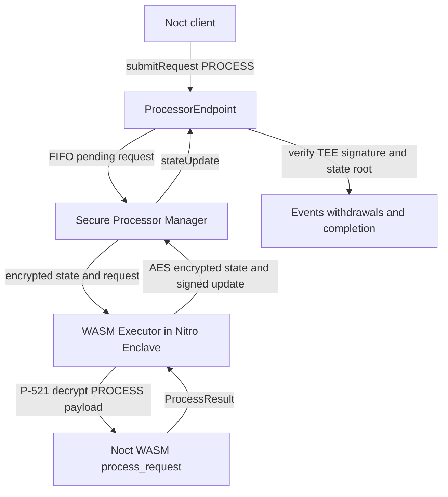
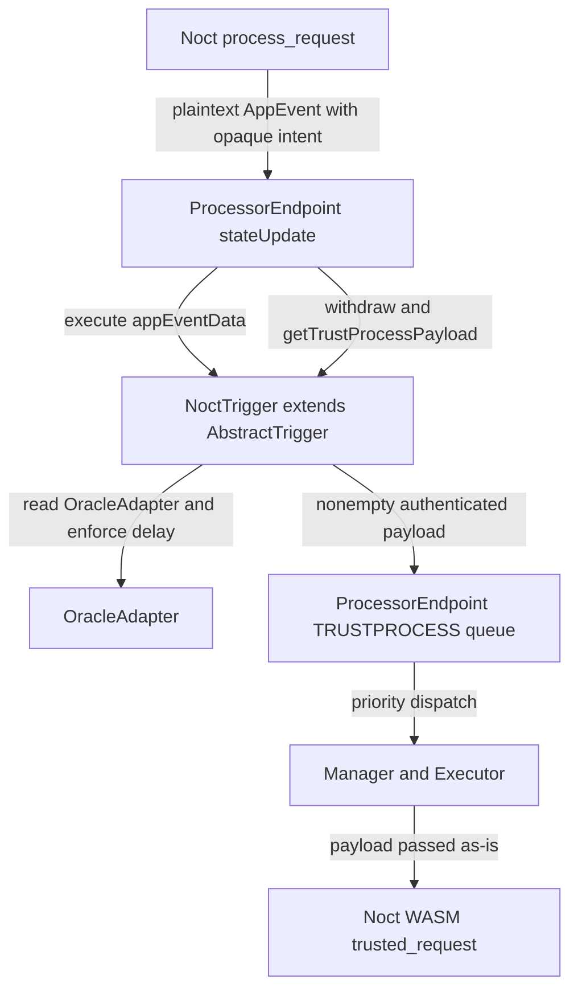

# 3. Vela Integration Architecture

**Status:** Implementation architecture baseline  
**Audience:** Noct engineering team, junior developer, coding agent  
**Normative terms:** MUST = mandatory; MUST NOT = prohibited; SHOULD = recommended; OPEN = unresolved and must not be invented.

## Current official Vela baseline

Noct targets the official Horizen Vela v0.2.0 application model: an EVM `ProcessorEndpoint`, an off-enclave Secure Processor Manager, a Wasmtime-go Executor in an AWS Nitro Enclave, and a TinyGo/WASI guest using `vela-common-go` types. The exact Vela tag and commit selected for deployment MUST be pinned; code and ABI from that pin override older prose.

Noct is a Vela WASM application. It MUST NOT create a parallel private-execution or custody platform.

## ProcessorEndpoint request path



A normal private request uses `ProcessorEndpoint.submitRequest(protocolVersion, appId, PROCESS, encryptedPayload, tokenAddress, assetAmount, maxFeeValue)` or the official facilitated `submitRequestFor` equivalent. `appId` is the Vela `uint64 applicationId` assigned when Noct is deployed; every client, trigger, proof context and Noct state MUST bind the same configured value.

The client obtains the attested TEE P-521 communication public key, derives an ECDH secret, and encrypts the `PROCESS` payload using the official Vela client format (P-521 ECDH, HKDF-SHA256 and AES-GCM). P-521 protects request and user-event confidentiality. It is not the TEE update-signing scheme and is not an oracle signature scheme. The Executor decrypts the payload before calling `process_request`; application state is separately encrypted with the enclave state key.

`ProcessorEndpoint.stateUpdate` verifies the attested TEE's secp256k1 signature, advances the application state root, emits encrypted `UserEvent`s and plaintext `AppEvent`s, accounts for per-app custody, and records withdrawals as pull-payment claims. Noct MUST use the official `ProcessResult`, `PlainEvent`, `AppEvent`, `Withdrawal`, `Address` and checked `Uint256` wire types from the pinned `vela-common-go` version.

## Registered trigger and TRUSTPROCESS path

Noct is deployed with `submitDeployRequestWithTrigger(protocolVersion, deployDescriptor, noctTrigger)`. The same trigger address MUST also be present in the guest's immutable deployment configuration. `NoctTrigger` MUST extend Vela's `AbstractTrigger`; it MUST NOT reimplement `ITrigger` or bypass the base contract's endpoint-only guard and sweep behavior.



Vela invokes the trigger only while finalizing `stateUpdate`. The endpoint calls trigger `execute`, the non-overridable sweep path, and `getTrustProcessPayload`; a nonempty result is enqueued as `TRUSTPROCESS` in Vela's higher-priority trigger queue. The Executor does not P-521-decrypt this payload. It calls the optional export:

```go
//export trusted_request
func trusted_request(appId int64, payloadPtr *byte, payloadLen int32,
    statePtr *byte, stateLen int32) *byte
```

`trusted_request` has no sender and no request type. Its authority comes from the Vela on-chain route: only the trigger registered to this `appId` can cause the endpoint to create this request. Noct additionally domain-separates every trigger payload with the configured chain ID, `ProcessorEndpoint`, Noct `appId`, trigger address, `OracleAdapter`, protocol version, payload kind and operation ID. The guest MUST reject any mismatch, malformed ABI encoding or replay.

The guest SHOULD emit no `AppEvent` from `trusted_request`. If it emits one, the trigger can create another `TRUSTPROCESS`; therefore any such chain MUST have a persisted, monotonic, strictly bounded termination condition.

## Oracle and risk integration

Public Pyth update data is submitted to the on-chain `OracleAdapter`, which verifies exact configured feed IDs through the official Pyth EVM contract. The adapter stores a checked normalized snapshot, a monotonic epoch and its commitment. It does not send HTTP data to the enclave.

A risk-sensitive user request creates an opaque pending intent but MUST NOT mutate debt, collateral or risk state in `process_request`. During that request's `stateUpdate`, `NoctTrigger` reads the adapter, enforces the configured on-chain maximum delay against `block.timestamp`, and returns an authenticated payload binding the intent to the adapter snapshot. `trusted_request` accepts a strictly newer oracle epoch and executes the bound risk transition atomically. Thus a borrow, collateral release or liquidation preparation uses the oracle epoch newly accepted in that same trusted transition.

Noct MUST NOT accept caller-selected prices, a purported 65-byte Pyth ECDSA signature, an HTTP/facilitator snapshot, or enclave self-reported time. Interest accrual uses the authenticated adapter block timestamp carried by the accepted snapshot, not WASI time and not Pyth `publishTime`.

## Coding structure

```text
runtime/
  main.go
  app/
    state/
    transitions/
    risk/
    interest/
    oracle/
    commitments/
    events/
    serialization/
```

`main.go` MUST remain a thin TinyGo/WASI bridge for pointer conversion, calling application functions and serializing results. Lending, oracle acceptance, replay protection and compliance logic belong in `app/`.

## ZK boundary

Vela provides TEE execution, encrypted state, request coordination and attested state updates. It does not natively provide Noct's lending circuits or zkVerify authorization. Any Noir/UltraHonk proof generation, zkVerify receipt validation and proof-to-state binding are custom Noct components layered around the Vela flow. Documentation and code MUST label this as custom ZK, never as a native Vela guarantee.

## DEANONYMIZATION compliance

Privacy does not remove Vela's regulatory path. Noct MUST support Vela request type `DEANONYMIZATION` through `process_request(requestType = 2)`, return the required report in `ProcessResult.Report`, and include the protocol records needed by the authorized scope, including accounts, positions, pending operation locks, oracle epochs and settlement references. `AuthorityRegistry` gates the requester; the Executor encrypts the report to the authority's registered P-521 key; and the Authority Service provides the official nonce/report retrieval path.

Normal users, keepers and liquidators MUST NOT obtain this report or an equivalent privileged state dump. Liquidation discovery remains private as specified in File 20; authorized deanonymization remains available and auditable.