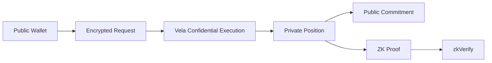

# 5. Privacy Model

**Status:** Implementation architecture baseline  
**Audience:** Noct engineering team, junior developer, coding agent  
**Normative terms:** MUST = mandatory; MUST NOT = prohibited; SHOULD = recommended; OPEN = unresolved and must not be invented.


## Privacy goal

Noct protects the relationship between a public wallet and the user's private lending position.

## Sensitive fields

```text
cashUSDC
collateralUSDC
borrowedZEN
borrowedETH
debtZEN
debtETH
LTV
healthFactor
private transaction history
account → position linkage
```

## Privacy boundaries



## Leakage sources

Review:
- public events;
- settlement timing;
- withdrawal amount;
- recipient address;
- proof public inputs;
- facilitator logs;
- browser logs;
- analytics;
- RPC traces.

## Hard rule

The frontend, facilitator and prover MUST NOT log private financial values.

## V1 claim

The core privacy property is private position state and reduced linkage between public chain activity and individual lending positions. External settlement may remain observable.
