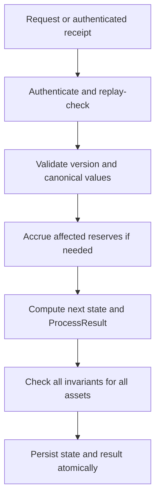
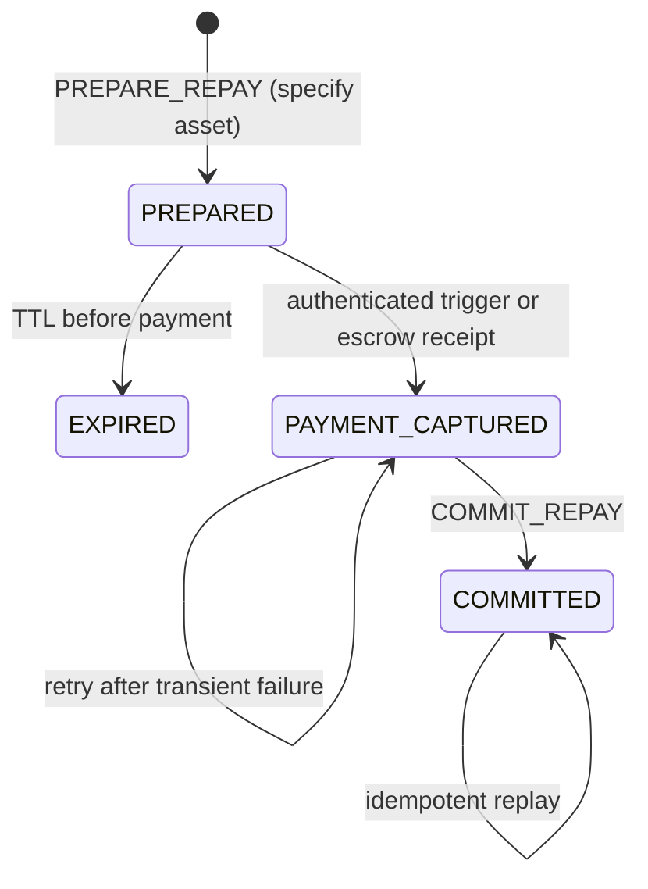
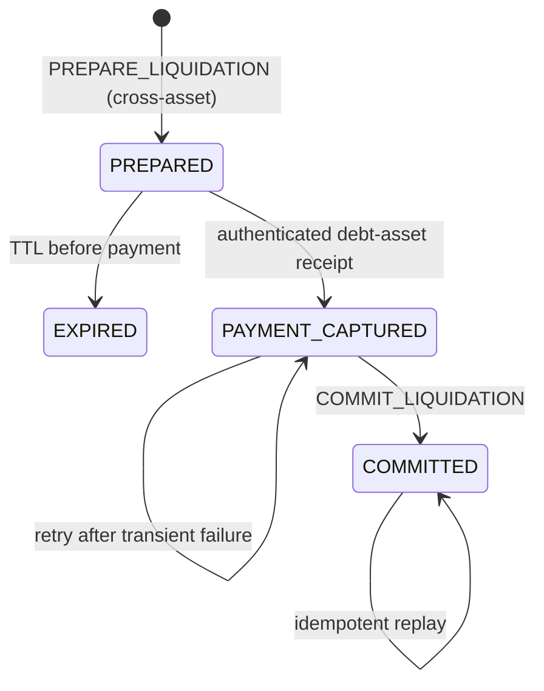

# 12. Complete State Machine V1 (Multi-Collateral)

**Status:** Implementation architecture baseline - MULTI-COLLATERAL  
**Audience:** Noct Finance team (Alex, Daniel), Vela acceleration team, coding agent  
**Normative terms:** MUST = mandatory; MUST NOT = prohibited; SHOULD = recommended; OPEN = unresolved and must not be invented.

## Transition set (Multi-Asset)

```text
# Deposit (per-asset)
T01-USDC: CONSUME_DEPOSIT_USDC
T01-ETH:  CONSUME_DEPOSIT_ETH
T01-ZEN:  CONSUME_DEPOSIT_ZEN

# Cash Withdrawal (per-asset)
T02-USDC: WITHDRAW_CASH_USDC
T02-ETH:  WITHDRAW_CASH_ETH
T02-ZEN:  WITHDRAW_CASH_ZEN

# Supply (per-asset)
T03-USDC: SUPPLY_USDC
T03-ETH:  SUPPLY_ETH
T03-ZEN:  SUPPLY_ZEN

# Release Collateral (per-asset, requires health factor check)
T04-USDC: RELEASE_COLLATERAL_USDC
T04-ETH:  RELEASE_COLLATERAL_ETH
T04-ZEN:  RELEASE_COLLATERAL_ZEN

# Borrow (per-asset, requires health factor check)
T05-USDC: BORROW_USDC
T05-ETH:  BORROW_ETH
T05-ZEN:  BORROW_ZEN

# Withdraw Borrowed Asset (per-asset)
T06-USDC: WITHDRAW_BORROWED_USDC
T06-ETH:  WITHDRAW_BORROWED_ETH
T06-ZEN:  WITHDRAW_BORROWED_ZEN

# Repayment (per-asset, multi-phase)
T07-USDC: PREPARE_REPAY_USDC
T07-ETH:  PREPARE_REPAY_ETH
T07-ZEN:  PREPARE_REPAY_ZEN

T08-USDC: COMMIT_REPAY_USDC
T08-ETH:  COMMIT_REPAY_ETH
T08-ZEN:  COMMIT_REPAY_ZEN

# Liquidation (cross-asset, multi-phase)
T09: PREPARE_LIQUIDATION (specifies debtAsset + collateralAsset)
T10: COMMIT_LIQUIDATION

# Reserve Funding (per-asset)
T11-USDC: CONSUME_RESERVE_FUNDING_USDC
T11-ETH:  CONSUME_RESERVE_FUNDING_ETH
T11-ZEN:  CONSUME_RESERVE_FUNDING_ZEN

# Reserve Accrual (per-asset)
T12-USDC: ACCRUE_RESERVE_USDC
T12-ETH:  ACCRUE_RESERVE_ETH
T12-ZEN:  ACCRUE_RESERVE_ZEN

# Bad-Debt Absorption (per-asset, governance-authenticated; SPEC-04/05)
T13-USDC: ABSORB_BAD_DEBT_USDC
T13-ETH:  ABSORB_BAD_DEBT_ETH
T13-ZEN:  ABSORB_BAD_DEBT_ZEN
```

**Multi-Asset Note:** Repayment and liquidation are intentionally multi-phase. A user request is not proof of payment, and debt MUST NOT decrease before an authenticated inbound payment receipt is captured and consumed. Cross-asset liquidations are supported (e.g., pay ETH debt, seize USDC collateral).

## Universal transition rules (Multi-Asset)

Every transition MUST:

1. authenticate its caller or trusted runtime source;
2. enforce request nonce and expected state/config version where applicable;
3. decode every financial value as a canonical 32-byte big-endian U256;
4. use checked TinyGo-compatible U256 arithmetic and full-width `mulDiv`;
5. accrue each affected reserve before reading current debt;
6. read risk prices only from the latest accepted authenticated `OracleState` epoch;
7. compute the complete next state and `ProcessResult` before committing either;
8. check account, scaled-debt, liquidity, receipt, custody and monotonicity invariants for all assets;
9. atomically persist state and return the matching result, or do neither.

`uint64` is allowed for nonce, version, epoch and timestamp only. Financial logic MUST NOT use `uint64`, `math/big`, or floating-point.



## Shared calculations (Multi-Asset)

For reserve asset `a`:

```text
accountDebt(a) = mulDivUp(account.scaledDebt[a], index[a], RAY)
scaledBorrow(amount) = mulDivUp(amount, RAY, index[a])
partialScaledReduction(amount) = mulDivDown(amount, RAY, index[a])
```

**Multi-Asset Risk Calculations:**

V1 uses **two distinct risk measures** computed from the same raw per-asset USD collateral value but
weighted by two different frozen parameters. They MUST NOT be collapsed into one number.

```text
collateralUsd[a] = mulDivDown(account.collateral[a], oracleState.prices[a], WAD)
```

LTV-weighted collateral — governs how much a user may borrow or release:

```text
ltvCollateralUsd = Σ over assets a:
  mulDivDown(collateralUsd[a], assetConfig[a].collateralFactorWad, WAD)
```

Threshold-weighted collateral — governs whether a position is liquidatable:

```text
thresholdCollateralUsd = Σ over assets a:
  mulDivDown(collateralUsd[a], assetConfig[a].liquidationThresholdWad, WAD)
```

Weighted debt USD (aggregate):

```text
weightedDebtUsd = Σ over assets a:
  currentDebt = mulDivUp(account.scaledDebt[a], reserve[a].borrowIndex, RAY)
  debtUsd = mulDivUp(currentDebt, oracleState.prices[a], WAD)
  mulDivUp(debtUsd, assetConfig[a].borrowFactorWad, WAD)
```

Health factor — the **liquidation** measure, defined on the threshold weighting:

```text
if weightedDebtUsd == 0:
  healthFactor = ∞
else:
  healthFactor = mulDivDown(thresholdCollateralUsd, WAD, weightedDebtUsd)
```

Borrow capacity factor — the **borrowing** measure, defined on the LTV weighting:

```text
if weightedDebtUsd == 0:
  borrowCapacityFactor = ∞
else:
  borrowCapacityFactor = mulDivDown(ltvCollateralUsd, WAD, weightedDebtUsd)
```

Collateral is rounded down and debt is rounded up in both measures, so both are conservative.

### The two gates are distinct (SPEC-01 remediation)

Borrow (T05) and collateral release (T04) are allowed only when the **post-transition** state
satisfies the LTV gate:

```text
postLtvCollateralUsd >= postWeightedDebtUsd
```

Liquidation (T09) is allowed only when the **current** state satisfies the liquidation gate:

```text
thresholdCollateralUsd < weightedDebtUsd     (equivalently healthFactor < WAD)
```

File 10 bounds every asset by `collateralFactorWad < liquidationThresholdWad`. Because both
weightings use `mulDivDown` over the same non-negative `collateralUsd[a]`, this implies

```text
ltvCollateralUsd <= thresholdCollateralUsd    (always)
ltvCollateralUsd <  thresholdCollateralUsd    (whenever any collateralUsd[a] > 0)
```

Therefore a position that has just satisfied the LTV gate necessarily satisfies
`thresholdCollateralUsd >= ltvCollateralUsd >= weightedDebtUsd` and is **not** liquidatable. The
gates cannot coincide. The buffer between them is the ratio
`liquidationThresholdWad / collateralFactorWad` for a single-asset position:

| Asset | `collateralFactorWad` | `liquidationThresholdWad` | Debt growth or collateral price fall required to reach liquidation from a max-LTV position |
|---|---:|---:|---:|
| USDC | 0.90 | 0.95 | 5.56% |
| ETH | 0.80 | 0.85 | 6.25% |
| ZEN | 0.70 | 0.80 | 14.29% |

This buffer is the protocol's only defense against the interest accrual and price movement that
occur between two risk checks. An implementation MUST NOT substitute `collateralFactorWad` for
`liquidationThresholdWad` in the liquidation gate, and MUST NOT substitute
`liquidationThresholdWad` for `collateralFactorWad` in the borrow gate. A configuration in which the
two parameters are equal for any asset MUST be rejected at decode time.


## T01: CONSUME_DEPOSIT (Per-Asset)

Input is an authenticated Vela-confirmed deposit receipt for asset ∈ {USDC, ETH, ZEN}, not a user assertion.

Preconditions:

- receipt asset is one of {USDC, ETH, ZEN} and purpose is `DEPOSIT`;
- required finality has been reached;
- receipt is `PENDING` and has never been consumed;
- receipt beneficiary and amount are authenticated receipt fields;
- amount is nonzero.

Atomic effects:

```text
account.cash[asset] += receipt.amount
receipt.status = CONSUMED
account.positionNonce += 1 only if this consumes a user-authorized deposit request
stateVersion += 1
```

A repeated receipt delivery returns the stored successful outcome and performs no second credit. This transition consumes the matching `PendingInbound[asset]` amount into the asset ledger.

## T02: WITHDRAW_CASH (Per-Asset)

A simple cash withdrawal is one Noct transition, not a debit-after-settlement workflow. Works for any asset ∈ {USDC, ETH, ZEN}.

Preconditions:

- valid user authorization and nonce;
- nonzero amount;
- `cash[asset] >= amount`;
- deterministic withdrawal ID is unused.

Atomic effects:

```text
account.cash[asset] -= amount
account.positionNonce += 1
stateVersion += 1
ProcessResult.Withdrawals += {
    withdrawalID, asset, amount, destination
}
```

The debit and withdrawal emission MUST be committed together. Emission moves the amount from `Ledger[asset]` to `PendingOutbound[asset]`; later Vela execution reduces both custody and pending outbound. Retrying the same accepted request MUST return the same result and MUST NOT emit a second withdrawal.

## T03: SUPPLY (Per-Asset)

This is an internal reclassification for asset ∈ {USDC, ETH, ZEN}; no custody transfer is emitted.

Preconditions: valid user nonce, nonzero amount, and `cash[asset] >= amount`.

```text
cash[asset] -= amount
collateral[asset] += amount
positionNonce += 1
stateVersion += 1
```

## T04: RELEASE_COLLATERAL (Per-Asset)

This converts collateral to private cash for asset ∈ {USDC, ETH, ZEN}; a separate T02 is needed to withdraw it.

Preconditions:

- latest accepted authenticated oracle epoch is fresh;
- all reserves with nonzero totalScaledDebt are accrued to the oracle timestamp;
- nonzero amount and `collateral[asset] >= amount`;
- the post-release position satisfies the **LTV gate**: `postLtvCollateralUsd >= postWeightedDebtUsd` if any debt remains.

```text
collateral[asset] -= amount
cash[asset] += amount
positionNonce += 1
stateVersion += 1
```

**Multi-Asset Note:** Health factor is computed across ALL collateral and ALL debt assets. Releasing one collateral asset affects the aggregate health factor.

## T05: BORROW (Per-Asset)

Borrow any asset ∈ {USDC, ETH, ZEN} against multi-asset collateral.

Preconditions:

- latest accepted authenticated oracle epoch is fresh;
- all reserves with nonzero totalScaledDebt are accrued to oracle timestamp before aggregate debt valuation;
- amount is nonzero and `reserve[asset].availableLiquidity >= amount`;
- `scaledDelta = mulDivUp(amount, RAY, currentIndex[asset])` succeeds and is nonzero;
- the post-borrow position satisfies the **LTV gate**: `postLtvCollateralUsd >= postWeightedDebtUsd`.

The LTV gate uses `collateralFactorWad`. It is strictly tighter than the liquidation gate, which
uses `liquidationThresholdWad`; see "Shared calculations". A borrow that would leave the position
liquidatable under the threshold weighting MUST be rejected even if it would satisfy it.

Atomic effects for selected asset:

```text
account.scaledDebt[asset] += scaledDelta
reserve[asset].totalScaledDebt += scaledDelta
reserve[asset].availableLiquidity -= amount
account.borrowed[asset] += amount
account.positionNonce += 1
stateVersion += 1
```

**Multi-Asset Note:** Health factor is computed across ALL collateral assets and ALL debt assets (including the new debt). A user with USDC + ETH collateral can borrow ZEN; health factor validates the aggregate position.

T05 credits a private borrowed balance in Vela custody. It does not have to emit a native withdrawal. A client that wants wallet delivery submits T06 separately after T05 commits.

## T06: WITHDRAW_BORROWED_ASSET (Per-Asset)

Withdraw borrowed balance for any asset ∈ {USDC, ETH, ZEN}.

Preconditions: valid user nonce, nonzero amount, sufficient private borrowed balance for that asset, and unused deterministic withdrawal ID.

Atomic effects:

```text
account.borrowed[asset] -= amount
account.positionNonce += 1
stateVersion += 1
ProcessResult.Withdrawals += {
    withdrawalID, asset, amount, destination
}
```

Debt and reserve available liquidity do not change. The balance debit and Vela withdrawal emission are atomic and idempotent exactly as in T02.

## Repayment lifecycle (Per-Asset)



### T07: PREPARE_REPAY (Per-Asset)

Preparation creates a quote and lock for repaying debt in a specific asset ∈ {USDC, ETH, ZEN}; it does not move funds or reduce debt.

Preconditions:

- valid user authorization and nonce;
- no other pending debt-mutation lock for the same account and asset;
- the account holds fewer than `config.maxConcurrentRepayLocks` (= 1) active repay locks in total,
  across all assets;
- if a repay lock for this account and asset previously expired without payment capture, at least
  `config.repayLockCooldownSeconds` (= 3600) MUST have elapsed since that expiry, measured against the
  latest accepted oracle timestamp and never host time;
- selected reserve is accrued;
- requested amount is nonzero and no greater than current debt for that asset;
- requested amount satisfies `amount mod quantum[asset] == 0` (File 08), unless this is a full
  repayment, which quotes `fullRepayPayment` as defined there.

Quote rules:

```text
currentDebt = mulDivUp(scaledDebt[asset], currentIndex[asset], RAY)

if fullRepay is requested:
    paymentAmount = currentDebt
    scaledDebtReduction = all account scaledDebt[asset]
else:
    require requestedAmount < currentDebt
    paymentAmount = requestedAmount
    scaledDebtReduction = mulDivDown(requestedAmount, RAY, currentIndex[asset])
    require scaledDebtReduction > 0
```

The pending operation binds account, asset (debtAsset), exact payment amount, scaled reduction, quote index, destination custody endpoint, expiry, nonce, config commitment and operation ID. While it is active, no borrow or repayment may mutate that account's scaled debt for the selected asset.

**Liquidation priority over a repay lock (SPEC-06 remediation).** A repay lock does **not** block
liquidation once the account is liquidatable. The previous text forbade borrow, repayment *and
liquidation* from touching the locked slice, which made `PREPARE_REPAY` a free, renewable
liquidation block: an attacker could prepare a repayment of one native quantum of debt, pay nothing,
let the TTL lapse, and re-prepare — indefinitely, without funding, while interest accrued into bad
debt. The corrected precedence is:

```text
if the account satisfies the liquidation gate (thresholdCollateralUsd < weightedDebtUsd):
    T09 PREPARE_LIQUIDATION proceeds and forcibly supersedes any repay lock on the
        (account, debtAsset) pair. The superseded repay operation is marked EXPIRED in the
        same transition, its lock is released, and no debt is reduced by it.
else:
    the repay lock is respected and T09 is not eligible anyway.
```

Superseding is atomic with the liquidation preparation: both roots update in one transition, so an
operation can never be left `PREPARED` with its lock removed. A repay lock therefore protects a
solvent borrower's quote from competing repayments, and nothing more. It confers no immunity once the
position is unsafe.

Combined with `maxConcurrentRepayLocks = 1` and `repayLockCooldownSeconds = 3600` in the
preconditions, the worst case a borrower can now achieve is one unpaid lock per hour per asset, each
of which is void the moment the position becomes liquidatable.


Atomic effects: create `PREPARED` operation, install the debt lock, increment the user nonce and state version. Debt and reserve liquidity are unchanged.

The pre-payment lock may expire after the configured TTL. Expiry removes only the lock and marks the operation `EXPIRED`; it does not refund anything because no payment has been captured.

### Payment capture for repayment

The on-chain trigger/escrow path accepts the exact prepared asset and amount and binds them to `operationID`. After required finality, trusted Vela/TRUSTPROCESS integration records an authenticated receipt and advances the operation to `PAYMENT_CAPTURED` idempotently.

Once captured:

- the receipt contributes to `PendingInbound[asset]`;
- the operation and lock MUST NOT expire;
- Noct MUST NOT issue a timeout refund;
- `COMMIT_REPAY` is retried until successful.

### T08: COMMIT_REPAY (Per-Asset)

Only authenticated TRUSTPROCESS processing may invoke commit. It MUST verify the captured receipt matches the prepared operation and remains unconsumed.

Atomic effects:

```text
# scaledDebtReduction is RE-DERIVED at commit per the drift rule below; it is
# not replayed from the stored quote unless the drift bound permits exact reuse.
account.scaledDebt[asset] -= scaledDebtReduction
reserve[asset].totalScaledDebt -= scaledDebtReduction
reserve[asset].availableLiquidity += operation.paymentAmount
receipt.status = CONSUMED
operation.status = COMMITTED
remove debt lock
stateVersion += 1
```

Full repayment clears all scaled debt for that asset. Partial repayment subtracts the stored nonzero floor-rounded reduction. Any remaining scaled debt continues accruing.

**Index-drift bound at commit (SPEC-07 remediation).** Preparation and commit are separated by an
authenticated on-chain payment, which may take many blocks. The reserve index accrues throughout. The
previous rule — "the commit uses the prepared scaled quantity even if the reserve index has since
increased" — let a borrower prepare a quote, wait for the index to rise, then pay the stale (smaller)
amount and receive credit for a scaled reduction computed at the stale index, systematically
under-repaying. Commit is now drift-bounded:

```text
currentIndex = reserve[asset].borrowIndex          # after accrual to the oracle timestamp
driftRay     = mulDivDown(currentIndex, RAY, operation.quoteIndex)

require operation.quoteIndex <= currentIndex       # index is monotonic; else fail closed
require driftRay <= config.maxQuoteIndexDriftRay   # 1.01 RAY = 1% maximum drift
```

On success the reduction is **re-derived from the captured payment at the current index** rather than
replayed from the quote:

```text
if the operation is a full repayment:
    scaledDebtReduction = account.scaledDebt[asset]        # clears the position exactly
else:
    scaledDebtReduction = mulDivDown(operation.paymentAmount, RAY, currentIndex)
    require scaledDebtReduction > 0
    require scaledDebtReduction <= account.scaledDebt[asset]
```

Re-deriving at `currentIndex` means the payment always buys exactly the debt it is worth at commit
time, which removes the arbitrage entirely; the drift bound exists so the re-derived quantity cannot
differ materially from what the borrower authorized, preserving informed consent.

On drift-bound failure the commit MUST revert without any debt reduction, liquidity credit or receipt
consumption. The operation is marked `EXPIRED`, its lock is released, and the **captured receipt is
preserved unconsumed** so the borrower can immediately re-prepare against it at the current index. The
receipt MUST NOT be discarded, refunded by Noct, or left in a state where no operation can consume it;
File 22 governs its recovery. This is the only case in which a `PAYMENT_CAPTURED` operation may leave
that state without reaching `COMMITTED`.


An already committed `operationID` returns the original result without a second subtraction or liquidity credit.

## Liquidation lifecycle (Cross-Asset)



Cross-contract phases are not atomic. Safety comes from exclusive locks, authenticated receipts, exact operation binding, append-only replay protection, and idempotent commit—not from claiming that debt payment, private-state mutation and collateral withdrawal occur in one EVM transaction.

### T09: PREPARE_LIQUIDATION (Cross-Asset)

**Multi-Asset Feature:** Liquidation can pay debt in one asset and seize collateral in a different asset (e.g., pay ETH debt, seize USDC collateral).

Preconditions:

- latest accepted authenticated `OracleState` is fresh;
- all reserves with nonzero totalScaledDebt are accrued to oracle timestamp;
- borrower is liquidatable under the **liquidation gate**: `thresholdCollateralUsd < weightedDebtUsd` (equivalently `healthFactor < WAD`);
- no conflicting account/asset **collateral** lock exists; a conflicting **repay** lock on the same
  `(account, debtAsset)` pair does not block this transition and is superseded atomically as
  specified in `T07 PREPARE_REPAY` (SPEC-06);
- requested debt-asset payment is nonzero.

**Debt Asset Selection (Deterministic Waterfall for V1):**
```text
Priority: ETH → ZEN → USDC
Select first asset where account.scaledDebt[asset] > 0
```

**Collateral Asset Selection:**
```text
For each collateral asset, compute bonus-adjusted value:
  baseValue = mulDivDown(collateral[a], price[a], WAD)
  valueWithBonus = mulDivUp(baseValue, WAD + liquidationBonus[a], WAD)

Select collateral asset with highest valueWithBonus
```

Maximum payment (SPEC-04 / SPEC-05 remediation):

```text
currentDebt    = mulDivUp(borrower.scaledDebt[debtAsset], index[debtAsset], RAY)
currentDebtUsd = mulDivUp(currentDebt, OracleState.prices[debtAsset], WAD)

# Rule 1 — economic floor. Below it no rational liquidator acts, so the position
# cannot be left dangling: it is routed to protocol bad-debt absorption instead.
if currentDebtUsd < config.minLiquidationDebtUsdWad:
    revert LIQUIDATION_UNECONOMIC        # caller MUST use T13 ABSORB_BAD_DEBT

closeLimit   = mulDivDown(currentDebt, assetConfig[debtAsset].closeFactorWad, WAD)
closeLimitUsd = mulDivUp(closeLimit, OracleState.prices[debtAsset], WAD)

# Rule 2 — close-factor escalation. If the configured slice alone is uneconomic
# but the position is not, escalate to a full close so the operation is worth
# executing. This removes the "dust slice" case entirely.
if closeLimitUsd < config.minLiquidationDebtUsdWad:
    closeLimit = currentDebt

# Rule 3 — the slice must be payable in whole native units of the debt asset,
# because the liquidator's payment arrives as an on-chain transfer.
closeLimit = quantizeDown(closeLimit, debtAsset)
require closeLimit > 0                      # else revert LIQUIDATION_UNECONOMIC

maxPayment = min(currentDebt, closeLimit)
require paymentAmount <= maxPayment
require paymentAmount mod quantum[debtAsset] == 0
```

Rules 1 and 2 together close the gap that previously existed between `12:392`, which rejected dust
liquidations "for explicit bad-debt handling", and `32:28-29`, which stated that V1 has **no** bad-debt
handling. V1 now has one: `T13 ABSORB_BAD_DEBT`, specified below. A dust position is never left
simultaneously unliquidatable and accruing.

An implementation MUST NOT silently seize collateral for a zero debt payment, and MUST NOT treat
`closeLimit = 0` as "seize nothing but still transfer collateral".

Scaled reduction follows repayment rules: all scaled debt only when payment equals current debt;
otherwise `mulDivDown(paymentAmount, RAY, index[debtAsset])` and require nonzero.


**Cross-Asset USD Conversion:**

```text
debtPrice       = OracleState.prices[debtAsset]
collateralPrice = OracleState.prices[collateralAsset]

debtPaymentUsd       = mulDivUp(paymentAmount, debtPrice, WAD)
baseCollateralNeeded = mulDivUp(debtPaymentUsd, WAD, collateralPrice)
collateralWithBonus  = mulDivUp(
    baseCollateralNeeded,
    WAD + assetConfig[collateralAsset].liquidationBonusWad,
    WAD)

# SPEC-02: the seizure leaves through a custody boundary, so it must be
# native-representable. quantizeDown rounds in the borrower's favour and can
# never cause the protocol to emit more value than it seized.
collateralWithBonus  = quantizeDown(collateralWithBonus, collateralAsset)

collateralToWithdraw = min(borrower.collateral[collateralAsset], collateralWithBonus)
require collateralToWithdraw > 0                  # else revert NO_SEIZABLE_COLLATERAL

seizedUsd = mulDivDown(collateralToWithdraw, collateralPrice, WAD)

# SPEC-05: profitability guard. The min() clamp above binds exactly when the
# borrower does not have enough of this collateral asset to cover the payment
# plus bonus. Clamping alone would let an operation be created in which the
# liquidator pays real value and receives less back — such an operation is never
# executed, so the position rots into bad debt while appearing liquidatable.
if seizedUsd < debtPaymentUsd:
    revert LIQUIDATION_UNPROFITABLE               # route to T13 ABSORB_BAD_DEBT
```

Both USD conversions use `mulDivUp` on the debt side and `mulDivDown` on the seizure side, so the
guard is evaluated pessimistically against the liquidator. `debtPaymentUsd` is rounded up and
`seizedUsd` is rounded down; the inequality therefore only passes when the liquidator recovers at
least the full USD value of the payment with genuine margin for the bonus.

The clamp may legitimately bind in the band where the borrower is short of bonus but still covers
principal — that band remains liquidatable and is the intended behaviour. Below it the position is
genuinely undercollateralized and MUST be resolved by `T13`, not by creating an operation no
liquidator will execute.


Preparation stores the accepted oracle epoch, debtAsset, collateralAsset, payment amount, scaled reduction and collateral amount. It exclusively locks that scaled-debt slice and collateral amount, increments the initiating request nonce as defined by the authorization model, and changes no debt, liquidity or collateral ownership.

A prepared liquidation may expire only before payment capture. Expiry releases its locks.

### Payment capture for liquidation

The liquidator sends the exact prepared debt asset amount through the authenticated trigger/escrow path. A finalized receipt bound to the operation advances it to `PAYMENT_CAPTURED`. There is no free liquidation: without this receipt, commit is impossible and no collateral withdrawal may be emitted.

After capture, the operation cannot timeout or refund through Noct. Commit is retried until it succeeds idempotently.

### T10: COMMIT_LIQUIDATION (Cross-Asset)

Only authenticated TRUSTPROCESS processing may invoke commit. It verifies the captured receipt and stored locks, then applies the same index-drift bound as `T08` before mutating state:

```text
currentIndex = reserve[debtAsset].borrowIndex      # after accrual to the oracle timestamp
driftRay     = mulDivDown(currentIndex, RAY, operation.quoteIndex)

require operation.quoteIndex <= currentIndex
require driftRay <= config.maxQuoteIndexDriftRay
require borrower.collateral[collateralAsset] >= operation.collateralToWithdraw
```

If the drift bound fails, the commit reverts with no debt reduction, no liquidity credit, no
collateral movement and no receipt consumption; the operation is marked `EXPIRED`, its locks are
released, and the captured receipt is preserved unconsumed exactly as in `T08`.

On success the debt reduction is re-derived at the current index, while the **seizure is not**:

```text
if the operation closes the full debt:
    scaledDebtReduction = borrower.scaledDebt[debtAsset]
else:
    scaledDebtReduction = mulDivDown(operation.paymentAmount, RAY, currentIndex)
    require scaledDebtReduction > 0
    require scaledDebtReduction <= borrower.scaledDebt[debtAsset]
```

`collateralToWithdraw` is replayed **exactly as quoted** at preparation. The liquidator authorized a
specific payment for a specific collateral amount at a specific oracle epoch; silently re-pricing the
seizure at commit would break that authorization and could hand the liquidator less than they agreed
to accept. The drift bound exists precisely to keep the two legs close enough that replaying the
quoted seizure remains fair while the debt side is corrected to current value. If the price has moved
far enough to matter, the bound fails and the liquidator re-prepares against a fresh epoch with a
fresh quote.

It then atomically performs:

```text
borrower.scaledDebt[debtAsset] -= scaledDebtReduction
reserve[debtAsset].totalScaledDebt -= scaledDebtReduction
reserve[debtAsset].availableLiquidity += operation.paymentAmount
borrower.collateral[collateralAsset] -= operation.collateralToWithdraw
receipt.status = CONSUMED
operation.status = COMMITTED
remove debt and collateral locks
stateVersion += 1

ProcessResult.Withdrawals += Withdrawal{
    TokenAddress: collateralAsset,
    Amount: operation.collateralToWithdraw,
    DestinationAddress: operation.destination
}
```

`operation.collateralToWithdraw` was quantized with `quantizeDown` at preparation (File 08), so the
emitted `Amount` is always a whole multiple of `quantum[collateralAsset]` and `wadToNative` at the
custody boundary is exact.


**Multi-Asset Note:** Collateral is sent as a direct Vela withdrawal in the collateralAsset to the liquidator; it is not credited as internal `cash[collateralAsset]`. Commit simultaneously moves captured debt tokens from pending inbound to reserve liquidity and seized collateral from the internal ledger to pending outbound.

An already committed operation returns the original `ProcessResult`, allowing Vela/TRUSTPROCESS delivery retries without duplicate debt reduction, liquidity credit or collateral withdrawal.

## T11: CONSUME_RESERVE_FUNDING (Per-Asset)

This consumes a finalized authenticated Noct-funding receipt for asset ∈ {USDC, ETH, ZEN} exactly once:

```text
reserve[asset].availableLiquidity += receipt.amount
receipt.status = CONSUMED
stateVersion += 1
```

There is no user supplier balance. Duplicate receipts cannot increase liquidity twice.

## T12: ACCRUE_RESERVE (Per-Asset)

Any authenticated transaction may request deterministic maintenance accrual for a specific reserve. It applies File 19 to one reserve (asset ∈ {USDC, ETH, ZEN}) using the latest accepted OracleState timestamp. It changes only `borrowIndex[asset]`, `lastAccrualTimestamp[asset]`, and state version. It emits no withdrawal and changes no scaled debt or liquidity.

**Multi-Asset Note:** Each reserve accrues independently. A transaction touching multiple assets may accrue multiple reserves.

## T13: ABSORB_BAD_DEBT (Per-Asset)

T13 is the terminal resolution for a position that is liquidatable under the threshold gate but
**cannot** be resolved by T09 — either because its debt is below `minLiquidationDebtUsdWad`
(`LIQUIDATION_UNECONOMIC`) or because no collateral asset yields a profitable seizure
(`LIQUIDATION_UNPROFITABLE`, `NO_SEIZABLE_COLLATERAL`). Before this transition existed, File 12
routed such positions to "explicit bad-debt handling" while File 32 stated V1 had none, leaving them
permanently liquidatable, permanently unliquidated, and permanently accruing.

**Access control.** T13 MUST be invokable only by the committed `governanceIdentity` field of
`GlobalRootStateV1` (File 09), frozen
in initial state alongside `velaApplicationID` and `chainID`. A user-authorized request MUST NOT
reach it. It emits no withdrawal and cannot be used to move value to a caller-chosen destination.

Preconditions:

- caller is the committed `governanceIdentity`;
- the latest accepted authenticated `OracleState` epoch is fresh;
- all reserves with nonzero `totalScaledDebt` are accrued to the oracle timestamp;
- the account is liquidatable: `thresholdCollateralUsd < weightedDebtUsd`;
- the position is **provably unresolvable by liquidation**: at the current accepted epoch, a T09
  preparation reverts for every `(debtAsset, collateralAsset)` pair the waterfall and selection rules
  could choose;
- no active debt or collateral lock exists on the account.

Atomic effects — the account is wound down completely:

```text
totalSeizedUsd = 0

# 1. Return every protocol-held balance to its own reserve. This is a ledger
#    reallocation only: Ledger[a] is unchanged, so custody conservation holds.
for each asset c in {USDC, ETH, ZEN}:
    seized = account.cash[c] + account.collateral[c] + account.borrowed[c]
    if seized > 0:
        reserve[c].availableLiquidity += seized
        totalSeizedUsd += mulDivDown(seized, prices[c], WAD)
    account.cash[c]        = 0
    account.collateral[c]  = 0
    account.borrowed[c]    = 0

# 2. Write off every debt asset. Debt is a receivable, not custody, so this
#    changes no Ledger term.
writtenOffUsd = 0
for each debt asset d in {USDC, ETH, ZEN}:
    scaled = account.scaledDebt[d]
    if scaled > 0:
        debtUsd = mulDivUp(mulDivUp(scaled, index[d], RAY), prices[d], WAD)
        account.scaledDebt[d]        = 0
        reserve[d].totalScaledDebt  -= scaled
        reserve[d].writtenOffDebtUsd += debtUsd
        writtenOffUsd               += debtUsd

# 3. Record the shortfall as protocol bad debt (USD accounting quantity).
#    The subtraction is guarded, never performed speculatively: a checked
#    subtraction of a larger value would revert, so compare first.
if writtenOffUsd > totalSeizedUsd:
    protocolBadDebtUsd += writtenOffUsd - totalSeizedUsd

# 4. Release locks and advance versions.
remove all debt and collateral locks for the account
account.positionNonce += 1
stateVersion += 1
no ProcessResult.Withdrawals entry is emitted
```

`reserve[d].writtenOffDebtUsd` and `protocolBadDebtUsd` are **USD accounting quantities**, not token
balances. They MUST NOT appear in `Ledger[a]`, in the File 11 custody equation, or in any withdrawal.
They exist so that absorbed loss is measurable and auditable rather than silently vanishing, and they
are committed in `reserveRoot` (File 09) so a proof constrains them.

Postconditions:

- `account.scaledDebt[d] = 0` for every `d`, so the account is never liquidatable again;
- `reserve[d].totalScaledDebt = Σ account.scaledDebt[d]` still holds (invariant 1);
- `Ledger[a]` is unchanged for every `a`, so custody conservation is preserved exactly;
- no value leaves the protocol; the shortfall is borne by Noct's funded reserves, matching the
  protocol-funded-reserve model in File 11.

T13 is idempotent on a wound-down account: with all balances zero, `writtenOffUsd = totalSeizedUsd = 0`
and the transition is a no-op apart from `stateVersion`. A repeat invocation MUST NOT create bad debt
twice.

## Recovery and retry rules

| Situation | Required behavior |
|---|---|
| Duplicate confirmed deposit/funding receipt (any asset) | Return prior outcome; no second credit |
| Simple withdrawal result redelivered (any asset) | Return identical result; Vela deduplicates withdrawal ID |
| Prepared operation expires before payment | Release locks; no financial mutation |
| Payment is captured, commit delivery fails | Keep locks and receipt; retry commit indefinitely |
| Commit succeeds but acknowledgement is lost | Replay returns stored committed result |
| Captured receipt conflicts with operation | Quarantine and halt affected operation; never guess or refund |
| Custody or scaled-debt invariant fails (any asset) | Fail closed and alert; no partial mutation |
| Oracle unavailable or stale | Block risk-sensitive preparation; allow receipt commits and risk-reducing repayment |

## Final invariants (Multi-Asset)

Every committed transition MUST preserve:

```text
For each asset a ∈ {USDC, ETH, ZEN}:
  reserve[a].totalScaledDebt = Σ account.scaledDebt[a]
  Custody[a] = Ledger[a] + PendingInbound[a] + PendingOutbound[a]
  reserve[a].availableLiquidity >= 0
  borrowIndex[a] and lastAccrualTimestamp[a] never decrease

Global:
  stateVersion, nonces, receipt states and operation states never regress
  
Multi-Asset Specific (two distinct gates — SPEC-01):
  For positions with debt:
    healthFactor         = thresholdCollateralUsd / weightedDebtUsd   (threshold-weighted)
    borrowCapacityFactor = ltvCollateralUsd      / weightedDebtUsd   (LTV-weighted)

  thresholdCollateralUsd < weightedDebtUsd  ⟹ position is liquidatable (T09 permitted)
  ltvCollateralUsd       >= weightedDebtUsd ⟹ borrow/release permitted (T04, T05)

  Because collateralFactorWad[a] < liquidationThresholdWad[a] for every a:
    ltvCollateralUsd <= thresholdCollateralUsd
  so the two gates are separated by a strictly positive buffer whenever collateral is nonzero.
  A position satisfying the borrow gate is never simultaneously liquidatable.
```

A `ProcessResult.Withdrawals` entry without the matching atomic ledger debit is invalid. A debt reduction without consumption of a matching captured payment receipt is invalid.
