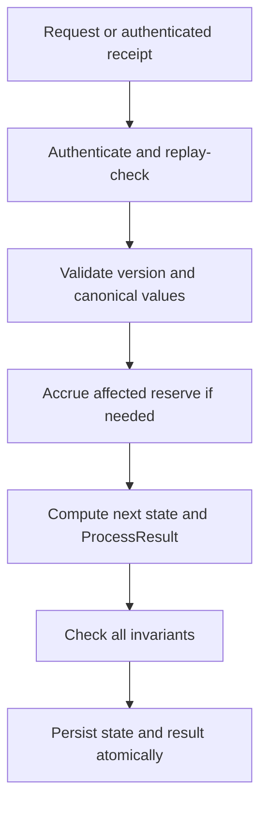
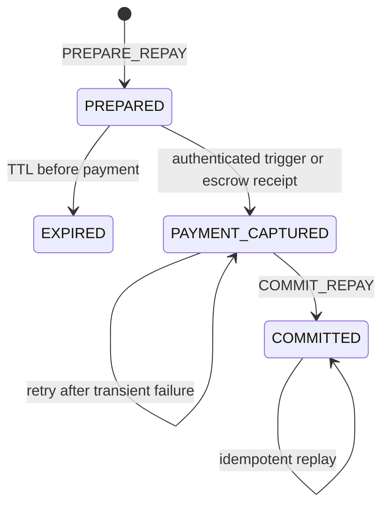
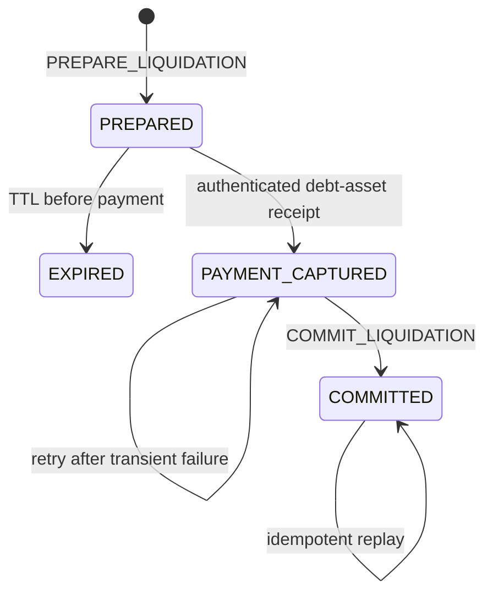

# 12. Complete State Machine

**Status:** Implementation architecture baseline  
**Audience:** Noct engineering team, junior developer, coding agent  
**Normative terms:** MUST = mandatory; MUST NOT = prohibited; SHOULD = recommended; OPEN = unresolved and must not be invented.

## Transition set

```text
T01 CONSUME_DEPOSIT_USDC
T02 WITHDRAW_CASH_USDC
T03 SUPPLY_USDC
T04 RELEASE_COLLATERAL_USDC
T05 BORROW_ZEN / BORROW_ETH
T06 WITHDRAW_BORROWED_ASSET
T07 PREPARE_REPAY
T08 COMMIT_REPAY
T09 PREPARE_LIQUIDATION
T10 COMMIT_LIQUIDATION
T11 CONSUME_RESERVE_FUNDING
T12 ACCRUE_RESERVE
```

Repayment and liquidation are intentionally multi-phase. A user request is not proof of payment, and debt MUST NOT decrease before an authenticated inbound payment receipt is captured and consumed.

## Universal transition rules

Every transition MUST:

1. authenticate its caller or trusted runtime source;
2. enforce request nonce and expected state/config version where applicable;
3. decode every financial value as a canonical 32-byte big-endian U256;
4. use checked TinyGo-compatible U256 arithmetic and full-width `mulDiv`;
5. accrue each affected reserve before reading current debt;
6. read risk prices only from the latest accepted authenticated `OracleState` epoch;
7. compute the complete next state and `ProcessResult` before committing either;
8. check account, scaled-debt, liquidity, receipt, custody and monotonicity invariants;
9. atomically persist state and return the matching result, or do neither.

`uint64` is allowed for nonce, version, epoch and timestamp only. Financial logic MUST NOT use `uint64`, `math/big`, or floating-point.



## Shared calculations

For reserve asset `a`:

```text
accountDebt(a) = mulDivUp(account.scaledDebt[a], index[a], RAY)
scaledBorrow(amount) = mulDivUp(amount, RAY, index[a])
partialScaledReduction(amount) = mulDivDown(amount, RAY, index[a])
```

Risk values use the latest accepted `OracleState`:

```text
collateralUsd = mulDivDown(collateralUSDC, usdcPrice, WAD)
debtUsd =
    mulDivUp(debtZEN, zenPrice, WAD) +
    mulDivUp(debtETH, ethPrice, WAD)
```

Borrow and collateral release are allowed only when:

```text
postDebtUsd <= mulDivDown(postCollateralUsd, maxLTVWad, WAD)
```

Liquidation is allowed only when:

```text
debtUsd > mulDivDown(collateralUsd, liquidationThresholdWad, WAD)
```

The liquidation threshold MUST NOT gate ordinary borrow or release. Collateral is rounded down and debt is rounded up.

## T01: CONSUME_DEPOSIT_USDC

Input is an authenticated Vela-confirmed USDC deposit receipt, not a user assertion.

Preconditions:

- receipt asset is USDC and purpose is `DEPOSIT`;
- required finality has been reached;
- receipt is `PENDING` and has never been consumed;
- receipt beneficiary and amount are authenticated receipt fields;
- amount is nonzero.

Atomic effects:

```text
account.cashUSDC += receipt.amount
receipt.status = CONSUMED
account.positionNonce += 1 only if this consumes a user-authorized deposit request
stateVersion += 1
```

A repeated receipt delivery returns the stored successful outcome and performs no second credit. This transition consumes the matching `PendingInbound[USDC]` amount into the USDC ledger.

## T02: WITHDRAW_CASH_USDC

A simple cash withdrawal is one Noct transition, not a debit-after-settlement workflow.

Preconditions:

- valid user authorization and nonce;
- nonzero amount;
- `cashUSDC >= amount`;
- deterministic withdrawal ID is unused.

Atomic effects:

```text
account.cashUSDC -= amount
account.positionNonce += 1
stateVersion += 1
ProcessResult.Withdrawals += {
    withdrawalID, asset: USDC, amount, destination
}
```

The debit and withdrawal emission MUST be committed together. Emission moves the amount from `Ledger[USDC]` to `PendingOutbound[USDC]`; later Vela execution reduces both custody and pending outbound. Retrying the same accepted request MUST return the same result and MUST NOT emit a second withdrawal.

## T03: SUPPLY_USDC

This is an internal reclassification; no custody transfer is emitted.

Preconditions: valid user nonce, nonzero amount, and `cashUSDC >= amount`.

```text
cashUSDC -= amount
collateralUSDC += amount
positionNonce += 1
stateVersion += 1
```

## T04: RELEASE_COLLATERAL_USDC

This converts collateral to private cash; a separate T02 is needed to withdraw it.

Preconditions:

- latest accepted authenticated oracle epoch is fresh;
- affected reserves are accrued to the oracle timestamp;
- nonzero amount and `collateralUSDC >= amount`;
- the post-release position satisfies `maxLTV` if any debt remains.

```text
collateralUSDC -= amount
cashUSDC += amount
positionNonce += 1
stateVersion += 1
```

Passing the liquidation threshold alone is insufficient. The stricter `maxLTV` test gates release.

## T05: BORROW_ZEN / BORROW_ETH

Preconditions:

- latest accepted authenticated oracle epoch is fresh;
- both debt reserves are accrued before total position debt is valued;
- amount is nonzero and `reserve.availableLiquidity >= amount`;
- `scaledDelta = mulDivUp(amount, RAY, currentIndex)` succeeds and is nonzero;
- the post-borrow position satisfies `maxLTV`.

Atomic effects for selected asset:

```text
account.scaledDebt += scaledDelta
reserve.totalScaledDebt += scaledDelta
reserve.availableLiquidity -= amount
account.borrowedBalance += amount
account.positionNonce += 1
stateVersion += 1
```

T05 credits a private borrowed balance in Vela custody. It does not have to emit a native withdrawal. A client that wants wallet delivery submits T06 separately after T05 commits.

## T06: WITHDRAW_BORROWED_ASSET

Preconditions: valid user nonce, asset is ZEN or ETH, nonzero amount, sufficient private borrowed balance, and unused deterministic withdrawal ID.

Atomic effects:

```text
account.borrowedBalance -= amount
account.positionNonce += 1
stateVersion += 1
ProcessResult.Withdrawals += {
    withdrawalID, asset, amount, destination
}
```

Debt and reserve available liquidity do not change. The balance debit and Vela withdrawal emission are atomic and idempotent exactly as in T02.

## Repayment lifecycle



### T07: PREPARE_REPAY

Preparation creates a quote and lock; it does not move funds or reduce debt.

Preconditions:

- valid user authorization and nonce;
- no other pending debt-mutation lock for the same account and asset;
- selected reserve is accrued;
- requested amount is nonzero and no greater than current debt.

Quote rules:

```text
currentDebt = mulDivUp(scaledDebt, currentIndex, RAY)

if fullRepay is requested:
    paymentAmount = currentDebt
    scaledDebtReduction = all account scaledDebt
else:
    require requestedAmount < currentDebt
    paymentAmount = requestedAmount
    scaledDebtReduction = mulDivDown(requestedAmount, RAY, currentIndex)
    require scaledDebtReduction > 0
```

The pending operation binds account, asset, exact payment amount, scaled reduction, quote index, destination custody endpoint, expiry, nonce, config commitment and operation ID. While it is active, no borrow, repayment, or liquidation may mutate that account's scaled debt for the selected asset.

Atomic effects: create `PREPARED` operation, install the debt lock, increment the user nonce and state version. Debt and reserve liquidity are unchanged.

The pre-payment lock may expire after the configured TTL. Expiry removes only the lock and marks the operation `EXPIRED`; it does not refund anything because no payment has been captured.

### Payment capture for repayment

The on-chain trigger/escrow path accepts the exact prepared asset and amount and binds them to `operationID`. After required finality, trusted Vela/TRUSTPROCESS integration records an authenticated receipt and advances the operation to `PAYMENT_CAPTURED` idempotently.

Once captured:

- the receipt contributes to `PendingInbound[asset]`;
- the operation and lock MUST NOT expire;
- Noct MUST NOT issue a timeout refund;
- `COMMIT_REPAY` is retried until successful.

### T08: COMMIT_REPAY

Only authenticated TRUSTPROCESS processing may invoke commit. It MUST verify the captured receipt matches the prepared operation and remains unconsumed.

Atomic effects:

```text
account.scaledDebt -= operation.scaledDebtReduction
reserve.totalScaledDebt -= operation.scaledDebtReduction
reserve.availableLiquidity += operation.paymentAmount
receipt.status = CONSUMED
operation.status = COMMITTED
remove debt lock
stateVersion += 1
```

Full repayment clears all scaled debt. Partial repayment subtracts the stored nonzero floor-rounded reduction. The commit uses the prepared scaled quantity even if the reserve index has since increased; the payment receipt proves the exact quote was captured. Any remaining scaled debt continues accruing.

An already committed `operationID` returns the original result without a second subtraction or liquidity credit.

## Liquidation lifecycle



Cross-contract phases are not atomic. Safety comes from exclusive locks, authenticated receipts, exact operation binding, append-only replay protection, and idempotent commit—not from claiming that debt payment, private-state mutation and collateral withdrawal occur in one EVM transaction.

### T09: PREPARE_LIQUIDATION

Preconditions:

- latest accepted authenticated `OracleState` is fresh;
- both reserves are accrued to its timestamp;
- borrower is liquidatable under the liquidation threshold;
- no conflicting account/asset debt or collateral lock exists;
- requested debt-asset payment is nonzero.

Maximum payment:

```text
currentDebt = mulDivUp(borrower.scaledDebt[asset], index[asset], RAY)
closeLimit = mulDivDown(currentDebt, closeFactorWad, WAD)
maxPayment = min(currentDebt, closeLimit)
require paymentAmount <= maxPayment
```

If config permits a close factor below WAD and rounding makes `closeLimit = 0`, liquidation of that dust position MUST be rejected for explicit bad-debt handling; an implementation MUST NOT silently seize collateral for zero debt payment.

Scaled reduction follows repayment rules: all scaled debt only when payment equals current debt; otherwise `mulDivDown(paymentAmount, RAY, index)` and require nonzero.

Correct cross-asset USD valuation is mandatory:

```text
debtPrice = OracleState.zenPrice or OracleState.ethPrice
debtPaymentUsd = mulDivUp(paymentAmount, debtPrice, WAD)
baseCollateralUSDC = mulDivUp(debtPaymentUsd, WAD, OracleState.usdcPrice)
collateralWithBonus = mulDivUp(
    baseCollateralUSDC,
    WAD + liquidationBonusWad,
    WAD)
collateralToWithdraw = min(borrower.collateralUSDC, collateralWithBonus)
```

Preparation stores the accepted oracle epoch, payment amount, scaled reduction and collateral amount. It exclusively locks that scaled-debt slice and collateral amount, increments the initiating request nonce as defined by the authorization model, and changes no debt, liquidity or collateral ownership.

A prepared liquidation may expire only before payment capture. Expiry releases its locks.

### Payment capture for liquidation

The liquidator sends the exact prepared ZEN or ETH amount through the authenticated trigger/escrow path. A finalized receipt bound to the operation advances it to `PAYMENT_CAPTURED`. There is no free liquidation: without this receipt, commit is impossible and no collateral withdrawal may be emitted.

After capture, the operation cannot timeout or refund through Noct. Commit is retried until it succeeds idempotently.

### T10: COMMIT_LIQUIDATION

Only authenticated TRUSTPROCESS processing may invoke commit. It verifies the captured receipt and stored locks, then atomically performs:

```text
borrower.scaledDebt[asset] -= operation.scaledDebtReduction
reserve.totalScaledDebt[asset] -= operation.scaledDebtReduction
reserve.availableLiquidity[asset] += operation.paymentAmount
borrower.collateralUSDC -= operation.collateralToWithdraw
receipt.status = CONSUMED
operation.status = COMMITTED
remove debt and collateral locks
stateVersion += 1
ProcessResult.Withdrawals += {
    withdrawalID: operationID-derived,
    asset: USDC,
    amount: operation.collateralToWithdraw,
    destination: liquidator
}
```

Collateral is sent as a direct Vela withdrawal to the liquidator; it is not credited as internal `cashUSDC`. Commit simultaneously moves captured debt tokens from pending inbound to reserve liquidity and seized USDC from the internal ledger to pending outbound.

An already committed operation returns the original `ProcessResult`, allowing Vela/TRUSTPROCESS delivery retries without duplicate debt reduction, liquidity credit or collateral withdrawal.

## T11: CONSUME_RESERVE_FUNDING

This consumes a finalized authenticated Noct-funding receipt for ZEN or ETH exactly once:

```text
reserve.availableLiquidity += receipt.amount
receipt.status = CONSUMED
stateVersion += 1
```

There is no user supplier balance. Duplicate receipts cannot increase liquidity twice.

## T12: ACCRUE_RESERVE

Any authenticated transaction may request deterministic maintenance accrual. It applies File 19 to one reserve using the latest accepted OracleState timestamp. It changes only `borrowIndex`, `lastAccrualTimestamp`, and state version. It emits no withdrawal and changes no scaled debt or liquidity.

## Recovery and retry rules

| Situation | Required behavior |
|---|---|
| Duplicate confirmed deposit/funding receipt | Return prior outcome; no second credit |
| Simple withdrawal result redelivered | Return identical result; Vela deduplicates withdrawal ID |
| Prepared operation expires before payment | Release locks; no financial mutation |
| Payment is captured, commit delivery fails | Keep locks and receipt; retry commit indefinitely |
| Commit succeeds but acknowledgement is lost | Replay returns stored committed result |
| Captured receipt conflicts with operation | Quarantine and halt affected operation; never guess or refund |
| Custody or scaled-debt invariant fails | Fail closed and alert; no partial mutation |
| Oracle unavailable or stale | Block risk-sensitive preparation; allow receipt commits and risk-reducing repayment |

## Final invariants

Every committed transition MUST preserve:

```text
reserve.totalScaledDebt[a] = Σ account.scaledDebt[a]
Custody[a] = Ledger[a] + PendingInbound[a] + PendingOutbound[a]
reserve.availableLiquidity[a] >= 0
borrowIndex[a] and lastAccrualTimestamp[a] never decrease
stateVersion, nonces, receipt states and operation states never regress
```

A `ProcessResult.Withdrawals` entry without the matching atomic ledger debit is invalid. A debt reduction without consumption of a matching captured payment receipt is invalid.
