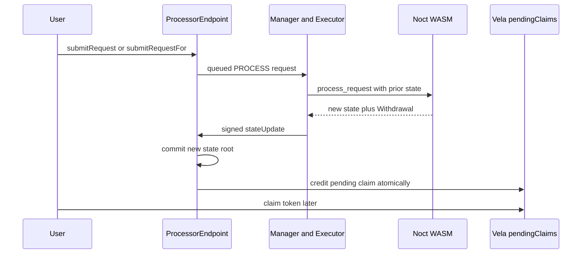
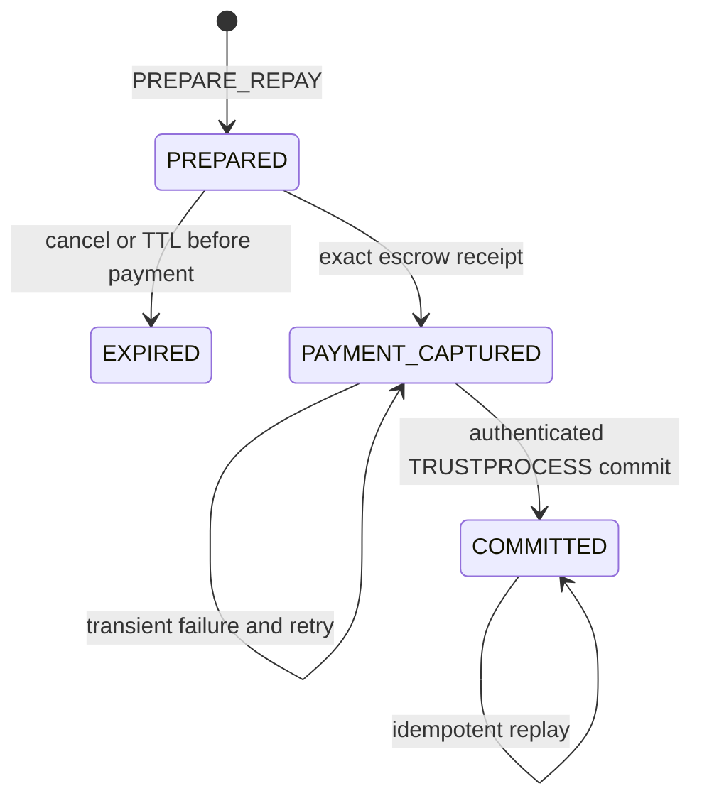
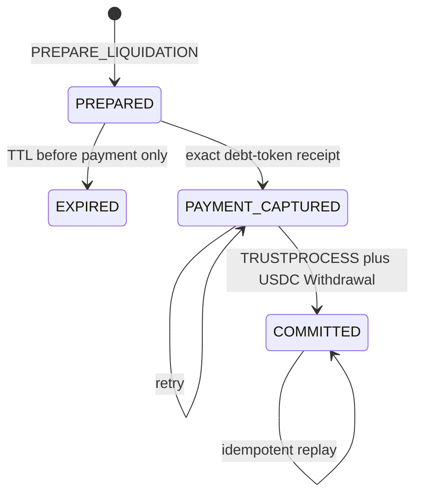

# 17. Settlement Architecture

**Status:** Frozen V1 implementation architecture  
**Audience:** Noct engineering team, junior developer, coding agent  
**Normative terms:** MUST = mandatory; MUST NOT = prohibited; SHOULD = recommended; OPEN = unresolved and must not be invented.

## Vela settlement boundary

Noct does not submit token transfers directly from guest code. The WASM receives prior application state and returns one `ProcessResult` containing the complete new state, withdrawals, events, report, and error result supported by the pinned Vela version.

Vela then signs and submits the corresponding `ProcessorEndpoint.stateUpdate`. For a native withdrawal, that state update atomically:

1. accepts the new encrypted application-state root;
2. accounts for the withdrawal against application custody; and
3. credits Vela `pendingClaims` for the recipient.

The later `claim(token, payee)` call only delivers an already-owned pending claim. It is not confirmation of the private transition and MUST NOT cause Noct to consume, restore, lock, or unlock a private balance.



There is no guest `vela.SubmitWithdrawal`, `CompleteSettlement`, `FailSettlement`, or direct LevelDB API.

## Native withdrawal rule

Cash USDC and private borrowed-asset withdrawals use the same pattern:

```text
validate authorization and exact nonce
validate available private balance
withdrawalID = domainHash(applicationId, chainId, requestId, token, destination, amount)
require withdrawalID is unused
nextState.balance -= amount
nextState.history += withdrawalID and output commitment
ProcessResult.Withdrawals += (token, destination, amount)
return nextState and result together
```

The private debit and withdrawal output MUST be computed and returned together. If processing or `stateUpdate` fails, Vela retains the old state and creates no claim. If `stateUpdate` succeeds, the debit is final even if the recipient waits to call `claim`.

Retrying an accepted request MUST return its stored successful result or be rejected by Vela/request replay protection. It MUST NOT emit a second withdrawal. No application timeout may cancel or recreate a Vela pending claim.

## Custody reconciliation

For each asset `a`, File 11 defines the conservation equation:

```text
VelaCustody[a] = PrivateLedger[a] + PendingInbound[a] + PendingOutbound[a]
```

A native withdrawal moves value from `PrivateLedger` to `PendingOutbound` in the Noct result. The accepted Vela state update then reduces custody and the corresponding pending-outbound amount together while creating the recipient's `pendingClaim`.

Reconciliation MUST use Vela request IDs, accepted state roots, withdrawal output commitments, and on-chain claim/accounting state. It MUST NOT infer failure merely because the user has not claimed the funds.

## Trigger semantics

Repayment and liquidation require inbound debt-asset payment and therefore use a trigger/escrow integration based on the official Vela trigger pattern:

- the registered contract extends `AbstractTrigger`;
- Noct emits a minimal plaintext `AppEvent` containing an opaque operation ID and operation kind;
- trigger `_execute` performs the permitted on-chain action;
- `_getTrustProcessPayload` returns a domain-separated result payload;
- `ProcessorEndpoint` queues a high-priority `TRUSTPROCESS` request;
- Noct handles the payload in `trusted_request`.

A trigger callback is isolated from the originating Vela state update. A trigger revert does not imply that the earlier state update was reverted. A later `TRUSTPROCESS` is another request and another state update. Noct MUST NOT describe these phases as one atomic EVM transaction.

Safety comes from exclusive private locks, an on-chain escrow receipt, append-only receipt consumption, and idempotent commit.

## Canonical operation identifiers

```text
operationID = H(
    NOCT_OPERATION_V1,
    chainId,
    applicationId,
    prepareRequestId,
    operationKind,
    initiator,
    affectedAccount,
    asset,
    amount,
    accountNonce,
    configCommitment
)

receiptID = H(
    NOCT_RECEIPT_V1,
    sourceChainId,
    escrowAddress,
    transactionHash,
    logIndex,
    operationID,
    asset,
    amount,
    payer
)
```

Identifiers use canonical fixed-width encodings. A receipt is accepted only from the configured trigger/escrow route and is consumed once. Replayed commit delivery returns the stored committed result without another balance mutation or withdrawal.

## Repayment prepare/capture/commit



### Prepare

`PREPARE_REPAY` accrues the reserve, computes the exact payment and scaled-debt reduction, installs an exclusive debt lock, and stores the operation. It does not receive funds, reduce debt, or increase liquidity.

A prepared operation may expire only while no payment has been captured.

### Capture

The trigger/escrow accepts exactly the prepared asset and amount and emits a receipt bound to `operationID`. It MUST reject:

- wrong token, payer policy, amount, operation, or destination;
- duplicate capture;
- expired or unknown preparation;
- fee-on-transfer or rebasing behavior that makes received amount differ from the receipt.

Once payment is captured, the operation cannot expire or be unlocked by a timeout. The payment is held for protocol settlement and `COMMIT_REPAY` is retried until accepted. Any administrative recovery must preserve the receipt and debt claim; it MUST NOT independently refund the payer while commit remains possible.

### Commit

Only the authenticated `TRUSTPROCESS` path may commit. The guest verifies the operation, receipt, exact amount, asset, escrow domain, and unconsumed status, then atomically:

```text
account.scaledDebt -= operation.scaledDebtReduction
reserve.totalScaledDebt -= operation.scaledDebtReduction
reserve.availableLiquidity += operation.paymentAmount
receipt = CONSUMED
operation = COMMITTED
remove debt lock
append history outcome
```

Debt reduction without receipt consumption is invalid.

## Liquidation prepare/capture/commit



`PREPARE_LIQUIDATION` privately verifies health, close factor, asset-specific prices, scaled-debt reduction, collateral seizure, and the current authenticated oracle epoch. It locks the exact debt slice and USDC collateral amount but changes no ownership.

The liquidator then pays the exact prepared debt-asset amount (USDC, ETH or ZEN) into the configured escrow. Without a finalized authenticated receipt, commit is impossible.

`COMMIT_LIQUIDATION` consumes the receipt and atomically returns:

```text
borrower scaled-debt reduction
matching reserve total-scaled-debt reduction
reserve liquidity credit for the captured debt asset
borrower USDC collateral debit
operation and receipt finalization
one ProcessResult.Withdrawals USDC output to the liquidator
```

The collateral debit and Vela withdrawal output are one Noct/Vela state update. The prior payment capture is not atomic with that update; liveness is provided through durable receipt state and indefinite idempotent commit retries.

The stored collateral amount is a maximum authorized by the liquidator and borrower-state lock. If commit policy rechecks a newer oracle epoch, it MAY reduce the seizure but MUST NOT increase payment or seized collateral beyond the prepared values. V1 uses the exact stored prepared quantities and exclusive locks so ordinary position changes cannot alter the quote before commit.

## Trigger failure behavior

| Failure point | Required result |
|---|---|
| Prepare rejected | No lock, payment, debt change, or withdrawal |
| Trigger fails before payment capture | Prepared operation remains cancellable/expirable |
| Payment capture succeeds but payload delivery fails | Keep receipt and locks; retry `TRUSTPROCESS` |
| Commit computation fails transiently | Keep `PAYMENT_CAPTURED`; retry without refund |
| Commit succeeds but acknowledgement is lost | Replay returns stored result; no duplicate effect |
| Native withdrawal claim is not called | No private rollback; pending claim remains user property |
| Receipt conflicts with prepared operation | Quarantine and halt the operation; never guess or auto-refund |

## Public leakage

Prices, adapter epochs, trigger calls, token movements, pending claims, destinations, amounts, and timing may be public. App events SHOULD contain only opaque operation IDs and kinds. Borrower identity, private balances, health factor, and internal candidate data MUST NOT be included in plaintext trigger events.

## Required integration tests

1. Native withdrawal state debit and pending-claim creation succeed or fail together.
2. Unclaimed pending claims never restore private balances.
3. Duplicate request/result delivery cannot create a second claim.
4. Trigger revert does not cause the implementation to assume the originating state update reverted.
5. Repayment debt never decreases before exact payment-receipt consumption.
6. Liquidation cannot emit collateral without an exact captured debt-token receipt.
7. Pre-capture expiry releases locks; post-capture timeout never does.
8. Restart and redelivery complete captured operations exactly once.
9. Custody and scaled-debt conservation hold through reorg and retry simulations.
