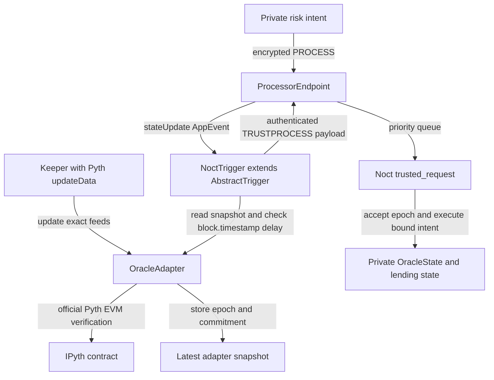

# 18. Oracle Architecture

**Status:** Frozen V1 implementation architecture  
**Audience:** Noct engineering team, junior developer, coding agent  
**Normative terms:** MUST = mandatory; MUST NOT = prohibited; SHOULD = recommended; OPEN = unresolved and must not be invented.

## Required feeds

V1 risk calculations require configured Pyth price feed IDs for:

- USDC/USD;
- ZEN/USD;
- ETH/USD.

Feed IDs are immutable deployment/configuration values, not symbols supplied by a caller. Network-specific IDs MUST be copied from Pyth's official feed registry and tested against the deployed Pyth EVM contract for that chain. A deployment MUST fail if any feed ID, Pyth contract address, chain ID, adapter address or decimals target is unset or duplicated.

## FROZEN: on-chain verification and trusted delivery

V1 uses this path exclusively:



There is no snapshot-in-user-transaction model. A client or facilitator MUST NOT provide prices to lending logic. There is no Noct-operated fake oracle key and no 65-byte Pyth ECDSA signature: Pyth EVM updates use Pyth's official verification contract and wire format.

## OracleAdapter verification

`OracleAdapter` is an on-chain Noct contract configured with the official `IPyth` address and the exact feed ID array. An updater supplies Pyth `updateData` and the required verification fee. The adapter MUST call the pinned official Pyth EVM API that verifies and parses updates for the exact configured IDs, preferably `parsePriceFeedUpdatesUnique{value: fee}(updateData, feedIds, minPublishTime, maxPublishTime)` or its exact equivalent in the pinned Pyth SDK. If the pinned API instead requires `updatePriceFeeds` plus reads, the adapter MUST prove that every configured feed was updated in this call and MUST NOT silently reuse an omitted feed.

The adapter sets the Pyth parse window from checked EVM time:

```text
minPublishTime = block.timestamp - maxPythAgeSeconds
maxPublishTime = block.timestamp + maxFutureSkewSeconds
```

For every exact configured feed, before storing anything, the adapter MUST validate:

1. Pyth verification/parsing succeeded for that feed ID;
2. raw signed `price > 0`;
3. `publishTime >= minPublishTime`;
4. `publishTime <= maxPublishTime`;
5. `publishTime` is strictly newer than that feed's previously stored publish time;
6. exponent normalization to the protocol target (`WAD`, 18 decimals) succeeds using checked U256 arithmetic;
7. normalized price is nonzero;
8. normalized confidence uses the same checked exponent conversion;
9. `mulDivUp(normalizedConfidence, WAD, normalizedPrice) <= maxConfidenceRatioWad`;
10. deviation from the previous accepted normalized price is within `priceDeviationThresholdWad`.

All feeds are accepted atomically or none are. A confidence, age, skew, exponent, overflow, missing-feed or deviation failure reverts and leaves epoch and snapshot unchanged. The deviation failure MUST also emit/record the adapter's breaker condition according to the contract's operational design; resumption requires the configured governance recovery procedure, not an updater override.

## Checked exponent normalization

Pyth supplies `price × 10^expo`. Conversion to WAD MUST be explicit and checked:

```text
scale = 18 + expo

if scale >= 0:
    normalized = checkedMul(unsignedValue, checkedPow10(scale))
else:
    normalized = unsignedValue / checkedPow10(-scale)
```

The contract MUST first prove the signed price is positive before converting it to U256. It MUST bound `scale` to the implemented power-of-ten table, reject multiplication overflow, and reject a normalized price of zero. Confidence is unsigned but follows the same scale and overflow bounds. Solidity casts, exponentiation and multiplication MUST NOT be relied upon without these checks.

Risk math consumes only normalized WAD values. Raw Pyth price/exponent values MUST remain available in events or adapter audit data if needed to reproduce normalization.

## Monotonic epoch and snapshot commitment

After all feed checks pass, the adapter increments a checked `uint64 epoch` and stores the complete snapshot. The canonical commitment is:

```text
snapshotCommitment = keccak256(abi.encode(
    ORACLE_SNAPSHOT_V1_DOMAIN,
    block.chainid,
    address(this),
    address(pyth),
    epoch,
    feedIds,                  // fixed canonical USDC, ZEN, ETH order
    normalizedPricesWad,
    normalizedConfidenceWad,
    rawExponents,
    publishTimes,
    block.number,
    block.timestamp
))
```

The adapter stores at least:

```solidity
struct AdapterSnapshot {
    uint64 epoch;
    uint64 adapterBlockNumber;
    uint64 adapterBlockTimestamp;
    bytes32[3] feedIds;
    uint256[3] pricesWad;
    uint256[3] confidenceWad;
    int32[3] exponents;
    uint64[3] publishTimes;
    bytes32 commitment;
}
```

Implementations MUST reject truncation if EVM block values do not fit the selected storage widths. The commitment binds chain, adapter, official Pyth contract, exact feeds, prices, confidence, exponents, Pyth publication times and EVM block data. Epoch, adapter block number, adapter block timestamp and each feed's publish time never decrease.

## NoctTrigger authentication and on-chain maximum delay

`NoctTrigger` is the only trigger registered to the Noct Vela `appId` and MUST extend official Vela `AbstractTrigger`. A Noct risk intent emits a plaintext `AppEvent` containing only an opaque operation ID and operation kind. During `ProcessorEndpoint.stateUpdate`, the trigger:

1. recognizes the exact event subtype and canonical ABI shape;
2. reads the latest `AdapterSnapshot` directly from the configured adapter;
3. verifies the adapter commitment by canonical field binding or by the adapter's trusted getter;
4. requires `block.timestamp >= adapterBlockTimestamp`;
5. requires `block.timestamp - adapterBlockTimestamp <= maxRiskDelaySeconds`;
6. builds a nonempty, domain-separated payload binding the snapshot to the opaque operation ID and kind.

The payload domain includes chain ID, `ProcessorEndpoint`, Noct Vela `appId`, trigger address, adapter address, protocol version and payload kind. It also includes trigger `block.number` and `block.timestamp`. `ProcessorEndpoint` then enqueues it as `TRUSTPROCESS`; users cannot submit that request type directly.

If the adapter is absent, broken, stale or domain-mismatched, the trigger MUST return no trusted payload. The pending intent then fails/expires without financial mutation. The trigger MUST NOT put private account or position data in its public payload.

## Guest OracleState acceptance

The guest stores:

```go
type OracleState struct {
    Epoch                 uint64
    AdapterBlockNumber    uint64
    AdapterBlockTimestamp uint64
    FeedIDs               [3][32]byte
    PricesWad             [3]U256
    ConfidenceWad         [3]U256
    PublishTimes          [3]uint64
    SnapshotCommitment    [32]byte
}
```

On `trusted_request`, Noct MUST validate the configured trigger domain, canonical payload, matching pending operation, exact feed IDs and recomputed commitment. It MUST require:

```text
payload.epoch > OracleState.epoch
payload.adapterBlockNumber >= OracleState.adapterBlockNumber
payload.adapterBlockTimestamp >= OracleState.adapterBlockTimestamp
payload.publishTimes[i] >= OracleState.publishTimes[i] for every feed
payload.triggerBlockNumber >= payload.adapterBlockNumber
payload.triggerBlockTimestamp >= payload.adapterBlockTimestamp
```

The stricter epoch rule prevents replay even when times are equal. The guest then stores `OracleState` and executes the bound risk transition atomically. A borrow, collateral release or `PREPARE_LIQUIDATION` MUST use this newly accepted epoch; it MUST NOT use a caller-selected or previously stored epoch.

The guest does not perform a self-freshness check: it has no authenticated independent clock. Freshness/max delay is an EVM property enforced by `NoctTrigger` against `block.timestamp`. The guest's timestamp checks enforce ordering and commitment consistency only.

## Interest clock

Before a risk transition reads debt, every affected reserve is accrued to `OracleState.AdapterBlockTimestamp`. This authenticated adapter EVM timestamp is the sole risk-path interest time. Pyth `publishTime` is not used as the interest clock because feeds can have different publication times. Local enclave time, request arrival time and facilitator time are prohibited.

## Fail-closed behavior

Risk-sensitive operations are blocked when:

- Pyth verification for an exact feed fails;
- a price is nonpositive or normalization fails;
- confidence ratio exceeds policy;
- publication age/future skew fails;
- the deviation breaker trips;
- the adapter snapshot exceeds on-chain `maxRiskDelaySeconds`, frozen at **120 seconds** and committed
  in `configCommitment` (File 10, SPEC-08). `NoctTrigger` enforces it as
  `block.timestamp - snapshot.adapterBlockTimestamp > maxRiskDelaySeconds`. Deployment MUST fail if the
  value configured in the trigger differs from the committed value;
- trigger domain/commitment validation fails;
- the epoch is not strictly newer;
- the coupled pending intent is absent, expired or already consumed.

Deposits, cash withdrawals and captured repayment/liquidation commits that require no new risk decision follow File 12's outage rules. A commit MUST consume its already authenticated captured receipt and stored prepared quantities; it MUST NOT be stranded merely because no newer oracle is available.

## Privacy

Feed IDs, prices, confidence values, publication times, adapter blocks, epochs and commitments are public. User quantities, account identities, health factors and candidate selection remain private in Vela state. Trigger `AppEvent` and `TRUSTPROCESS` payloads use opaque operation IDs and MUST NOT expose position data.