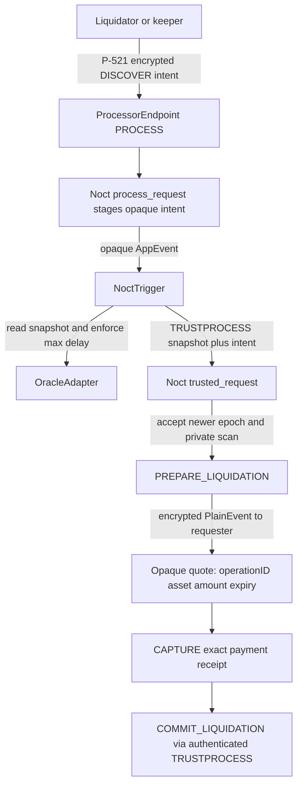

# 20. Liquidation Discovery

**Status:** Frozen V1 implementation architecture  
**Audience:** Noct engineering team, junior developer, coding agent  
**Normative terms:** MUST = mandatory; MUST NOT = prohibited; SHOULD = recommended; OPEN = unresolved and must not be invented.

## Problem and privacy requirement

Liquidators must be able to initiate liquidation while borrowers may be offline, but no public or privileged bot may receive an account list, balances, debt, collateral, health factors or raw Merkle witnesses. Discovery happens inside the attested Noct guest over encrypted private state.

A candidate's identity is not returned to the liquidator. The external handle is a domain-separated opaque `operationID`. Public chain data may reveal that a liquidation workflow exists and its debt asset/payment amount when payment occurs; it MUST NOT reveal the borrower or full position.

## FROZEN V1 mechanism

A permissionless keeper/liquidator requests one private discovery attempt through an encrypted Vela `PROCESS` request. Noct stages an opaque scan intent. The registered trigger couples it to a newly verified on-chain oracle epoch, and `trusted_request` scans private state and performs File 12's `PREPARE_LIQUIDATION` transition.



No HTTP oracle fetch, caller snapshot or facilitator price is accepted. The scan uses the `OracleState` epoch accepted in the same trusted transition. Both debt reserves are accrued to the authenticated adapter block timestamp before health checks.

## Discovery and PREPARE

`DISCOVER_LIQUIDATION` is a user-authorized `PROCESS` command. `process_request` authenticates the requester, burns the applicable request nonce, creates a deterministic opaque intent ID and emits an `AppEvent` containing only the intent ID and event kind. It MUST NOT change debt, collateral, reserve liquidity or oracle state.

During `stateUpdate`, `NoctTrigger` reads the on-chain `OracleAdapter`, requires:

```text
block.timestamp >= snapshot.adapterBlockTimestamp
block.timestamp - snapshot.adapterBlockTimestamp <= maxRiskDelaySeconds
```

and returns the domain-separated snapshot/intent payload through Vela's authenticated `TRUSTPROCESS` route. `trusted_request` validates trigger origin/domain, strict epoch monotonicity, nondecreasing block/publish times and the snapshot commitment as specified in File 18.

Using that newly accepted epoch, the guest scans accounts with active debt in deterministic, state-committed order. To avoid leaking population size or scan position, each request processes a configured fixed maximum work budget and produces at most one quote. The persisted scan cursor advances deterministically. Runtime, fuel and event shape SHOULD be padded/bucketed where practical; no logs may identify the candidate.

For the selected unsafe account, `trusted_request` executes exactly File 12 T09 `PREPARE_LIQUIDATION`:

- accrue both reserves to `OracleState.AdapterBlockTimestamp`;
- require debt USD to exceed collateral USD at the liquidation threshold;
- enforce no conflicting debt/collateral lock;
- calculate current debt, close-factor maximum and nonzero scaled reduction with checked U256 arithmetic;
- calculate cross-asset USD payment and USDC collateral-with-bonus with File 12's rounding directions;
- store the accepted oracle epoch, exact payment, scaled reduction, collateral amount, destination, expiry and operation ID;
- install exclusive debt/collateral locks;
- change no debt, liquidity or collateral ownership.

Candidate selection SHOULD be deterministic but starvation-resistant, for example a committed round-robin cursor over a canonical account-key order. It MUST NOT prioritize using public account metadata.

If no candidate is found within the fixed work budget, the requester receives only an encrypted `NO_QUOTE` result. It learns neither whether other accounts exist nor their health.

## Private quote

The requester receives a Vela `PlainEvent`; the Executor encrypts it to the requester's registered P-521 key. The minimum quote is:

```text
operationID
paymentAsset
exactPaymentAmount
paymentEndpoint
pre-payment expiry
quote/config version
```

The quote MUST NOT include borrower address, collateral total, debt total, health factor, account state, scan cursor or a candidate list. `operationID` is unlinkable to the borrower without enclave state or an authorized deanonymization report.

Only the owner of the liquidator destination authorization may capture payment. A discovered quote is not a liquidation proof and creates no public right to inspect the borrower.

## CAPTURE: authenticated payment receipt

Capture follows File 12 and is a distinct phase. The liquidator pays the exact prepared debt-asset amount (USDC, ETH or ZEN) through the configured on-chain trigger/escrow/Vela deposit path, binding asset, amount, payer/destination authorization and `operationID`. Required finality is reached before Vela/trigger integration sends an authenticated capture payload to `trusted_request`.

The capture handler MUST:

1. validate the configured trigger domain and canonical receipt identifier;
2. match the receipt exactly to a `PREPARED` operation;
3. require the receipt to be finalized and unconsumed;
4. add the amount to `PendingInbound[asset]`;
5. mark the operation `PAYMENT_CAPTURED` idempotently;
6. make the operation and its locks non-expiring.

Capture does not reduce debt, increase reserve liquidity, seize collateral or emit a withdrawal. Before capture, expiry may release locks because no payment moved. After capture, Noct MUST NOT timeout, release locks, or invent a refund; commit is retried until successful.

## COMMIT: consume receipt and settle

`COMMIT_LIQUIDATION` is invoked only by authenticated Vela `TRUSTPROCESS` processing after capture. It uses the quantities frozen by PREPARE and performs exactly File 12 T10 atomically:

```text
borrower.scaledDebt[asset] -= operation.scaledDebtReduction
reserve.totalScaledDebt[asset] -= operation.scaledDebtReduction
reserve.availableLiquidity[asset] += operation.paymentAmount
borrower.collateralUSDC -= operation.collateralToWithdraw
receipt.status = CONSUMED
operation.status = COMMITTED
remove debt and collateral locks
stateVersion += 1
ProcessResult.Withdrawals += operationID-derived USDC withdrawal to liquidator
```

Commit MUST NOT rerun discovery, choose a new borrower, change payment terms or require a new oracle. Its safety comes from the exclusive quantities locked by PREPARE and exact authenticated payment captured before COMMIT. A replay returns the stored result and cannot reduce debt, credit liquidity or withdraw collateral twice.

This is PREPARE/CAPTURE/COMMIT, not a claim of cross-contract atomicity. On-chain payment, trusted guest execution and withdrawal claim occur in separate authenticated/idempotent phases.

## No privileged liquidation bot

A keeper can automate encrypted discovery requests and payments, but it receives the same minimal encrypted quote as any liquidator. No service account gets direct enclave-state read access. The following are prohibited:

- returning an encrypted or plaintext candidate list;
- returning borrower identity or health factor to a bot;
- giving a bot a guest debug/state export;
- asking the bot to create a witness from private borrower fields;
- accepting a bot-fetched oracle snapshot;
- relying on the borrower's browser or online presence.

## ZK boundary

Vela does not natively generate a liquidation proof and this V1 discovery flow does not require one. If Noct later requires Noir/UltraHonk proofs or zkVerify receipts for requester authorization, that is custom Noct ZK. Such a proof MUST bind the Noct app ID, chain, endpoint, state/config commitments, operation ID, transition and nonce, and MUST NOT expose the borrower. It does not replace the TEE's private scan, on-chain Pyth verification, authenticated payment receipt or File 12 invariants.

## DEANONYMIZATION compliance

Privacy from liquidators and the public does not block authorized compliance. A Vela `DEANONYMIZATION` request approved by `AuthorityRegistry` may include borrower identities, positions, liquidation operation IDs, accepted oracle epochs and settlement receipts in `ProcessResult.Report` according to the authorized scope. The Executor encrypts that report to the authority's P-521 key, and it is retrieved through the official Authority Service.

Liquidation code MUST NOT create an alternate report endpoint. Keepers, liquidators and facilitators are not authorities merely because they participate in discovery or payment.

## Required tests

At minimum, test:

- no candidate identity/health data appears in `AppEvent`, trigger payload, public logs or quote;
- stale adapter snapshots cannot produce a trusted discovery payload;
- a non-new epoch cannot prepare liquidation;
- scan cursor and fixed work budget are deterministic;
- PREPARE changes no financial balances;
- payment below, above, in the wrong asset or for the wrong operation cannot capture;
- pre-capture expiry releases only locks;
- post-capture expiry/refund is impossible;
- COMMIT without a captured receipt is impossible;
- duplicate capture and duplicate commit are idempotent;
- committed withdrawal and ledger debit remain atomic;
- authorized DEANONYMIZATION reports remain available while ordinary discovery stays private.