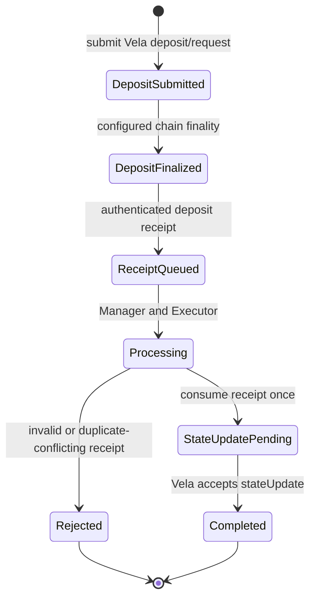
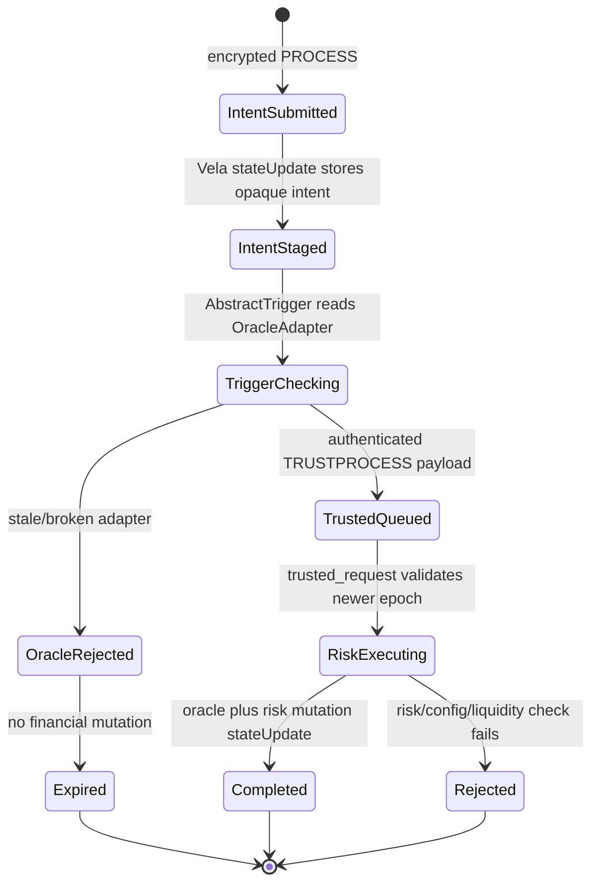
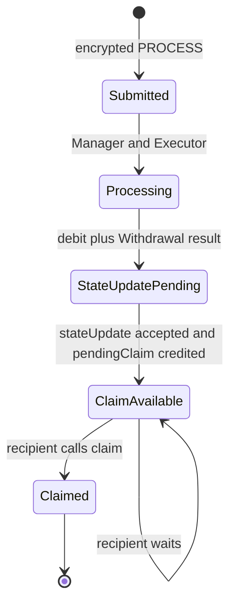

# 21. Transaction / Request Lifecycle

**Status:** Frozen V1 implementation architecture  
**Audience:** Noct engineering team, junior developer, coding agent  
**Normative terms:** MUST = mandatory; MUST NOT = prohibited; SHOULD = recommended; OPEN = unresolved and must not be invented.

## Vela request lifecycle

Users do not connect directly to the enclave. Every ordinary Noct command enters through the official Vela contracts:

```text
CLIENT_CREATED
→ ONCHAIN_SUBMITTED              submitRequest or submitRequestFor
→ VELA_QUEUED                    ProcessorEndpoint request exists
→ MANAGER_PICKED_UP
→ EXECUTOR_PROCESSING
→ STATE_UPDATE_PENDING
→ VELA_COMPLETED                 signed stateUpdate accepted
```

A rejected guest transition produces the error/refund behavior supported by the pinned Vela version and no new Noct state. A network timeout is not proof of failure; clients reconcile the Vela request ID before constructing another economic request.

Finality depth, block time, Manager polling interval, and timeout policy are deployment configuration—not hard-coded Vela guarantees. UI and monitoring MUST obtain them from the active deployment profile.

## Vela envelope versus Noct payload

The Vela envelope is created by the official client/contracts and includes the actual `applicationId`, Vela request type, sender/meta-transaction context, encrypted payload, and Vela-derived request ID according to the pinned API.

Inside the P-521-encrypted application payload, Noct defines:

```text
NoctCommandV1 {
    domainVersion
    operationKind
    account
    accountNonce
    expectedConfigCommitment
    expectedAppRoot                 // when required by custom proof mode
    asset
    amount                          // canonical U256 bytes when applicable
    destination
    operationID                     // follow-up phases only
    expiry
    authorizationData
    optionalCustomProofAuthorization
}
```

The payload MUST NOT invent a Vela application ID as `keccak256("NoctFinance")`, invent the Vela request ID, assume chain ID 1, or include caller-selected oracle prices. The guest validates the actual deployment domain and uses the request ID/context delivered by the pinned Vela integration.

EIP-712 is used where the official facilitator/meta-transaction path requires it. It is not an extra application signature requirement for every direct request unless Noct explicitly specifies one.

## Optional custom ZK stages

Noir/UltraHonk proving and zkVerify are custom Noct services. They are not Vela request states. If enabled for a transition, the client may show:

```text
PROOF_QUEUED → PROOF_GENERATED → PROOF_AUTHORIZED
```

before `ONCHAIN_SUBMITTED`. Proof failure cannot mutate Noct state. Proof receipts use File 09/23 bindings and do not replace Vela attestation, Pyth verification, or payment receipts.

## Deposit lifecycle



A duplicate finalized receipt returns the stored outcome and cannot credit `cashUSDC` twice. A deposit that exists on-chain but is not yet reflected privately remains a reconciliable pending inbound; recovery MUST NOT mint a replacement receipt.

## Supply

Supply is one normal `PROCESS` request. On successful Vela completion, cash has been reclassified to collateral. It has no oracle or external token-settlement phase.

```text
submit PROCESS → guest validates nonce/balance → cash-to-collateral stateUpdate → completed
```

## Risk-operation lifecycle

Borrow, collateral release, and liquidation discovery require a newly accepted OracleAdapter epoch. They use two Vela transitions:



The first `PROCESS` transition stages only an opaque intent. It MUST NOT mutate debt, collateral, liquidity, or risk state. The second transition accepts the oracle epoch, accrues reserves, and executes the bound operation atomically.

Borrow credits a private borrowed balance. Wallet delivery is a separate native withdrawal request.

## Native withdrawal lifecycle



`ClaimAvailable` is economic completion. The private balance is already debited. Failure or delay of the optional `claim()` delivery transaction MUST NOT restore the balance or create a second withdrawal.

## Repayment lifecycle

```mermaid
stateDiagram-v2
    [*] --> Prepared: PREPARE_REPAY completed through Vela
    Prepared --> Expired: cancel or TTL before payment
    Prepared --> PaymentSubmitted: exact token payment to trigger/escrow
    PaymentSubmitted --> PaymentCaptured: finalized authenticated receipt
    PaymentCaptured --> CommitQueued: TRUSTPROCESS
    CommitQueued --> Committed: receipt consumed and debt reduced
    CommitQueued --> PaymentCaptured: transient failure; retry
    Committed --> Committed: idempotent redelivery
```



Preparation locks exact terms but moves no funds and reduces no debt. After capture, the operation does not expire and Noct does not issue a timeout refund. Reconciliation retries commit until the receipt is consumed exactly once.

## Liquidation lifecycle

```mermaid
stateDiagram-v2
    [*] --> DiscoveryIntent: encrypted permissionless request
    DiscoveryIntent --> FreshOracle: trigger and TRUSTPROCESS
    FreshOracle --> NoQuote: fixed private scan finds none
    FreshOracle --> Prepared: PREPARE_LIQUIDATION locks exact quantities
    Prepared --> Expired: TTL before payment
    Prepared --> PaymentCaptured: exact debt-token receipt
    PaymentCaptured --> CommitQueued: authenticated TRUSTPROCESS
    CommitQueued --> Committed: debt/liquidity/collateral plus USDC Withdrawal
    CommitQueued --> PaymentCaptured: transient failure; retry
    Committed --> ClaimAvailable: Vela pendingClaim exists
    ClaimAvailable --> Claimed: liquidator calls claim
```



No external bot receives borrower identity or health factor. Commit cannot occur without captured payment. Trigger failure does not roll back an already accepted preparation state update. The USDC collateral debit and withdrawal creation occur together at commit.

## Client-visible states

The UI SHOULD use truthful, operation-specific states:

- `Preparing locally` — encoding/encryption or optional proof work;
- `Awaiting wallet signature`;
- `Submitted on-chain` — show Vela transaction/request ID;
- `Queued for private processing`;
- `Awaiting state update`;
- `Awaiting oracle trigger` — risk operations only;
- `Prepared; payment not sent` — repayment/liquidation only;
- `Payment captured; finalizing` — cannot be canceled or treated as failed;
- `Claim available` — withdrawal is settled and may be pulled;
- `Completed`;
- `Rejected` with privacy-safe reason;
- `Reconciling` — outcome unknown, do not invite a conflicting retry.

The UI MUST NOT display `Completed` before the canonical Vela state update is accepted. It MUST distinguish an unclaimed pending claim from a failed withdrawal and a captured payment from an unpaid preparation.

## Timeout policy

Timeouts change display/reconciliation behavior, not canonical financial state:

- before on-chain submission: client may rebuild safely;
- submitted Vela request: query official request status before retry;
- prepared but unpaid operation: may expire under its authenticated TTL;
- captured payment: never auto-expire/unlock/refund; retry commit;
- pending claim: remains settled property regardless of claim delay.

## Required tests

1. Direct and facilitated requests both route through `ProcessorEndpoint`.
2. Risk operations cannot mutate during the initial intent transition.
3. Caller-supplied oracle data is rejected.
4. Native withdrawal debit and pending-claim creation are one accepted update.
5. Unclaimed withdrawals never restore private balances.
6. Repayment/liquidation cannot commit before exact receipt capture.
7. Pre-capture expiry and post-capture retry behavior are distinct.
8. Lost acknowledgements return stored idempotent outcomes.
9. UI state is derived from canonical request, operation, receipt, and claim data.
