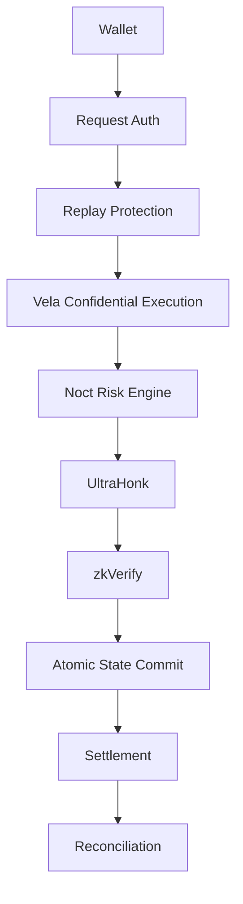

# 26. Security Model

**Status:** Implementation architecture baseline  
**Audience:** Noct engineering team, junior developer, coding agent  
**Normative terms:** MUST = mandatory; MUST NOT = prohibited; SHOULD = recommended; OPEN = unresolved and must not be invented.

## Defense in depth

## Security rules

- Frontend never enforces the final financial rule.
- Facilitator never becomes financial source of truth.
- Vela execution is deterministic.
- ZK proof must bind to the correct protocol state/config.
- Settlement requires an authorized internal balance.
- All withdrawals are idempotent.

## High-priority audit areas

1. fixed-point arithmetic;
2. commitments;
3. replay/version logic;
4. withdrawal locks;
5. oracle;
6. liquidation;
7. proof-to-state binding.
