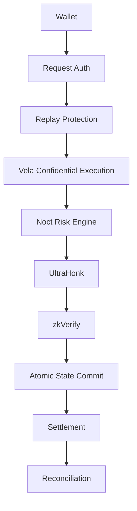

# 26. Security Model

**Status:** Implementation architecture baseline  
**Audience:** Noct engineering team, junior developer, coding agent  
**Normative terms:** MUST = mandatory; MUST NOT = prohibited; SHOULD = recommended; OPEN = unresolved and must not be invented.

## Defense in depth

## Security rules

Each rule below is normative and maps to the component that enforces it. A rule with no enforcement
point is not a control.

1. **The frontend never enforces a financial rule.** It may estimate; the TEE re-derives every value
   from committed state. Enforcement point: File 12 universal transition rules.
2. **The facilitator never becomes a financial source of truth.** It transports encrypted payloads and
   cannot supply prices, timestamps or receipts. Enforcement point: `08:116`, `10:163`, `18:129`.
3. **Vela execution is deterministic.** No host wall clock, no `time.Now()`, no map iteration order in
   any committed value; time comes only from the accepted `OracleState` timestamp (`10:169`, `18:167`).
4. **A ZK proof binds the correct protocol state and config.** `circuitID`, `vkHash`,
   `configCommitment`, `oracleCommitment`, `oldAppRoot` and `newAppRoot` are public inputs 4-9
   (`09:148-164`). A proof over any other state cannot verify.
5. **Settlement requires an authorized internal balance.** A withdrawal is emitted only inside the
   same transition that debits the matching ledger balance (File 12 `T02`/`T06`).
6. **All withdrawals are idempotent.** A deterministic `withdrawalID` plus `outcomeCommitment` in
   `historyRoot` means a retry returns the stored result and emits nothing new (`09:112`, File 23).
7. **Debt never decreases without a consumed receipt.** Preparation and user intent are not payment
   (File 12, File 11).
8. **Every amount crossing a custody boundary is a whole native unit.** `quantizeDown` is applied at
   computation time (File 08, SPEC-02).
9. **Every persisted economic field is reachable from `appRoot`.** No field may exist outside the
   commitment tree (File 09, SPEC-03 / N-1).
10. **Arithmetic fails loudly.** Every operation returns an explicit success flag; a wrap is never a
    valid result (`TOOLCHAIN-LOCK.md`, SPEC-10).
11. **Fail closed.** Any invariant, arithmetic, oracle or receipt failure aborts the transition with
    no partial state mutation and no withdrawal emission (`08:201`, File 12).
12. **The two risk gates are distinct.** Borrow/release use `collateralFactorWad`; liquidation uses
    `liquidationThresholdWad`. They MUST NOT be collapsed (Files 10 and 12, SPEC-01).

## High-priority audit areas

These are ordered by demonstrated exploitability, not by intuition. Each names the concrete failure
mode that the audit found in this specification set.

1. **Fixed-point arithmetic.** The required checked U256 kernel with full-width `mulDiv` did not exist
   in the repository; the demo substituted unchecked `uint64` `Mul64` (`DEMO-01`), where a wrapped
   product silently passes a collateral check. Audit every multiplication for width, and every
   division for order — `(A * B) / C`, never `(A / C) * B`.
2. **Commitments.** The account leaf omitted nine multi-asset fields and `reserveRoot` omitted the USDC
   reserve entirely (SPEC-03, N-1). Audit leaf-by-leaf against `PrivateAccount` and `ReserveState`
   and confirm every field is hashed.
3. **Replay and version logic.** Confirm `stateVersion`, account nonce, Vela app nonce and oracle epoch
   are each monotonic under their own rule, and that an idempotent replay does not advance them twice.
4. **Withdrawal and operation locks.** A `PREPARE_REPAY` lock that blocks liquidation is a free
   renewable DoS on the protocol's only recovery mechanism (SPEC-06). Audit every lock for who can
   acquire it, at what cost, for how long, and what it blocks.
5. **Oracle.** `maxRiskDelaySeconds` had no value and no commitment (SPEC-08). Audit every parameter
   referenced by a security check for a frozen value and a place in `configCommitment`.
6. **Liquidation.** Four independent defects: gate collapse (SPEC-01), dust positions with no
   resolution path (SPEC-04), unprofitable seizures that no liquidator executes (SPEC-05), and
   stale-quote under-repayment (SPEC-07).
7. **Proof-to-state binding.** Confirm the guest recomputes `appRoot` from `GlobalRootStateV1` and that
   a Vela encrypted-state root can never be substituted for it (`09:20`, `09:204`).
8. **Decimal handling.** USDC is 6-decimal in an otherwise 18-decimal protocol; a single misplaced
   `10^12` is indistinguishable from theft (SPEC-02).

## Verification requirement

No transition may be considered implemented until it has a test that fails when the transition is
mutated to violate each rule above. File 29 defines the strategy; File 25 defines the adversary each
test represents.

