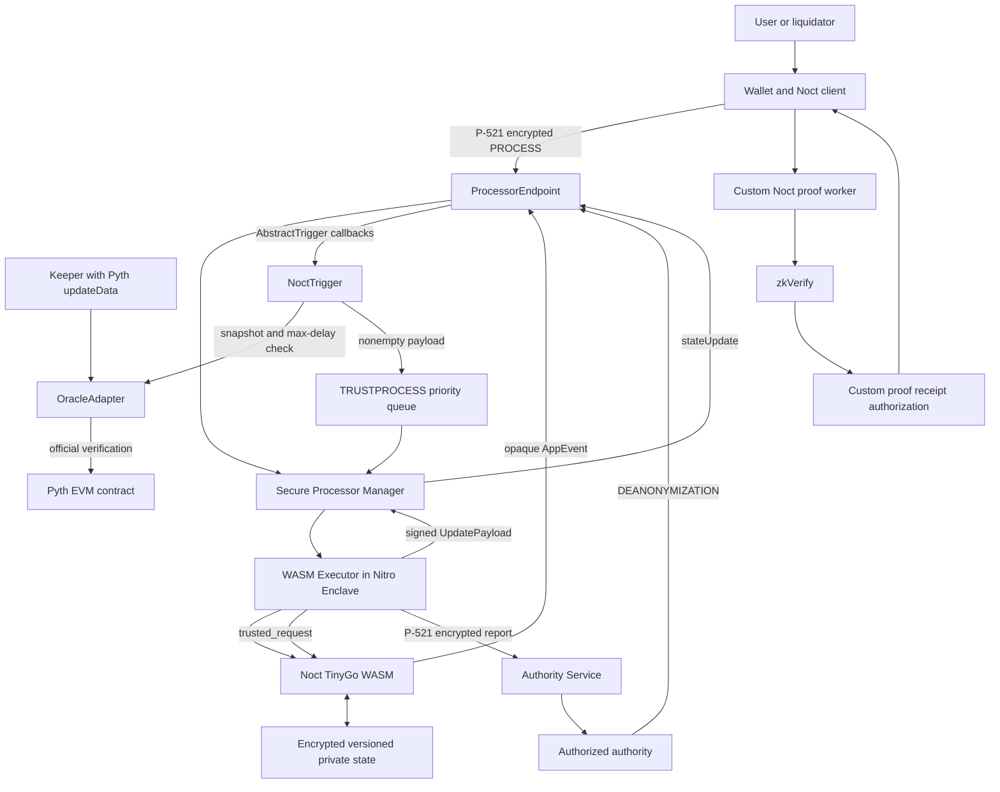
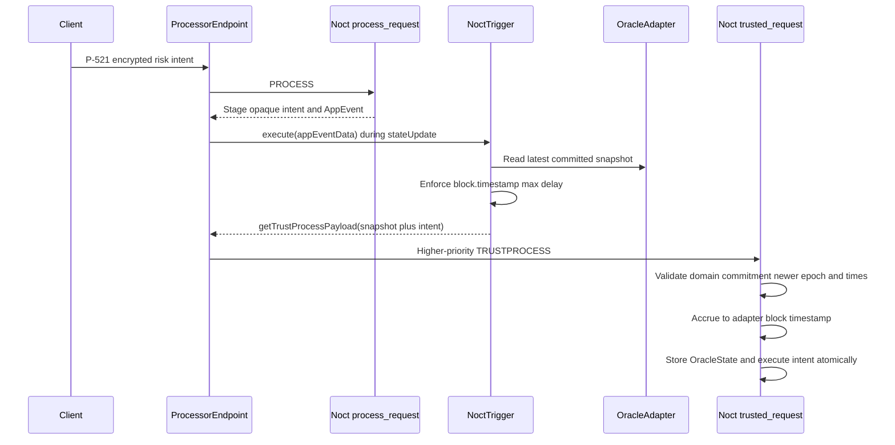

# 30. End-to-End Architecture

**Status:** Implementation architecture baseline  
**Audience:** Noct engineering team, junior developer, coding agent  
**Normative terms:** MUST = mandatory; MUST NOT = prohibited; SHOULD = recommended; OPEN = unresolved and must not be invented.

## Full system



## Vela application identity and deployment

The Noct WASM is deployed through the official Vela deploy flow. The WASM artifact is referenced by SHA-256 in the deploy descriptor, and `ProcessorEndpoint` assigns a `uint64 applicationId`. This Vela `appId` is immutable protocol identity and MUST be bound into:

- guest state and every private request;
- trigger and oracle payload domains;
- custom proof public inputs and authorization receipts;
- operation IDs, state/config commitments and replay keys;
- DEANONYMIZATION reports.

Noct uses `submitDeployRequestWithTrigger` to register a predeployed `NoctTrigger` that extends official Vela `AbstractTrigger`. The same trigger address is passed in the guest constructor configuration. Chain ID, `ProcessorEndpoint`, `appId`, trigger, `OracleAdapter` and protocol version form one deployment domain.

## Private client request path

1. The user associates a P-521 public key with the Noct app through Vela `ASSOCIATEKEY`.
2. The client builds a canonical command bound to the deployment domain, expected state/config commitment, nonce and expiry.
3. If a custom Noct proof is required, the proof worker generates it and obtains the specified zkVerify receipt/authorization.
4. The client encrypts the private `PROCESS` payload to the attested TEE P-521 communication key using the official Vela client format.
5. The wallet calls `ProcessorEndpoint.submitRequest`, or a facilitator calls official `submitRequestFor` with the required EIP-712 authorization.
6. The Manager dequeues the request, loads WASM and encrypted state, and sends them to the Executor.
7. The Executor decrypts state and payload, then calls Noct `process_request(appId, sender, requestType, payload, state)`.
8. The Executor encrypts returned state and `PlainEvent`s, computes the state root and signs the `UpdatePayload` with the attested TEE secp256k1 key.
9. The Manager calls `ProcessorEndpoint.stateUpdate`; the endpoint verifies the signature/state root and finalizes events, custody effects and completion.

P-521 encryption protects request, event and report confidentiality. It is distinct from user EVM signatures, TEE update signatures, Pyth verification and custom ZK proofs.

## Oracle update path

1. A permissionless keeper obtains official Pyth EVM `updateData`.
2. The keeper calls `OracleAdapter` and pays the official Pyth verification fee.
3. The adapter invokes the pinned official Pyth EVM parser/verifier for the exact configured USDC/USD, ZEN/USD and ETH/USD feed IDs.
4. The adapter rejects nonpositive prices, invalid checked-U256 exponent normalization, excessive confidence ratio, old/future publication time, nonmonotonic feed time and excessive deviation.
5. After all feeds pass atomically, it increments its checked monotonic epoch and stores normalized price/confidence data, Pyth publish times, adapter block number/timestamp and the chain/adapter/feed/data commitment.

The adapter never fabricates or accepts a 65-byte "Pyth ECDSA" signature. A facilitator/HTTP service is not an oracle authority and cannot inject a snapshot into Noct.

## Risk operation path

Borrow, collateral release and liquidation preparation require an oracle epoch newly accepted in the same trusted guest transition:



The normal `PROCESS` phase MUST NOT mutate debt, collateral or risk state. `NoctTrigger` checks `block.timestamp - adapterBlockTimestamp <= maxRiskDelaySeconds` on chain. The guest has no independent authenticated clock and performs no self-freshness claim; it validates ordering, strict epoch advancement and commitment consistency. Interest accrues to authenticated `adapterBlockTimestamp`, never local enclave time or Pyth `publishTime`.

`trusted_request` has no sender/request type and receives a clear-text payload. It accepts only the configured Vela route and a payload domain matching chain, endpoint, Noct `appId`, trigger, adapter, protocol version, kind and operation ID. Trigger payloads contain opaque IDs and public oracle data, never private position data.

## Borrow example

```text
wallet authorization and optional custom proof
→ official Vela P-521 encrypted BORROW intent
→ ProcessorEndpoint PROCESS
→ process_request authenticates and stages opaque operation
→ NoctTrigger reads OracleAdapter and enforces on-chain max delay
→ ProcessorEndpoint enqueues authenticated TRUSTPROCESS
→ trusted_request accepts strictly newer oracle epoch
→ reserves accrue to authenticated adapter block timestamp
→ checked post-borrow max-LTV validation
→ debt and private borrowed balance update atomically
→ encrypted user result
→ optional separate borrowed-asset withdrawal and pull-payment claim
```

## Private liquidation path

Liquidation discovery never publishes a candidate list or gives a bot privileged state access:

```text
permissionless encrypted DISCOVER request
→ opaque scan intent only
→ trigger couples intent to fresh-on-chain adapter snapshot
→ trusted_request accepts newer epoch and scans private state
→ File 12 PREPARE_LIQUIDATION locks exact debt/collateral quantities
→ P-521 encrypted minimal quote with opaque operationID
→ exact on-chain payment CAPTURED by authenticated finalized receipt
→ authenticated TRUSTPROCESS COMMIT_LIQUIDATION
→ consume receipt, reduce debt, credit liquidity, seize locked collateral
→ operationID-derived USDC withdrawal to liquidator
```

PREPARE changes no financial balances. CAPTURE records exact finalized payment in `PendingInbound` but changes no debt or collateral. COMMIT consumes the receipt and applies the stored quantities atomically and idempotently. A pre-capture operation may expire and release locks; a captured operation cannot expire or receive a guessed timeout refund. This is File 12's corrected PREPARE/CAPTURE/COMMIT lifecycle, not a claim that separate EVM/TEE phases are one transaction.

## Settlement and custody

`ProcessorEndpoint` tracks custody per app and token. A Noct `Withdrawal` is included in the signed update and becomes the official pull-payment claim path. Every withdrawal identifier and operation result is deterministic and replay-safe. Private ledger debits and matching `ProcessResult.Withdrawals` are produced atomically by the guest; on-chain claim delivery does not repeat the guest debit.

Captured repayment and liquidation receipts are consumed exactly once. Oracle outage blocks new risk decisions but does not invalidate an already prepared/captured commit that uses frozen quantities and requires no new risk decision.

## Custom—not native—ZK

Noct may use Noir/UltraHonk proof workers and zkVerify receipts for selected authorizations. These are custom Noct components. Official Vela provides neither native lending circuits nor native zkVerify verification. Therefore:

- proof public inputs MUST bind chain, endpoint, Vela `appId`, state/config commitment, transition, operation ID, nonce and expiry;
- ZK receipt acceptance MUST be explicitly implemented by Noct/on-chain authorization code;
- ZK does not replace Pyth EVM verification, the TEE state transition, trigger authentication or payment receipts;
- architecture claims MUST distinguish custom ZK soundness from Vela attestation guarantees.

## DEANONYMIZATION compliance path

Vela request type `DEANONYMIZATION` remains supported. An authority approved by `AuthorityRegistry` submits the encrypted request for the Noct `appId`. The Executor calls `process_request(requestType = 2)`; Noct returns the authorized report only in `ProcessResult.Report`. The Executor encrypts it to the authority's P-521 key, and the Authority Service exposes the official nonce/get-report retrieval flow.

The report may include identities, balances, positions, locks, opaque liquidation operation mappings, accepted oracle epochs and receipt/settlement references according to authorized scope. It MUST NOT be emitted as a public `AppEvent`, ordinary encrypted user event, trigger payload or debug dump. Privacy from users, liquidators and facilitators and compliance access for an authorized authority are simultaneous requirements.

## End-to-end invariants

The complete system MUST preserve:

```text
one configured Vela appId and deployment domain everywhere
only official Pyth EVM verification can advance OracleAdapter epoch
OracleState epoch strictly increases and commitments recompute exactly
risk mutation uses the epoch accepted in that same trusted transition
interest time equals authenticated adapter block timestamp
no private position data enters AppEvent or TRUSTPROCESS payload
scaled debt totals equal the sum of account scaled debt
custody equals private ledger plus pending inbound plus pending outbound
captured payment receipts are consumed at most once
withdrawal emission has a matching atomic private-ledger debit
trigger and request replays cannot duplicate financial effects
DEANONYMIZATION is AuthorityRegistry-gated and P-521 encrypted
```

## System feedback

```text
official Pyth update → OracleAdapter validation → epoch commitment
opaque risk intent → AbstractTrigger max-delay check → TRUSTPROCESS
accepted OracleState → authenticated interest time → risk transition
private discovery → PREPARE → CAPTURE → COMMIT
TEE guarantees + custom ZK guarantees → separate tests and threat claims
AuthorityRegistry → scoped encrypted report → compliance audit
```