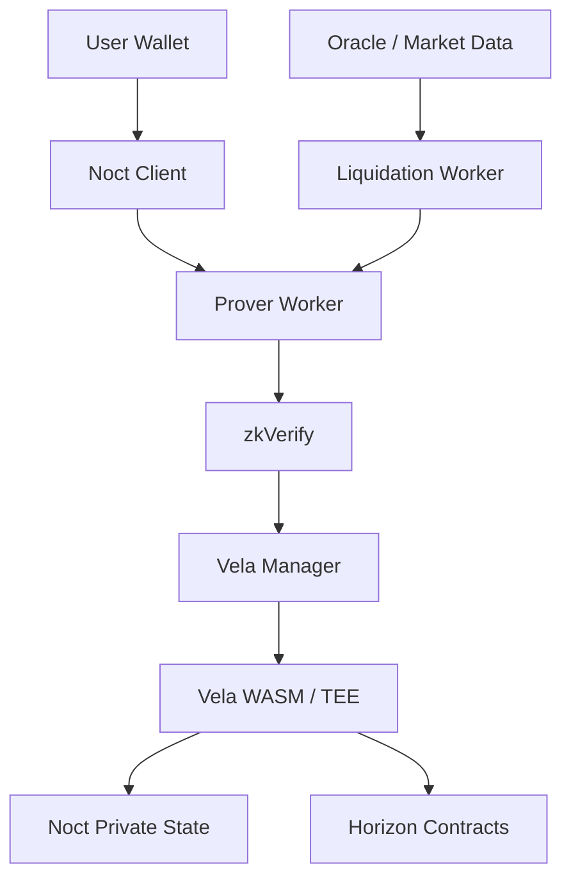
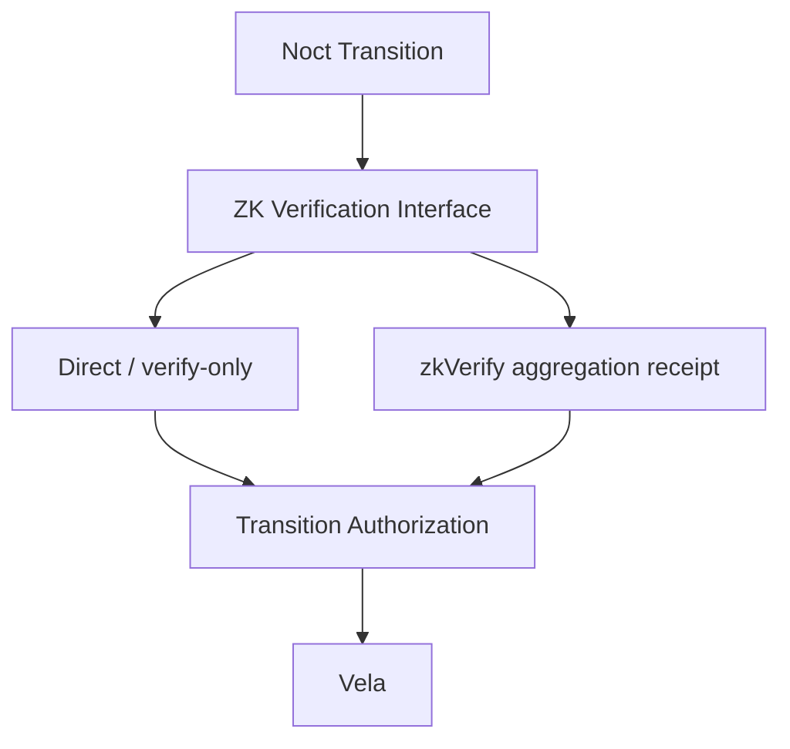
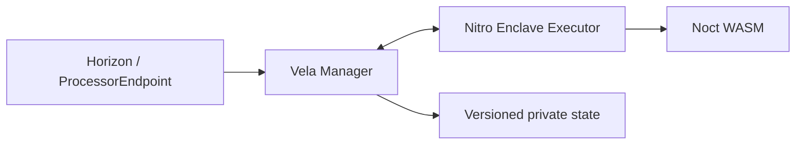
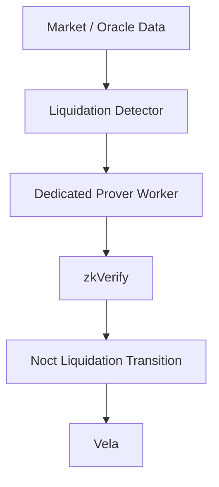

# Noct Finance — Implementation Architecture

> **SUPERSEDED — DO NOT IMPLEMENT.** Use `NOCT-FINANCE-V1-ARCHITECTURE-DOCUMENTS-CORRECTED/` as the sole authoritative source. This historical file contains pre-review accounting, settlement, oracle, replay, and Vela assumptions.

**Version:** 1.0-architecture-freeze  
**Status:** Implementation specification baseline  
**Primary audience:** Human engineering team + implementation coding agent  
**Canonical format:** Markdown  
**Scope:** Noct V1 testnet private lending architecture using Vela, Horizon, UltraHonk and zkVerify.

---

## 0. How the implementation agent must use this document

This document is the architectural source of truth for the current Noct implementation baseline.

### Normative language

- **MUST** = mandatory.
- **MUST NOT** = prohibited.
- **SHOULD** = recommended unless an explicit architecture decision overrides it.
- **MAY** = optional.
- **CONDITIONAL** = depends on benchmark/evidence.
- **OPEN** = not yet frozen; do not silently invent protocol semantics.

The implementation agent MUST NOT convert an old brainstorming idea into protocol behavior. Where a section is marked OPEN, implementation must stop at the interface/placeholder boundary and request or use a later architecture decision.

---

# 1. Product objective

Noct is a privacy-preserving DeFi lending application intended to provide Aave-like lending primitives while preventing an external observer from associating a specific wallet with a specific private lending position.

The V1 testnet scope is intentionally narrow:

- **Supply/collateral asset:** USDC only.
- **Borrowable assets:** ZEN and ETH.
- **Protocol-funded liquidity:** Noct funds the ZEN and ETH borrow pools for the test application.
- **User position privacy:** collateral, debt, LTV, health factor, balances and transition details are private.
- **Aggregate protocol information:** may be public where it does not reveal an individual position.
- **ZK:** used where it materially strengthens private state-transition authorization, subject to performance gates.
- **Vela:** used as the confidential execution/state platform.
- **Horizon:** settlement/on-chain coordination layer for the deployment target.

---

# 2. Core mental model

A user's assets have distinct lifecycle states.

```text
External wallet
      |
      | deposit USDC
      v
+------------------+
| Noct cashUSDC    |
| private balance  |
+------------------+
      |
      | supply
      v
+------------------+
| collateralUSDC   |
| private balance  |
+------------------+
      |
      | borrow
      v
+------------------+
| borrowedZEN/ETH  |
| private balance  |
+------------------+
      |
      | optional withdrawal
      v
External wallet
```

The important rule is:

> **Deposit is not supply.**

A deposited USDC balance may remain as private cash and may be withdrawn without ever becoming collateral.

Likewise, when collateral is released, it returns to the user's private cash balance first. The user then decides whether to withdraw that cash externally.

Borrowed assets similarly enter a private borrowed-asset balance first; the user may then withdraw them to an external wallet.

---

# 3. System boundaries



### Responsibility boundary

| Component | Responsibility |
|---|---|
| User wallet | User authorization/signing and external asset ownership |
| Noct client | UI, transaction construction, private-state interaction, status |
| Prover | Generate ZK proofs from authorized private witnesses |
| zkVerify | Verify supported ZK proofs and optionally aggregate them |
| Vela Manager | Request orchestration, blockchain interaction, state persistence/coordination |
| Vela WASM/TEE | Confidential application execution |
| Noct private state | Account/position state that must not be exposed to observers |
| Horizon contracts | On-chain custody/coordination/settlement boundary |
| Oracle/market data | Prices and risk inputs |
| Liquidation worker | Detect eligible positions and drive liquidation transitions |

---

# 4. On-chain vs private/off-chain data

## 4.1 Private

The following should remain inside the confidential Noct state or be represented only through commitments/proofs:

- account private identity linkage;
- cash USDC balance;
- supplied USDC/collateral amount;
- ZEN debt;
- ETH debt;
- borrowed-but-not-yet-withdrawn balances;
- LTV;
- health factor;
- user-specific interest/debt accounting;
- user-specific transition history;
- pending private state data;
- private nonces/nullifiers as applicable.

## 4.2 Public / observable

Only data required for coordination, settlement, configuration and protocol-level observability should be exposed:

- application identity;
- protocol configuration commitments;
- asset configuration identifiers;
- state commitments/roots;
- transition commitments;
- proof/verification references;
- protocol aggregate metrics where privacy is preserved;
- public contract events required for reconciliation;
- external settlement transactions that inherently occur on a public chain.

### Privacy principle

An observer should not be able to take a public transaction and reliably conclude:

> “This exact wallet owns this exact Noct lending position with this collateral, debt and health factor.”

Noct therefore does not promise that every external blockchain interaction is invisible. The V1 privacy boundary is primarily **private lending state and private state transitions**.

---

# 5. V1 asset model

| Asset | Deposit | Supply/collateral | Borrow | Protocol liquidity |
|---|---:|---:|---:|---:|
| USDC | YES | YES | NO | User supplied |
| ZEN | NO | NO | YES | Noct-funded |
| ETH | NO | NO | YES | Noct-funded |

V1 intentionally avoids a multi-collateral/multi-supply model.

This reduces:

- oracle complexity;
- risk-parameter complexity;
- circuit complexity;
- state-transition complexity;
- liquidation complexity;
- testing surface.

---

# 6. Account lifecycle

A simplified account lifecycle is:

```text
UNINITIALIZED
    |
    | account initialization
    v
ACTIVE
    |
    +--> CASH ONLY
    |
    +--> COLLATERALIZED
    |
    +--> BORROWED
    |
    +--> BORROWED + CASH
    |
    +--> BORROWED + PENDING WITHDRAWAL
    |
    +--> LIQUIDATION ELIGIBLE
    |
    +--> LIQUIDATION
    |
    +--> ACTIVE
```

These are conceptual states, not necessarily enum values. The canonical state fields and transition rules are specified in `02-NOCT_STATE_MACHINE.md`.

---

# 7. ZK architecture

Noct does not hard-code a single proof-consumption strategy into every transition.



### Frozen decision

**Production target:** direct consumption of zkVerify aggregation receipts by the Noct/Horizon on-chain layer.

**Condition:** this target is not accepted into the user-facing critical path until end-to-end performance is benchmarked.

**Fallback:** verify-only/app-side consumption may be used for testnet or a transition if aggregation latency/complexity fails the performance gate.

zkVerify currently documents Noir UltraHonk support with `V0_84`, `V3_0` and `Legacy` submission variants, with limits including 32 public inputs and evaluation-domain size `2^25`. See the current zkVerify supported-proofs documentation.

---

# 8. Vela architecture

The current Vela repository describes a privacy-preserving execution platform based on AWS Nitro Enclaves, encrypted state management and blockchain coordination. The Vela runtime executes WASM; the Manager coordinates blockchain requests/state; the storage layer supports versioned application state.

Noct should treat Vela as the confidential execution substrate, not as the lending protocol itself.



The Vela Starter Kit provides the local development stack and a WASM application development path. Vela Nova is a concrete private-transfer application demonstrating private balances, transfers and withdrawals. These repositories are implementation references, not permission to copy their business logic into Noct.

---

# 9. Vela security boundary

The Noct WASM application MUST treat its private state as authoritative only when:

1. the request is correctly authenticated;
2. the request is bound to the correct Noct application;
3. the state version/root is valid;
4. transition preconditions pass;
5. the proof/authorization required by that transition passes;
6. replay protection passes;
7. the resulting state transition is deterministic.

The implementation must preserve Vela's state versioning/rollback properties and must not introduce non-deterministic state changes.

---

# 10. Performance is a hard requirement

No ZK component may enter a user-facing critical path without benchmarking.

The full pipeline to benchmark is:

```text
witness preparation
      ↓
UltraHonk proving
      ↓
zkVerify submission
      ↓
zkVerify verification
      ↓
aggregation (if used)
      ↓
receipt availability
      ↓
Horizon/Noct receipt consumption
      ↓
Vela execution
      ↓
final settlement
```

Required metrics:

- p50;
- p95;
- p99;
- maximum;
- CPU;
- RAM;
- proof size;
- circuit constraints;
- failure/retry rate.

Browser proving is not mandatory for V1. An external prover-worker architecture MUST be supported as the baseline implementation option.

---

# 11. Liquidation architecture

Liquidation must not depend on an end-user browser.



Liquidation performance is a separate benchmark class because delayed liquidation can directly affect protocol solvency.

Exact liquidation formulas, auction/repayment mechanics and liquidator incentive parameters must remain aligned with the finalized state-machine specification.

---

# 12. Security principles

Noct MUST prioritize:

1. privacy correctness;
2. state-transition correctness;
3. replay protection;
4. authorization correctness;
5. deterministic execution;
6. failure recovery;
7. asset conservation;
8. liquidation safety;
9. proof verification correctness;
10. performance.

Speed must not be achieved by weakening a security invariant.

---

# 13. Implementation constraints

The implementation agent MUST NOT:

- expose private balances in public events;
- expose user LTV/health factor publicly;
- infer account identity from state commitments;
- allow deposit to automatically imply supply;
- allow collateral release to bypass the private cash balance;
- treat borrowed balance and debt as the same state variable;
- decrement debt when borrowed assets are withdrawn;
- allow a pending withdrawal to be spent again;
- accept a stale state root;
- accept a replayed transition;
- depend on browser proving for liquidation;
- assume zkVerify aggregation latency without benchmark data;
- silently add assets to V1.

---

# 14. Source references

Implementation should use the current repositories as primary Vela references:

- Vela Starter Kit: https://github.com/HorizenOfficial/vela-starterkit
- Vela Nova: https://github.com/HorizenOfficial/vela-nova
- Vela core: https://github.com/HorizenOfficial/vela
- Vela Facilitator: https://github.com/HorizenOfficial/vela-facilitator
- zkVerify supported proofs: https://docs.zkverify.io/architecture/supported_proofs
- zkVerify UltraHonk verifier: https://docs.zkverify.io/architecture/verification_pallets/ultrahonk
- zkVerifyJS/aggregation: https://docs.zkverify.io/overview/zkverifyjs

---

# 15. Document dependencies

- `02-NOCT_STATE_MACHINE.md` is authoritative for state and transitions.
- `03-NOCT_ZK_SPECIFICATION.md` is authoritative for ZK.
- `04-NOCT_VELA_INTEGRATION.md` is authoritative for Vela integration.
- `05-NOCT_IMPLEMENTATION_PLAN.md` is authoritative for build sequencing.

If documents conflict, implementation must stop and the conflict must be resolved explicitly.
