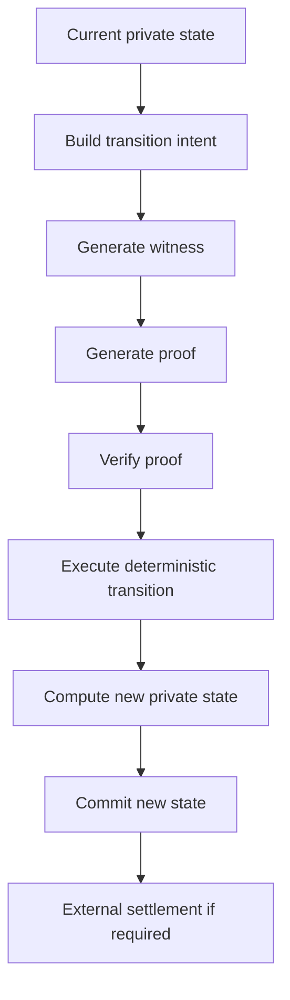

# Noct Finance — State Machine Specification

> **SUPERSEDED — DO NOT IMPLEMENT.** Use corrected Files 08, 11, 12, 17, 19, and 23 in `NOCT-FINANCE-V1-ARCHITECTURE-DOCUMENTS-CORRECTED/`. This snapshot predates scaled debt, checked U256 arithmetic, custody invariants, and receipt-driven prepare/commit settlement.

**Version:** 1.0-architecture-freeze  
**Status:** Frozen baseline for implemented decisions  
**Purpose:** Define the private account model and state-transition semantics.

---

# 1. Core rule

Noct separates:

1. **cash** — deposited but not supplied;
2. **collateral** — supplied USDC;
3. **borrowed balance** — debt asset received from the protocol but not yet externally withdrawn;
4. **debt** — outstanding liability.

These are distinct concepts and MUST NOT be collapsed into one balance.

---

# 2. V1 asset constraints

```text
SUPPLY_ASSET = USDC

BORROW_ASSETS = {
  ZEN,
  ETH
}
```

V1 users deposit USDC only.

ZEN and ETH are borrow-only assets for the V1 lending market and are funded by Noct.

---

# 3. Conceptual account state

```text
AccountState {
  identityCommitment
  accountNonce

  cashUSDC

  collateralUSDC

  borrowedZEN
  borrowedETH

  debtZEN
  debtETH

  protocolStateVersion
  stateCommitment
  transitionNonce

  pendingWithdrawal
  pendingSettlement

  status
}
```

This is a conceptual schema. Exact field encodings, integer widths, hashes and serialization formats must be fixed in implementation after the circuit/public-input design is finalized.

---

# 4. Conservation relationships

### USDC

```text
private user USDC =
    cashUSDC
  + collateralUSDC
  + any explicitly pending USDC state
```

A user can deposit repeatedly:

```text
Day 1: deposit 10 USDC
cashUSDC = 10

Day 2: deposit 5 USDC
cashUSDC = 15
```

The system MUST support repeated deposits.

---

# 5. Deposit transition

## DEPOSIT_USDC

Purpose: move USDC from the external custody boundary into the user's private Noct cash balance.

### Preconditions

- asset is USDC;
- amount > 0;
- external deposit is valid;
- request is bound to the correct Noct application;
- replay protection passes.

### State change

```text
cashUSDC' = cashUSDC + amount
```

No collateral is created.

No debt is created.

No supply is implied.

### Example

```text
Before:
cashUSDC = 0
collateralUSDC = 0

Deposit 10 USDC

After:
cashUSDC = 10
collateralUSDC = 0
```

---

# 6. Supply transition

## SUPPLY_USDC

Purpose: move existing private cash USDC into collateral.

### Preconditions

```text
amount > 0
amount <= cashUSDC
```

### State change

```text
cashUSDC' = cashUSDC - amount
collateralUSDC' = collateralUSDC + amount
```

### Example

```text
Before:
cashUSDC = 15
collateralUSDC = 0

Supply 13

After:
cashUSDC = 2
collateralUSDC = 13
```

The user does not need to supply immediately after depositing.

---

# 7. Borrow transition

## BORROW_ZEN / BORROW_ETH

Purpose: create a debt against eligible USDC collateral and credit the borrowed asset to the user's private borrowed balance.

### Core rule

The borrowed asset first appears inside Noct as:

```text
borrowedZEN
```

or:

```text
borrowedETH
```

It is not automatically sent to the user's external wallet.

### Preconditions

The transition MUST verify:

- user authorization;
- valid private state;
- sufficient collateral;
- asset borrowability;
- protocol liquidity;
- risk parameters;
- resulting LTV/health constraints;
- transition nonce/replay protection;
- correct state root/version;
- required ZK proof/verification.

### State change

For ZEN:

```text
borrowedZEN' = borrowedZEN + amount
debtZEN' = debtZEN + debtAmount
```

For ETH:

```text
borrowedETH' = borrowedETH + amount
debtETH' = debtETH + debtAmount
```

The exact pricing, interest-rate and debt-accounting formulas must be frozen in the risk-parameter section before production deployment.

---

# 8. Example borrow

Alice:

```text
cashUSDC       = 0
collateralUSDC = 100
debtZEN        = 0
borrowedZEN    = 0
```

She borrows 20 ZEN worth $50.

After:

```text
cashUSDC       = 0
collateralUSDC = 100
debtZEN        = $50-equivalent
borrowedZEN    = 20 ZEN
```

Alice can keep the 20 ZEN inside Noct or request withdrawal.

---

# 9. Withdraw borrowed asset

## WITHDRAW_BORROWED_ASSET

Purpose: move a previously borrowed asset from the private borrowed balance to the user's external wallet.

### Required state model

The borrowed balance is locked before external settlement.

```text
borrowedZEN = 20
lockedZEN = 0

Request 20 ZEN withdrawal

borrowedZEN = 20
lockedZEN = 20
```

### Successful settlement

```text
borrowedZEN = 0
lockedZEN = 0
debtZEN = unchanged
```

### Failed settlement

```text
borrowedZEN = 20
lockedZEN = 0
debtZEN = unchanged
```

### Security invariant

A pending withdrawal MUST prevent the same borrowed balance from being withdrawn twice.

---

# 10. Collateral release

When Alice releases collateral:

```text
collateralUSDC -= amount
cashUSDC += amount
```

The released collateral does **not** immediately go to the external wallet.

Example:

```text
Before:
cashUSDC       = 5
collateralUSDC = 100
debtZEN        = $50

Release 20 USDC

After:
cashUSDC       = 25
collateralUSDC = 80
debtZEN        = $50
```

Alice can then choose:

```text
cashUSDC -> external wallet
```

This preserves the separation between protocol cash and external withdrawal.

---

# 11. Withdraw cash USDC

## WITHDRAW_CASH_USDC

Purpose: withdraw USDC that is already in private cash.

### Preconditions

```text
amount > 0
amount <= cashUSDC
```

### State behavior

The amount is locked for settlement.

On success:

```text
cashUSDC -= amount
lockedUSDC -> 0
```

On failure:

```text
cashUSDC unchanged
lockedUSDC -> 0
```

This transition does not create or reduce debt.

---

# 12. Repayment

Repayment must reduce outstanding debt; it is distinct from withdrawing or moving a borrowed balance.

Conceptually:

```text
debtZEN' = debtZEN - repayment
```

or:

```text
debtETH' = debtETH - repayment
```

The exact handling of:

- overpayment;
- repayment larger than debt;
- accrued interest;
- rounding;
- partial repayment;
- repayment from private cash versus externally supplied repayment;

must be implemented only according to the finalized repayment specification.

Do not invent an overpayment policy in code.

---

# 13. Liquidation

Liquidation is a protocol transition, not a user-wallet operation.

The liquidation engine must establish that the private position is liquidatable without publicly exposing the user's position.

Conceptual flow:

```text
Private position
      |
      | ZK/risk proof
      v
Liquidation eligible
      |
      v
Liquidation execution
      |
      +--> debt reduced
      +--> collateral reduced
      +--> liquidator settlement
      |
      v
New private state
```

Exact liquidation mechanism, liquidation bonus, close factor, oracle assumptions and liquidator settlement fields are **OPEN until the liquidation transition specification is explicitly frozen**.

---

# 14. Global transition invariants

Every transition MUST preserve:

### I1 — No negative balances

```text
all asset balances >= 0
```

### I2 — No debt creation without collateral/risk authorization

### I3 — No debt reduction without a valid repayment/liquidation event

### I4 — No external withdrawal without an internal balance

### I5 — No double withdrawal

### I6 — No stale-state transition

### I7 — No replayed transition

### I8 — Correct asset binding

### I9 — Correct application binding

### I10 — Deterministic state transition

### I11 — Private position fields are not emitted publicly

### I12 — Failed external settlement restores spendable private balance

---

# 15. State commitment

The implementation should expose only a commitment/root representing the private state.

A conceptual commitment is:

```text
stateCommitment =
    Hash(
      identityCommitment,
      cashUSDC,
      collateralUSDC,
      borrowedZEN,
      borrowedETH,
      debtZEN,
      debtETH,
      accountNonce,
      pendingState,
      protocolStateVersion
    )
```

The exact hash/circuit encoding is OPEN until the ZK specification freezes it.

---

# 16. Transition lifecycle

Every transition follows the same conceptual pipeline:



A failed transition MUST NOT partially mutate the authoritative private state.

---

# 17. Freeze rule

The state machine is frozen only for decisions explicitly marked above.

The implementation agent MUST NOT silently fill OPEN risk or liquidation semantics.
