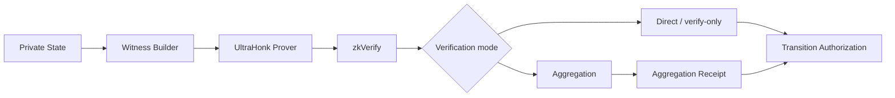
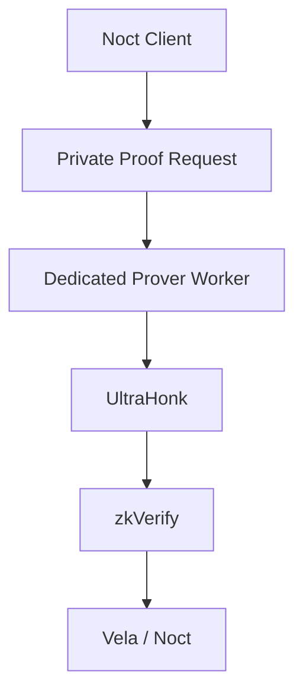

# Noct Finance — ZK Specification

> **SUPERSEDED — DO NOT IMPLEMENT.** Use corrected Files 09, 13, 14, 15, and 23 in `NOCT-FINANCE-V1-ARCHITECTURE-DOCUMENTS-CORRECTED/`. Custom ZK/zkVerify is conditional Noct infrastructure and must use the complete compact commitment schema.

**Version:** 1.0-architecture-freeze  
**Status:** ZK architecture baseline; circuit details evolve through benchmark gates.

---

# 1. Objective

ZK proves that a private Noct state transition is valid without revealing the user's complete lending position.

The proof system must establish statements such as:

- the user controls the relevant private state;
- the current state is valid;
- the transition follows protocol rules;
- collateral/risk constraints hold;
- the resulting state is correctly derived;
- the transition is not a replay.

The proof MUST NOT expose private collateral, debt or health-factor values merely because the transition is verified.

---

# 2. ZK pipeline



---

# 3. UltraHonk compatibility

Current zkVerify documentation lists Noir UltraHonk support for:

- Noir >= v1.0.0-beta.14;
- bb >= v3.0.0;
- bb.js >= v3.0.0;
- Keccak256;
- submission variants `V0_84`, `V3_0`, and `Legacy`.

Current documented limits include:

- maximum public inputs: 32;
- maximum evaluation domain size: `2^25`.

The implementation MUST pin and test exact toolchain versions rather than using floating versions.

---

# 4. Public/private input design

## Private witness candidates

Examples:

- private account secret/key material;
- current private balances;
- private debt;
- private collateral;
- private nonce;
- Merkle/state membership witnesses;
- transition-specific secret randomness.

## Public input candidates

Examples:

- state commitment/root;
- protocol configuration commitment;
- transition identifier;
- asset identifier;
- amount commitment or authorized public amount where required;
- nonce/nullifier commitment;
- previous/new state commitment;
- verification-domain identifiers.

The final public-input list MUST be frozen per circuit before deployment.

---

# 5. Privacy requirement

The circuit must avoid making these directly public:

```text
Alice.collateralUSDC
Alice.debtZEN
Alice.debtETH
Alice.healthFactor
Alice.LTV
```

Instead, the proof establishes that the hidden values satisfy the required inequalities.

Example concept:

```text
private:
  collateral = 100
  debt = 50
  oraclePrice = ...

public:
  stateRoot
  protocolConfigHash
  transitionId
  newStateCommitment

proof:
  "The private state satisfies the borrow constraint."
```

---

# 6. Circuit decomposition

Do not build one monolithic lending circuit.

Recommended circuit families:

```text
deposit validation
supply
borrow
repay
release collateral
withdraw cash
withdraw borrowed asset
liquidation
```

Shared gadgets/primitives MAY include:

- commitment hashing;
- state membership;
- nullifier/replay protection;
- signature/authorization verification;
- range checks;
- arithmetic constraints;
- risk inequalities.

---

# 7. Borrow proof

The borrow circuit should prove, without revealing the user's full position:

```text
1. Current state commitment is valid.
2. User is authorized.
3. USDC collateral exists.
4. Requested borrow asset is enabled.
5. Protocol liquidity is sufficient.
6. Borrow amount satisfies risk constraints.
7. New debt is correctly derived.
8. New state commitment is correctly computed.
9. Transition nonce is valid.
10. The transition has not been replayed.
```

The exact collateral/risk formula must come from the finalized risk configuration.

---

# 8. Repay proof

The repay circuit should prove:

```text
1. State is current.
2. Debt exists.
3. Repayment amount is valid.
4. New debt is correctly computed.
5. New state commitment is correct.
6. Replay protection passes.
```

Overpayment behavior remains an explicit protocol decision and must not be inferred by the implementation agent.

---

# 9. Withdrawal proof

For cash withdrawal:

```text
cashUSDC >= withdrawalAmount
```

For borrowed-asset withdrawal:

```text
borrowedAsset >= withdrawalAmount
```

The withdrawal proof must bind:

- account;
- asset;
- amount;
- transition nonce;
- current state;
- destination authorization;
- application identity.

---

# 10. Liquidation proof

Liquidation should prove that the hidden position satisfies the liquidation condition under the approved oracle/risk configuration.

The proof must avoid exposing the complete position.

Liquidation is expected to use dedicated infrastructure rather than browser proving.

---

# 11. Verification architecture

Noct uses an abstraction:

```text
interface ZKVerifier {
    verifyTransition(proof, verificationContext) -> VerificationResult
}
```

Implementations:

```text
DirectVerifier
AggregationReceiptVerifier
```

The state machine should depend on the interface, not the concrete mechanism.

---

# 12. zkVerify aggregation

zkVerify domains support aggregation. Current zkVerifyJS documentation describes:

- proof submission to a domain;
- aggregation after the domain's aggregation size is reached;
- `NewAggregationReceipt`;
- domain ID;
- aggregation ID;
- a Merkle-root receipt;
- retrieval of the statement path for the aggregate.

Noct therefore targets aggregation receipts for the production decentralized architecture.

However, aggregation latency is a performance-gated decision.

---

# 13. Performance gate

A ZK feature cannot be accepted merely because the proof verifies.

For every circuit measure:

```text
Circuit constraints
Witness generation
Proof generation
Proof size
Local verification
zkVerify submission
zkVerify verification
Aggregation
Receipt publication/availability
Noct/Vela consumption
Horizon confirmation
Total end-to-end latency
CPU
RAM
Failure rate
```

Use:

```text
p50
p95
p99
max
```

Do not report only averages.

---

# 14. Prover architecture

V1 MUST support an external prover-worker architecture.



The prover service must not become a plaintext store of user financial positions.

The design must define:

- encryption in transit;
- access control;
- retention policy;
- memory cleanup;
- logging policy;
- failure/retry behavior;
- witness confidentiality.

Browser proving can be supported experimentally but is not the V1 critical-path requirement.

---

# 15. Benchmark harness

The benchmark harness MUST be built before final ZK integration.

Test:

| Transition | Prove | Verify | Aggregate | Receipt | E2E |
|---|---:|---:|---:|---:|---:|
| Supply | ✓ | ✓ | ✓ | ✓ | ✓ |
| Borrow | ✓ | ✓ | ✓ | ✓ | ✓ |
| Repay | ✓ | ✓ | ✓ | ✓ | ✓ |
| Release collateral | ✓ | ✓ | ✓ | ✓ | ✓ |
| Withdraw | ✓ | ✓ | ✓ | ✓ | ✓ |
| Liquidation | ✓ | ✓ | ✓ | ✓ | ✓ |

---

# 16. Circuit size budget

Because zkVerify documents limits for UltraHonk, circuit design must stay within the supported public-input and evaluation-domain constraints.

The implementation MUST fail the build/CI if a circuit exceeds the selected deployment profile.

---

# 17. Version pinning

The project MUST pin:

- Noir version;
- Barretenberg/bb version;
- bb.js version if used;
- circuit source hash;
- verification key hash;
- zkVerify submission variant;
- protocol configuration version.

A proof generated under an incompatible circuit/VK version must not be accepted as a current proof.

---

# 18. ZK failure handling

Possible failures:

```text
witness generation failed
proof generation failed
proof invalid
zkVerify submission failed
verification rejected
aggregation unavailable
receipt unavailable
receipt mismatch
state root stale
Vela execution failed
Horizon settlement failed
```

Each failure must have deterministic handling and MUST NOT partially commit private state.

---

# 19. Source references

- zkVerify supported proofs: https://docs.zkverify.io/architecture/supported_proofs
- UltraHonk verifier: https://docs.zkverify.io/architecture/verification_pallets/ultrahonk
- zkVerifyJS aggregation: https://docs.zkverify.io/overview/zkverifyjs
