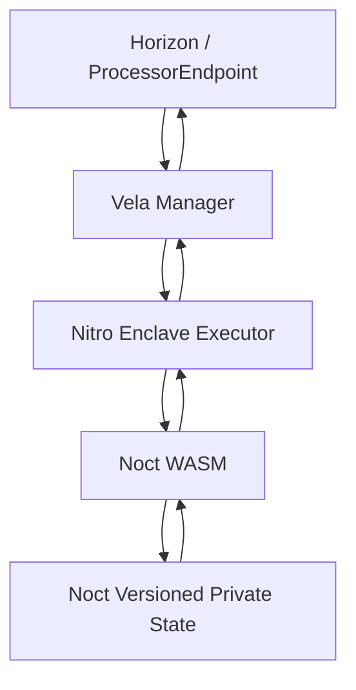

# Noct Finance — Vela Integration Specification

> **SUPERSEDED — DO NOT IMPLEMENT.** Use corrected Files 03, 16–18, 21–23, and 30 in `NOCT-FINANCE-V1-ARCHITECTURE-DOCUMENTS-CORRECTED/`. This snapshot predates the corrected ProcessorEndpoint, native withdrawal, trigger, recovery, and OracleAdapter semantics.

**Version:** 1.0-architecture-freeze  
**Status:** Vela integration baseline.

---

# 1. Purpose

Vela is the confidential execution substrate for Noct.

Noct supplies the lending state machine and business rules.

Vela supplies the confidential WASM execution environment, state coordination and blockchain-facing execution model.

The Noct implementation must be based primarily on the current Vela repositories rather than stale high-level documentation.

Primary references:

- `HorizenOfficial/vela-starterkit`
- `HorizenOfficial/vela-nova`
- `HorizenOfficial/vela`
- `HorizenOfficial/vela-facilitator`

---

# 2. Current Vela architecture relevant to Noct

The current Vela repository describes:

```text
Manager
  |
  +-- blockchain interaction
  +-- request fetching
  +-- state persistence
  +-- communication with Executor
  |
Executor
  |
  +-- Wasmtime
  +-- WASM execution
  +-- encrypted state handling
  +-- cryptographic keysets
  +-- attestation payloads
```

The Executor runs inside an AWS Nitro Enclave in the intended Vela architecture.

---

# 3. Noct application inside Vela

Noct should be implemented as a Vela WASM application:



The Noct WASM application must be deterministic.

---

# 4. State persistence

Noct state should use the Vela application-state mechanism rather than inventing a second uncontrolled state database.

The current Vela codebase describes versioned LevelDB application state and rollback support.

Noct must maintain:

- current application state;
- state version;
- previous state/version where required for rollback;
- state commitment;
- transition metadata required for reconciliation.

---

# 5. Request lifecycle

Conceptual lifecycle:

```text
1. Client constructs request.
2. Request is authenticated/encrypted as required by Vela.
3. Blockchain request is submitted.
4. Vela Manager fetches request.
5. Executor receives request.
6. Noct WASM validates/decrypts/processes it.
7. Noct state transition executes deterministically.
8. Result/AppEvent data is returned.
9. Manager persists the resulting state.
10. Blockchain settlement/update is performed.
```

The exact request encoding must follow the current Vela Starter Kit / Nova client patterns.

---

# 6. Noct transition adapter

Noct should expose a deterministic transition dispatcher:

```text
process(request) -> result
```

Conceptual request types:

```text
INIT_ACCOUNT
DEPOSIT_USDC
SUPPLY_USDC
BORROW_ZEN
BORROW_ETH
REPAY_ZEN
REPAY_ETH
RELEASE_COLLATERAL
WITHDRAW_CASH_USDC
WITHDRAW_BORROWED_ASSET
LIQUIDATE
```

These names are implementation-level labels and can be mapped to the actual Vela request model.

---

# 7. Private state rule

The WASM application is the authoritative execution environment for private lending state.

It must not emit:

```text
Alice collateral = 100
Alice debt = 50
Alice HF = 1.2
```

in plaintext public events.

Instead it should emit only the minimum public information needed for:

- settlement;
- reconciliation;
- commitments;
- transition status;
- protocol aggregate reporting.

---

# 8. External settlement

Vela's current ecosystem includes an on-chain ProcessorEndpoint and private transfer patterns.

For Noct, external settlement should follow a lock/settle/unlock model.

Example:

```text
borrowedZEN = 20
      |
withdraw request
      |
lockedZEN = 20
      |
Vela settlement
   /       \
success    failure
  |          |
burn/clear   unlock
```

A failed settlement must not permanently destroy the private balance.

---

# 9. Trigger contracts

Current Vela documentation describes trigger contracts capable of enqueuing follow-up requests after a normal request completes.

Noct should not introduce triggers unless they materially simplify a required settlement flow.

If used, the implementation must account for:

- callback ordering;
- isolated try/catch behavior;
- TRUSTPROCESS priority;
- termination conditions;
- replay/chaining risk.

Trigger-based architecture is therefore **optional and conditional**, not automatically part of V1.

---

# 10. Facilitator / relayer

A facilitator can submit requests and pay gas on behalf of users.

This is useful if Noct wants a gasless UX.

However:

```text
facilitator != trusted custodian
```

The facilitator should not receive unnecessary private financial data.

Where Vela supports encrypted request payloads, Noct should preserve that privacy boundary.

The current Vela Facilitator demonstrates gas-relayed submission and TEE-confirmed settlement patterns.

---

# 11. Relayer failure model

A relayer/facilitator may:

- go offline;
- delay submission;
- submit duplicate requests;
- submit malformed requests;
- run out of gas.

Noct state must therefore rely on authenticated requests, nonces/replay protection and deterministic settlement rather than trusting the relayer.

---

# 12. Vela + zkVerify integration

Noct should conceptually use:

```text
Noct private witness
      ↓
UltraHonk proof
      ↓
zkVerify
      ↓
verification result / aggregation receipt
      ↓
Noct transition authorization
      ↓
Vela WASM
      ↓
new private state
```

The exact ordering may differ for individual transitions after benchmarking.

The architecture MUST allow proof verification before state mutation.

---

# 13. State mutation rule

Never:

```text
mutate state
then verify proof
```

Instead:

```text
validate request
   ↓
verify authorization
   ↓
verify proof
   ↓
validate transition
   ↓
compute new state
   ↓
commit atomically
```

If any step fails, authoritative state remains unchanged.

---

# 14. Failure and rollback

Every state transition should be atomic from the protocol's perspective.

Required properties:

- no partial balance updates;
- no partial debt updates;
- no double withdrawal;
- no stale state commit;
- retry-safe processing;
- deterministic failure result;
- reconciliation metadata.

Use Vela's state-versioning/rollback capabilities where appropriate.

---

# 15. Vela local development

The current Starter Kit provides a Docker-based local environment with a local EVM chain and Vela components including Executor, Manager and Authority Service.

The local environment emulates the TEE; it is not equivalent to a production AWS Nitro Enclave.

Therefore:

> Passing local Vela tests does not by itself establish production TEE security.

Production deployment must separately validate attestation, deployment identity and enclave assumptions.

---

# 16. Vela source-of-truth policy

Implementation should prefer:

1. current repository source;
2. repository tests;
3. repository design docs;
4. current official Horizen docs;
5. older docs only when clearly compatible.

The Starter Kit and Nova repositories should be used as concrete implementation references.

---

# 17. References

- Starter Kit: https://github.com/HorizenOfficial/vela-starterkit
- Vela Nova: https://github.com/HorizenOfficial/vela-nova
- Vela core: https://github.com/HorizenOfficial/vela
- Vela Facilitator: https://github.com/HorizenOfficial/vela-facilitator
